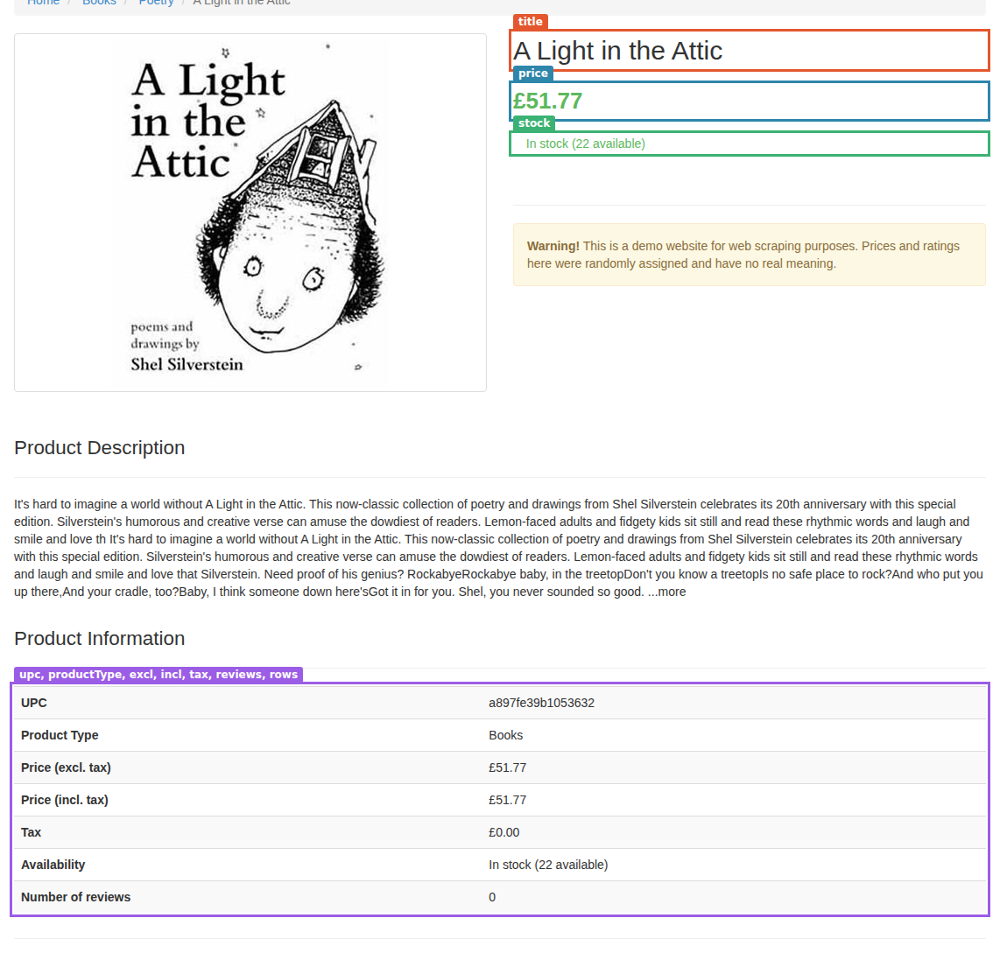
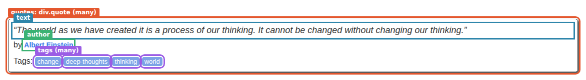
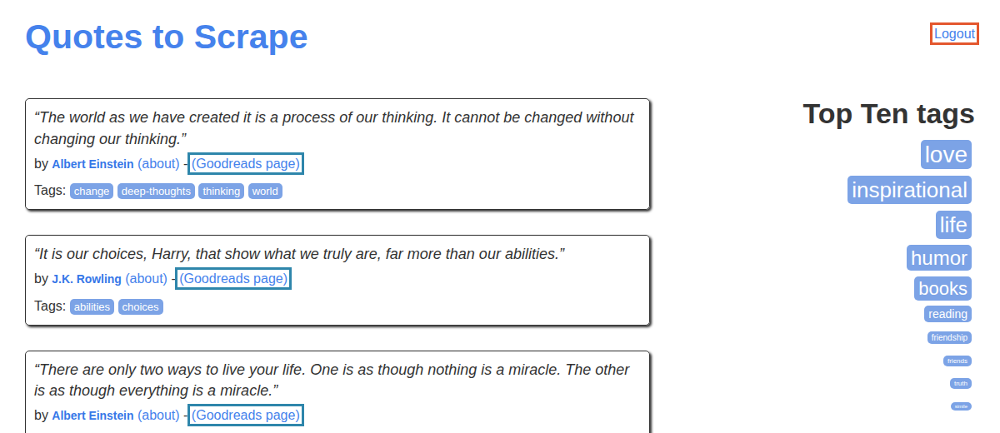

<p align="center">
  
</p>

# Recipes

[← How OpenCraw works](README.md) · Next: [3. Page steps](02-page-steps.md)

A crawl is a set of JSON files. **One output recipe** says what a record is: its fields, their types, which
fields identify it. **One or more input recipes** say where the data is and how to get it: web or api mode, where
to start, which steps to run, and how the values the steps found map to the output's fields. This page follows
both kinds of file through the engine: what each type does to a real value, how keys drop duplicates across
recipes, what changes between web and api mode, and what the loader checks before anything runs.

[authoring.md §1–2](../recipes/authoring.md#1-the-output-recipe) is the reference for every key named here, and
[§8](../recipes/authoring.md#8-loading-binding-and-running) for loading.

## The output recipe: what a record is

An output recipe is a list of fields. Each field has a `type`, and optionally says whether it's `required`,
whether `null` is acceptable (`nullable`), what to use when the value is missing (`default`), whether it's part
of the record's identity (`key`), or that the engine fills it in (`generated`). The input recipes never say what
type a value is; they only say where it comes from. The output decides the type, and every input recipe that
feeds it gets the same conversion.

The engine applies the output recipe last. After the steps have run and a record is emitted, the mapping reads
each field's value from the scope and runs its transforms, and only then does the output recipe act on it,
field by field:

1. **coerce** the value to the field's type, or fail;
2. **validate** it against `min`, `max`, `pattern`, `minLength` or `maxLength`, if the field has any;
3. if the value is **missing** (`undefined`, `null`, or `""` after coercion), apply the missing-value policy
   instead. Coercion runs first, so `""` counts as missing only where the type keeps it (`string`, `json`); in a
   `number` or `date` field it fails coercion ([#80](https://github.com/russoedu/open.craw/issues/80));
4. add the **generated** fields, and compute the **key**.

Only the fields the output declares make it into the record. A mapping can't add a field the output doesn't
have: the loader refuses it (see [binding](#binding-do-the-recipes-fit-together)).

### Every type, on one real page

The scene: one book on [books.toscrape.com](https://books.toscrape.com), read in api mode (the HTML is fetched,
no browser). Every `extract` takes text as the page shows it, and the output
([`book-detail.output.json`](recipes/recipes-types/book-detail.output.json)) gives each field a type:

```json
"upc":         { "type": "string", "required": true, "key": true },
"price":       { "type": "currency", "required": true },
"priceValue":  { "type": "number" },
"prices":      { "type": "object", "fields": { "excl": { "type": "currency" }, "incl": { "type": "currency" }, "tax": { "type": "currency" } } },
"inStock":     { "type": "boolean" },
"available":   { "type": "integer", "min": 0 },
"productType": { "type": "enum", "values": ["Books", "E-books"] },
"image":       { "type": "url" },
"breadcrumb":  { "type": "array", "items": { "type": "string" } },
"rows":        { "type": "json" },
```

<!-- capture:recipes-types screenshot alt=A_Light_in_the_Attic:_the_values_the_extracts_read -->

<!-- /capture -->

The input recipe ([`attic-api.input.json`](recipes/recipes-types/attic-api.input.json)) maps most fields
straight from an extract, with no transform, so the table shows what coercion alone does. `read` is the value the
mapping read from the scope, and **field** is the value after coercion:

<!-- capture:recipes-types mapping fields=upc,title,price,priceValue,prices.excl,prices.tax,inStock,available,reviews,productType,image,breadcrumb,rows -->
| Field | Step | Value |
|---|---|---|
| `upc` | read | `"a897fe39b1053632"` |
| | **field** | `"a897fe39b1053632"` |
| `title` | read | `"A Light in the Attic"` |
| | **field** | `"A Light in the Attic"` |
| `price` | read | `"£51.77"` |
| | **field** | `{"amount":51.77,"currency":"GBP"}` |
| `priceValue` | read | `"£51.77"` |
| | **field** | `51.77` |
| `prices.excl` | read | `"£51.77"` |
| | **field** | `{"amount":51.77,"currency":"GBP"}` |
| `prices.tax` | read | `"£0.00"` |
| | **field** | `{"amount":0,"currency":"GBP"}` |
| `inStock` | read | `"In stock (22 available)"` |
| | **field** | `true` |
| `available` | read | `"In stock (22 available)"` |
| | **field** | `22` |
| `reviews` | read | `"0"` |
| | **field** | `0` |
| `productType` | read | `"Books"` |
| | **field** | `"Books"` |
| `image` | read | `"../../media/cache/fe/72/fe72f0532301ec28892ae79a629a293c.jpg"` |
| | `absoluteUrl` | `"https://books.toscrape.com/media/cache/fe/72/fe72f0532301ec28892ae79a629a293c.jpg"` |
| | **field** | `"https://books.toscrape.com/media/cache/fe/72/fe72f0532301ec28892ae79a629a293c.jpg"` |
| `breadcrumb` | read | `["Home","Books","Poetry"]` |
| | **field** | `["Home","Books","Poetry"]` |
| `rows` | read | `["UPCa897fe39b1053632","Product TypeBooks","Price (excl. tax)£51.77","… 4 more"]` |
| | **field** | `["UPCa897fe39b1053632","Product TypeBooks","Price (excl. tax)£51.77","… 4 more"]` |
<!-- /capture -->

The same text, `"£51.77"`, becomes an object in a `currency` field and a plain number in a `number` field. The
same `"In stock (22 available)"` becomes `true` in a `boolean` field and `22` in an `integer` field. What each
type does:

| Type | What it accepts | What it refuses | Seen here |
|---|---|---|---|
| `string` | text as it is, with no trimming; a number or a boolean becomes its text | a list or an object | `"a897fe39b1053632"` stays as it is |
| `number` | a number, or text containing one: it keeps the digits, `.`, `,` and the signs, and drops everything else (see [below](#the-same-text-read-as-a-number)) | text with no digit in it | `"£51.77"` → `51.77` |
| `integer` | the same as `number`, then cut toward zero (truncated, not rounded) | the same as `number` | `"In stock (22 available)"` → `22` |
| `boolean` | anything. `true` when the whole text is `true`, `yes`, `y`, `1` or `on`, or it contains the words `in stock` or `available`; a number is `true` unless it's `0` | nothing: whatever isn't `true` is `false` | `"In stock (22 available)"` → `true` |
| `date` | a `Date`, milliseconds since 1970, ISO text (or other text JavaScript's `Date` reads), or text matching the field's `format` (`DD/MM/YYYY`…); gives the day in UTC. Without a `format`, text with a time but no offset is read in the machine's time zone | text that doesn't read as a date | `now` → `"2026-09-27"` (the generated `scrapedOn`) |
| `datetime` | the same as `date` | the same | `now` → `"2026-09-27T17:…Z"` |
| `currency` | text with an amount and a symbol or a three-letter code, a number, or `{ amount, currency }`. The field's own `currency`, when set, replaces any code in the value | a value with no code anywhere (not in the text, the transform or the field) | `"£51.77"` → `{"amount":51.77,"currency":"GBP"}` |
| `url` | an absolute URL, trimmed and normalised | anything relative | the image, after `absoluteUrl` |
| `enum` | text that is exactly one of `values`, case included | anything else | `"Books"` |
| `array` | a list, or a single value (wrapped in a list); each item is coerced with `items` | an item its `items` refuses | the breadcrumb |
| `object` | an object; only the declared `fields` are kept, each coerced | a list, or text | `prices`, built from three dotted targets (`prices.excl`…) |
| `json` | any JSON value, kept exactly as it is | what JSON can't hold: `NaN`, a `Date`, a function | the seven table rows, as a list |

`object` and `json` both hold structure, but they do opposite things. `object` is for a shape you know: it keeps
the declared members and drops the rest. `json` is for a shape you don't want to fix: it keeps everything and
checks nothing.

The record, with the generated fields at the end:

<!-- capture:recipes-types record -->
```json
{
  "upc": "a897fe39b1053632",
  "title": "A Light in the Attic",
  "price": {
    "amount": 51.77,
    "currency": "GBP"
  },
  "priceValue": 51.77,
  "prices": {
    "excl": {
      "amount": 51.77,
      "currency": "GBP"
    },
    "incl": {
      "amount": 51.77,
      "currency": "GBP"
    },
    "tax": {
      "amount": 0,
      "currency": "GBP"
    }
  },
  "inStock": true,
  "available": 22,
  "reviews": 0,
  "productType": "Books",
  "image": "https://books.toscrape.com/media/cache/fe/72/fe72f0532301ec28892ae79a629a293c.jpg",
  "breadcrumb": [
    "Home",
    "Books",
    "Poetry"
  ],
  "rows": [
    "UPCa897fe39b1053632",
    "Product TypeBooks",
    "Price (excl. tax)£51.77",
    "… 4 more"
  ],
  "oldPrice": null,
  "onSale": false,
  "subtitle": null,
  "scrapedAt": "2026-09-27T17:40:57.616Z",
  "scrapedOn": "2026-09-27",
  "sourceUrl": "https://books.toscrape.com/catalogue/a-light-in-the-attic_1000/index.html",
  "recipe": "attic-api"
}
```
<!-- /capture -->

Two details in the `rows` field: `take: "text"` on a table row joins the cells' text with no space
(`"UPCa897fe39b1053632"`), because there's no whitespace between the `<th>` and the `<td>` in the page's HTML.
And the record prints four of the seven rows: the guide cuts long lists for reading, and the field holds all
seven.

### The same text, read as a number

A number type doesn't look for "the number" in a text. It keeps every digit, `.`, `,`, `-`, `+` and space, drops
everything else, and reads what's left. The scene
[`recipes-number`](recipes/recipes-number/attic-rows.input.json) reads every row of the product table and maps
the same cell into a `number`, an `integer` and a `boolean` field:

<!-- capture:recipes-number records n=7 -->
```json
{"row":"UPC","text":"a897fe39b1053632","number":897391053632,"integer":897391053632,"boolean":false}
{"rejected":{"field":"number","reason":"number: transform \"number\": no number in \"Books\""}}
{"row":"Price (excl. tax)","text":"£51.77","number":51.77,"integer":51,"boolean":false}
{"row":"Price (incl. tax)","text":"£51.77","number":51.77,"integer":51,"boolean":false}
{"row":"Tax","text":"£0.00","number":0,"integer":0,"boolean":false}
{"row":"Availability","text":"In stock (22 available)","number":22,"integer":22,"boolean":true}
{"row":"Number of reviews","text":"0","number":0,"integer":0,"boolean":false}
```
<!-- /capture -->

- The UPC `a897fe39b1053632` becomes `897391053632`: the letters are dropped and the digits are joined. A number
  field fed the wrong text gives no error; it gives a wrong number. Pick the number out with a `regex` transform
  first when the text holds anything but one number (`"2 for 10,00"` would read as `210`).
- `"Books"` has no digit, so it's refused. The mapping rule says `"onMissing": "skip-record"`, so the record is
  rejected and the run goes on (next section).
- Without a `locale`, the decimal separator is guessed: the last `.` or `,` is the decimal point only if 1 or 2
  digits follow it and it appears once. So `"£51.77"` is `51.77`, `"1.299"` is `1299`, and `"0.125"` is `125`.
  Use the `number` transform with `locale` when a site's format is known.
- `integer` truncates: `51.77` becomes `51`.
- `boolean` never fails. Of the seven texts only `"In stock (22 available)"` is `true`, and `"0"` is `false`.

### What coercion refuses

The scene [`recipes-rejects`](recipes/recipes-rejects) runs six small input recipes against the same page.
Five each map one real value into a field that can't take it, with `"onMissing": "skip-record"` on the rule, so
the record is rejected with the reason:

<!-- capture:recipes-rejects records n=5 -->
```json
{"rejected":{"field":"amount","reason":"amount: no currency: set \"currency\" on the field or use the currency transform"}}
{"rejected":{"field":"availableOn","reason":"availableOn: transform \"date\": cannot read \"In stock (22 available)\" as a date"}}
{"rejected":{"field":"kind","reason":"kind: \"Books\" is not one of book, ebook"}}
{"rejected":{"field":"section","reason":"section: expected text, got a list"}}
{"rejected":{"field":"image","reason":"image: \"../../media/cache/fe/72/fe72f0532301ec28892ae79a629a293c.jpg\" is not an absolute URL (use the absoluteUrl transform)"}}
```
<!-- /capture -->

In order: `"0"` in a `currency` field with no code; the availability text in a `date` field; `"Books"` against
lowercase `values` (enums are case-sensitive); the breadcrumb (`many: true`, a list) in a `string` field; the
relative image link in a `url` field.

The sixth recipe, `url-without-policy`, maps the same image link with no policy. A coercion failure isn't a
missing value, so `default` and `null` can't rescue it. Only `skip-record` turns it into a rejected record;
anything else fails the step that emitted, and with the default step policy the recipe stops:

<!-- capture:recipes-rejects summary -->
```text
reject-currency: 0 emitted, 1 rejected, 0 duplicates, 1 pages
reject-date: 0 emitted, 1 rejected, 0 duplicates, 1 pages
reject-enum: 0 emitted, 1 rejected, 0 duplicates, 1 pages
reject-string: 0 emitted, 1 rejected, 0 duplicates, 1 pages
reject-url: 0 emitted, 1 rejected, 0 duplicates, 1 pages
url-without-policy: 0 emitted, 0 rejected, 0 duplicates, 1 pages, stopped: step steps.2 (emit) failed: mapping failed: image: image: "../../media/cache/fe/72/fe72f0532301ec28892ae79a629a293c.jpg" is not an absolute URL (use the absoluteUrl transform)
```
<!-- /capture -->

Only that recipe stopped: the others had already finished, and a failed recipe doesn't stop the rest of the set
(`onRecipeError` is `continue` by default). [Part 9, Policies](08-policies.md) follows every case: missing
values, coercion, validation and transform failures, and which policy applies where.

### `required`, `nullable`, `default`

The product page has no old price, no sale badge and no subtitle. The recipe extracts all three with
`"onError": { "policy": "skip" }`, so each `extract` that finds nothing is skipped and its id stays unbound:

<!-- capture:recipes-types trace grep=↷ -->
```text
  ↷ steps.13  extract oldPrice  skipped: no match for .product_main .price_old
  ↷ steps.14  extract saleBadge  skipped: no match for .product_main .sale
  ↷ steps.15  extract subtitle  skipped: no match for .product_main h2
```
<!-- /capture -->

Each of the three fields then shows a different rule for a missing value:

| Field | Spec | Record | Why |
|---|---|---|---|
| `oldPrice` | `{ "type": "currency", "currency": "GBP" }` | `null` | Not required, so missing becomes `null`. |
| `onSale` | `{ "type": "boolean", "default": false }` | `false` | A field with a `default` uses it when the value is missing. |
| `subtitle` | `{ "type": "string", "required": true, "nullable": true, "onMissing": "null" }` | `null` | Required, but its policy is `null` and it's `nullable`. |

- `required` alone makes a missing value fail the recipe. `nullable` doesn't change that on its own: it only
  lets a required field be `null` when the policy that applies is `null` (from the field, the rule or the output
  recipe's `onMissing`). Without the `onMissing`, `subtitle` would stop the run.
- A `default` is used as it is: it isn't coerced or validated, so write it in the field's type.
- An empty list is not missing. `many: true` with no match binds `[]`, and `[]` goes to coercion like any value
  (a `string` field refuses it).

### Generated fields

`generated` fields are filled in by the engine, after the mapping: `now` (the time the record was mapped),
`uuid`, `sourceUrl` (the page the record was emitted from) and `recipeId`. They're coerced like any other field,
so `now` gives an instant in the `datetime` field `scrapedAt` and a day in the `date` field `scrapedOn` (see the
record above). A generated field can't be mapped, and can't be marked `required`: it's always there. The loader
refuses both.

## Keys and duplicates

Every field marked `key: true` is part of the record's identity. The key is the JSON list of those fields'
values, in the order the output declares them, after coercion: the book above has the key
`["a897fe39b1053632"]`, which the trace prints on its record line:

<!-- capture:recipes-types trace grep=record -->
```text
  ✚ record ["a897fe39b1053632"]
```
<!-- /capture -->

A missing key field counts as `null` in the key, and an output with no key field gives every record the key
`null`: those records are never checked for duplicates.

Before a record reaches the sink, the engine checks whether its key has been seen. A record whose key has been
seen is counted as a **duplicate** and not written; the first record with a key wins. The scene
[`recipes-dedupe`](recipes/recipes-web-vs-api) runs two recipes that feed the same `quote` output, keyed by the
quote's text: `quotes-api` reads pages 1 and 2 of the site's JSON API, and `quotes-web` reads page 1 of its
JavaScript-rendered page. The set runs its input recipes in the order they were loaded (here, the files'
alphabetical order), so the api recipe runs first:

<!-- capture:recipes-dedupe summary -->
```text
quotes-api: 20 emitted, 0 rejected, 0 duplicates, 2 pages
quotes-web: 0 emitted, 0 rejected, 10 duplicates, 1 pages
```
<!-- /capture -->

<!-- capture:recipes-dedupe trace grep=▶|■|≡ lines=4 -->
```text
▶ quotes-api (api)
■ quotes-api: 20 emitted, 0 rejected, 0 duplicates, 2 pages, … ms
▶ quotes-web (web)
  ≡ duplicate ["“The world as we have created it is a process of our thinking. It cannot be changed without changing our thinking.”"]
  …
```
<!-- /capture -->

The web recipe did all its work and every record it built was already written. Things to know:

- **The scope is the whole run by default.** `createCrawler({ dedupe })` takes `run` (one set of keys shared by
  every recipe of a `run()` call, the default), `recipe` (each recipe run, each matrix variant and each worker
  item on its own) or `off`. [Worker mode](../recipes/worker-mode.md) defaults to `recipe`.
- **The comparison is exact.** The key is built from coerced values, and a `string` field isn't trimmed, so
  `"Albert Einstein"` and `"Albert Einstein "` are two keys. Two recipes meant to overlap must produce the same
  text: trim, or build URLs with `absoluteUrl`, in both.
- **Which record wins depends on order.** With `parallel`, it's whichever recipe emits first.
- **Duplicates are counted, not hidden:** `record:duplicate` events, and `duplicates` in the report.
- Resuming a crawl reads keys back from the sink and skips records it already has: see
  [part 10](09-running.md).

## The input recipe: where the data is and how to get it

An input recipe names the output it feeds (`output`), then says how to reach the data:

| Key | What it does |
|---|---|
| `mode` | `web` runs the steps in a browser page; `api` sends HTTP requests with no browser. |
| `start` | One or more start points `{ url, vars? }`. Each runs the whole step list from a fresh scope. |
| `vars` | Values the steps and the mapping read as `vars.name`. |
| `limits` | `maxRecords`, `delayMs`, `timeoutMs`, `concurrency`, `retry`. |
| `session` | Headers, cookies, user agent, a login (`bootstrap`), access, block handling, captchas. |
| `onError` | The default error policy for every step. |
| `steps` | What to do: navigate, extract, loop, emit ([parts 3 to 5](02-page-steps.md)). |
| `mapping` | Output field → where its value comes from and how it's transformed ([part 8](07-mapping-and-transforms.md)). |

### Web or api: the same data read both ways

[quotes.toscrape.com](https://quotes.toscrape.com) serves the same quotes twice: `/js/` builds them in the
browser with a script (the HTML the server sends has no `div.quote` in it, only the script and its data), and
`/api/quotes?page=N` returns them as JSON. The scene [`recipes-web-vs-api`](recipes/recipes-web-vs-api) reads
both into one output, with de-duplication off so both sets of records are kept.

<!-- capture:recipes-web-vs-api screenshot alt=The_JavaScript-rendered_page,_with_what_the_web_recipe_selects -->

<!-- /capture -->

The two recipes' steps:

```json
"mode": "web",
"steps": [
  { "type": "goto", "url": "{{start.url}}" },
  { "type": "extract", "id": "quotes", "selector": "div.quote", "kind": "css", "take": "html", "many": true },
  { "type": "forEach", "over": "quotes", "as": "quote", "emit": true, "steps": [
    { "type": "extract", "id": "text", "from": "quote", "selector": "span.text", "kind": "css" },
    { "type": "extract", "id": "author", "from": "quote", "selector": "small.author", "kind": "css" },
    { "type": "extract", "id": "tags", "from": "quote", "selector": "a.tag", "kind": "css", "many": true }
  ]}
]
```

```json
"mode": "api",
"steps": [
  { "type": "request", "url": "{{start.url}}" },
  { "type": "extract", "id": "quotes", "selector": "$.quotes[*]", "kind": "jsonpath", "take": "json", "many": true },
  { "type": "forEach", "over": "quotes", "as": "item", "emit": true, "steps": [] }
]
```

The web recipe has to take the values out of markup, one `extract` per value. The api recipe's items are
already data, so its loop has no steps: the mapping reads straight into each item (`item.author.name`). The
scopes the two emits hand to the mapping, for the first quote:

<!-- capture:recipes-web-vs-api scope ids=text,author,tags,page,vars record=20 -->
```json
{
  "text": "“The world as we have created it is a process of our thinking. It cannot be changed without changing our thinking.”",
  "author": "Albert Einstein",
  "tags": [
    "change",
    "deep-thoughts",
    "thinking",
    "world"
  ],
  "page": {
    "url": "https://quotes.toscrape.com/js/",
    "number": 1
  },
  "vars": {
    "via": "web"
  }
}
```
<!-- /capture -->

<!-- capture:recipes-web-vs-api scope ids=item,page,vars record=0 -->
```json
{
  "item": {
    "author": {
      "goodreads_link": "/author/show/9810.Albert_Einstein",
      "name": "Albert Einstein",
      "slug": "Albert-Einstein"
    },
    "tags": [
      "change",
      "deep-thoughts",
      "thinking",
      "world"
    ],
    "text": "“The world as we have created it is a process of our thinking. It cannot be changed without changing our thinking.”"
  },
  "page": {
    "url": "https://quotes.toscrape.com/api/quotes?page=1",
    "number": 1
  },
  "vars": {
    "via": "api"
  }
}
```
<!-- /capture -->

And the two records, the web one first. They're the same record, except for `via`, which each recipe sets in its
`vars`:

<!-- capture:recipes-web-vs-api record record=20 -->
```json
{
  "text": "“The world as we have created it is a process of our thinking. It cannot be changed without changing our thinking.”",
  "author": "Albert Einstein",
  "tags": [
    "change",
    "deep-thoughts",
    "thinking",
    "world"
  ],
  "via": "web"
}
```
<!-- /capture -->

<!-- capture:recipes-web-vs-api record record=0 -->
```json
{
  "text": "“The world as we have created it is a process of our thinking. It cannot be changed without changing our thinking.”",
  "author": "Albert Einstein",
  "tags": [
    "change",
    "deep-thoughts",
    "thinking",
    "world"
  ],
  "via": "api"
}
```
<!-- /capture -->

What each mode opens, and what it allows:

| | `web` | `api` |
|---|---|---|
| Session | a new browser context and one page, on a shared Chromium | Playwright's HTTP request context: no browser, no JavaScript |
| Steps | every step; `request` shares the page's cookies | `request`, `extract` and the flow steps (`forEach`, `paginate`, `if`, `set`, `collect`, `emit`, `hook`) |
| `page.url` | the browser's real URL, updated after every step | the final URL of the nearest `request` |
| Refused at load | nothing mode-specific | page steps (`goto`, `click`, `fill`…), `forEach` over a `selector`, `paginate` with `next.selector`, a `request` with `form` |

Try `api` first: it's faster, lighter, and most sites send their data in the HTML or a JSON endpoint. Use `web`
when a script builds the content (as on `/js/`), when a value only appears after a click or a scroll, or when the
site refuses plain HTTP clients. An api recipe can still log in with a browser, in its session bootstrap
([below](#session-in-outline)).

### `start` and `vars`

Each start point runs the whole step list in a fresh scope, where `start.url` is its URL and `page` starts as
`{ url: start.url, number: 1 }`. The api recipe has two start points, one per API page, so its trace shows two
first pages:

<!-- capture:recipes-dedupe trace grep=▶|⇢|■ -->
```text
▶ quotes-api (api)
  ⇢ page 1  https://quotes.toscrape.com/api/quotes?page=1
  ⇢ page 1  https://quotes.toscrape.com/api/quotes?page=2
■ quotes-api: 20 emitted, 0 rejected, 0 duplicates, 2 pages, … ms
▶ quotes-web (web)
  ⇢ page 1  https://quotes.toscrape.com/js/
■ quotes-web: 0 emitted, 0 rejected, 10 duplicates, 1 pages, … ms
```
<!-- /capture -->

Both lines say `page 1`: `page.number` counts pages within one start point, and only `paginate` moves it on.
The report's `pages` counts every page visit of the run, so the api recipe reports 2.

`vars` are the recipe's parameters. The steps read them in templates (`{{vars.tag}}`), and the mapping reads
them like any other value (`"via": { "from": "vars.via" }`). A run's vars are built in this order, each layer
overriding the one before: the recipe's `vars`, then the `matrix` combination or the worker item's vars, then
the start point's own `vars`. The start point wins, even over a matrix.

### `limits`

| Limit | What it bounds |
|---|---|
| `maxRecords` | Stops the whole walk once that many records were written. Rejected and duplicate records don't count. Exact, even with `concurrency`. |
| `delayMs` | The shortest time between two request starts in this recipe run: every `goto`, `request` and next-page click, across all loops. Not the page's own images and scripts. |
| `timeoutMs` | Navigations, requests, `wait`, `select`, downloads. Not clicks or fills: those take the browser's timeout. |
| `concurrency` | How many iterations of a `forEach` over a list run at once: tabs in web mode, requests in api mode. Default 1. |
| `retry` | How a request that fails in passing is sent again. On by default (three tries). |

The recipes on this page all set `delayMs: 300`, to be polite to the practice sites. The session scene below
also sets `maxRecords: 3` and `timeoutMs: 60000`. [Part 10](09-running.md) covers throttling, retries and
concurrency in depth.

### `session`, in outline

`session` holds what the site needs from the client: `headers`, `userAgent`, `cookies`, `viewport`, and three
bigger pieces:

- **`bootstrap`**: steps run in a browser **before** the crawl, typically a login. Afterwards the engine keeps
  what `keep` lists (`cookies`, `localStorage`, or both), and every page or request of the crawl starts with it.
  `saveTo` writes that state to a file, and `storageStatePath` starts from a saved file instead of running the
  bootstrap (the file must exist).
- **`browserProfile`**: a named browser profile kept between runs (cookies, storage, cache). Web recipes run in
  it; api recipes start from its cookies.
- **`access`, `blockedWhen`, `onBlock`, `captcha`**: proxies, what counts as being blocked, what to do then, and
  captcha solving. All in [part 10](09-running.md).

The scene [`recipes-session`](recipes/recipes-session/quotes-signed-in.input.json) is an **api** recipe whose
bootstrap logs in with a browser. quotes.toscrape.com accepts any user name and password, and once signed in
shows each author's Goodreads link:

```json
"mode": "api",
"session": { "bootstrap": { "keep": ["cookies"], "steps": [
  { "type": "goto", "url": "https://quotes.toscrape.com/login" },
  { "type": "fill", "selector": "#username", "value": "{{vars.user}}" },
  { "type": "fill", "selector": "#password", "value": "{{vars.password}}" },
  { "type": "click", "selector": "input[type=submit]" },
  { "type": "wait", "selector": "a[href='/logout']" }
]}}
```

<!-- capture:recipes-session screenshot alt=Signed_in:_the_Logout_link_and_the_Goodreads_links_the_recipe_reads -->

<!-- /capture -->

The bootstrap's steps run first, with paths under `session.bootstrap.steps`. Then the recipe's `request` goes
out with the session cookie:

<!-- capture:recipes-session trace lines=13 -->
```text
▶ quotes-signed-in (api)
  ⇄ access direct (direct)
  ⇢ page 1  https://quotes.toscrape.com/login
  · session.bootstrap.steps.0  goto  … ms
  · session.bootstrap.steps.1  fill  … ms
  · session.bootstrap.steps.2  fill  … ms
  · session.bootstrap.steps.3  click  … ms
  · session.bootstrap.steps.4  wait  … ms
  ⇢ page 1  https://quotes.toscrape.com/
  · steps.0  request  … ms
  · steps.1  extract menu  … ms
  · steps.2  extract quotes  … ms
    · steps.3.steps.0  extract text  … ms
  …
```
<!-- /capture -->

<!-- capture:recipes-session records n=3 -->
```json
{"text":"“The world as we have created it is a process of our thinking. It cannot be changed without changing our thinking.”","author":"Albert Einstein","goodreads":"http://goodreads.com/author/show/9810.Albert_Einstein","menu":"Logout"}
{"text":"“It is our choices, Harry, that show what we truly are, far more than our abilities.”","author":"J.K. Rowling","goodreads":"http://goodreads.com/author/show/1077326.J_K_Rowling","menu":"Logout"}
{"text":"“There are only two ways to live your life. One is as though nothing is a miracle. The other is as though everything is a miracle.”","author":"Albert Einstein","goodreads":"http://goodreads.com/author/show/9810.Albert_Einstein","menu":"Logout"}
```
<!-- /capture -->

The menu reads `Logout` and every quote has its Goodreads link, so the HTTP client was signed in. Without the
bootstrap, the menu would read `Login` and the `goodreads` extract would find nothing. Three records, because
`maxRecords` is 3. Some details:

- The bootstrap always runs in a browser, even for an api recipe, with the same proxy lease as the crawl, so the
  login and the crawl come from the same address.
- It sees the recipe's `vars`, but not a start point's own `vars`, and it can't emit records.
- It runs again whenever the session is reopened: after a rotation to a new proxy, for example.
- The bootstrap's page visit counts in the report's `pages`: this run reports 2.

## Loading, validation and binding

Nothing runs until the whole set has loaded. `loadRecipeSet({ output, inputs })` takes the output recipe apart
from the inputs; `loadRecipes(source)` takes one source holding all of them and finds the output by its `kind`.
A source can be a file, a directory, JSON or JSON Lines text, bytes, or already-decoded objects. Loading does
two things, in this order.

### Validation: is each file a recipe?

Each document is parsed against its contract. The contracts are strict: an unknown key is an error, so a typo
never silently does nothing. Every problem is reported at once, each with the JSON path where it is.

To show what that looks like, three recipes were broken on purpose and loaded with `loadRecipeSet` from a small
Node script, passing each recipe as a decoded object. A recipe given as an object is labelled `output` or
`inputs[N]`; one given as a file is labelled with its path. The first is this page's `book-detail` output with
`price` typed `money`, the `enum` field's `values` removed, `"required": true` added to the generated
`scrapedAt`, and a field named `stock.count`:

```text
RecipeValidationError: output: invalid recipe
  fields.price.type: Invalid option: expected one of "string"|"number"|"integer"|"boolean"|"date"|"datetime"|"currency"|"url"|"enum"|"array"|"object"|"json"
  fields.productType.values: a "enum" field needs "values"
  fields.scrapedAt.required: a generated field is always present; drop "required"
  fields.stock.count: Invalid key in record
```

The last line is about the field *name*: names can't contain dots, since a dot in a mapping target means "a
member of an object field".

The second is the `quotes-web` input with the loop's `as` deleted, `selector` misspelt `selecter` in the first
inner `extract`, and `kind` misspelt `cs` in the second:

```text
RecipeValidationError: inputs[0]: invalid recipe
  steps.2.as: Invalid input: expected string, received undefined
  steps.2.steps.0.selector: Invalid input: expected string, received undefined
  steps.2.steps.0: Unrecognized key: "selecter"
  steps.2.steps.1.kind: Invalid option: expected one of "css"|"xpath"|"jsonpath"|"regex"|"table"
```

A path is the route to the problem: `steps.2.steps.0` is the first step inside the third top-level step, the same
numbering the trace uses. When a step type could match several shapes, the errors come from the shape the
recipe got furthest into, so they describe the step you meant.

Point `$schema` at the published JSON Schemas (as every recipe in this guide does), and an editor checks the
same shapes while you type. Some rules have no JSON Schema form ("an `enum` needs `values`", "give exactly one
of `selector` or `target`"), so only the loader reports those.

### Binding: do the recipes fit together?

Once every file is valid, each input recipe is checked against the output and against itself. The third broken
recipe is valid on its own: it's the `quotes-api` input with a `goto` added, `author` mapped from an id that
doesn't exist, a mapping for a field the output doesn't have, and the mapping for the required `text` removed:

```text
RecipeBindingError: recipes do not bind
  quotes-api steps.1: "goto" needs a browser; this recipe runs in api mode (use session.bootstrap for browser steps)
  quotes-api mapping.author.from: "quote.author.name" does not start with a known id
  quotes-api mapping.language: output "quote" has no field "language"
  quotes-api mapping: required output field "text" is not mapped
```

Binding checks:

- the input's `output` is the output recipe's `id`, and no two inputs share an `id`;
- every mapping target is a field of the output (a dotted target walks into `object` fields), and none is
  `generated`;
- every `from` starts with a known id: `page`, `start`, `vars`, a var's name, a step's `id`, a `forEach`'s `as`,
  or a pagination cursor;
- every `required` field with no `default` and not `generated` is mapped;
- no id is bound twice on one path, and none is called `page`, `start` or `vars`;
- the steps fit the mode (the table [above](#web-or-api-the-same-data-read-both-ways)), except in a bootstrap,
  which always runs in a browser;
- at most one emitting construct on any path: no `emit` inside an emitting `forEach`;
- `collect.into` is bound before the loop, every `matrix` var is declared in `vars`, a `captcha` step has a
  solver.

Some things can only be known once the recipe runs: whether a selector matches, whether a template's path exists
(a missing one renders as empty: see [part 6](05-templates-and-scope.md#missing-values)), whether a hook name is
registered, and whether an `emit` naming an `output` names the one being produced. Those surface as step errors,
under the step's error policy.

The capture script of this guide runs the same loading for every scene on each pull request
(`capture.mjs --check`), so a change to the engine that breaks one of these recipes fails there.

Next: [3. Page steps](02-page-steps.md).
