<p align="center">
  
</p>

# Page steps

Part 3 of [How OpenCraw works](README.md). Next: [4. Data steps](03-data-steps.md).

A `web` recipe drives a real browser. Its page steps do what a person does: open a page, type, press a key,
click, pick from a list, scroll, wait. This page shows each of them on a real page, with the elements the step
acts on outlined, the trace lines it produces and what it binds. The fields of every step are in the reference,
[authoring.md §3.1](../recipes/authoring.md#31-web-steps-browser-page); this page explains what happens when
they run.

## What web mode is underneath

The engine runs web steps with [Playwright](https://playwright.dev). Three objects matter:

- **The browser.** One per crawler, launched the first time a recipe needs it (headless Chromium unless the
  crawler's `browser` options say otherwise), and launched again if it crashes. `crawler.close()` closes it.
- **The context.** A browser context is a private profile: its own cookies, storage and cache. Each recipe run
  gets **a new context with one page (tab)** when it starts, before its first start point. Every start point
  of that run uses the same page, so a login made on the first start point is still there on the second. When
  the run ends, the context is closed, and everything in it is gone.
- **The page.** Every step acts on that one tab. The browser moves from page to page on it, the way a person's
  tab does.

When a context opens, and which:

| Situation | What opens |
|---|---|
| A `web` recipe run starts | A new context and page on the shared browser, with the recipe's `session` (cookies, headers, user agent, viewport) and access (proxy). |
| `session.bootstrap` | A throwaway context of its own, closed once the bootstrap ran; only what `keep` lists is carried into the run's context ([part 10](09-running.md#2-sessions)). |
| `session.browserProfile` | A persistent context in the profile's folder instead: cookies and storage survive between runs. |
| The access lease is a remote browser (`cdp`) | The provider's own context, over the DevTools protocol. |
| A block with `onBlock.rotate` | The context is closed and a new one opened with a new lease; the bootstrap runs again. |
| `forEach` with `limits.concurrency` above 1 | More tabs **in the same context**, one per iteration running at once: they share the cookies. |

An `api` recipe opens no browser for its steps: it has an HTTP client instead, and page steps are refused when
the recipes are loaded. Only its bootstrap runs in a browser.

After **every** web step, whatever it was, the engine reads the tab's URL and, if it changed, writes it to
`page.url`. A click or a key press that navigates therefore keeps `page.url` right. `page.number` is not
touched: it is the pagination counter, and only `paginate` advances it.

### Timeouts

Each step waits for something, and not every step takes its limit from the same place:

| Step | How long it waits |
|---|---|
| `goto` | `limits.timeoutMs`, else the browser's default |
| `wait` (`selector`, `state`) | the step's `timeoutMs`, else `limits.timeoutMs`, else the browser's default |
| `select` with `values`, `multiple`, `force` or `search` | the step's `timeoutMs`, else `limits.timeoutMs`, else 30 s |
| `click` with `download` | `download.timeoutMs`, else `limits.timeoutMs`, else 30 s |
| `click` with `optional: true` | 2 s for the element to show, then the step does nothing |
| `click`, `fill`, `press`, a plain `select` | the browser's default only: the crawler's `browser.timeoutMs`, else Playwright's 30 s |

The last row is the one that surprises: `limits.timeoutMs` does not bound a click or a fill in a local browser.

### `extract`: the live page, or a fragment

In web mode an `extract` reads one of two things:

- **The live page**, when it has no `from`: `css` and `xpath` go through Playwright, one round trip that reads
  every match at once; `regex` and `table` read the page's current HTML. This is the DOM as it is now, after
  scripts ran and after every click.
- **A value in scope**, when it has `from` (an HTML fragment an earlier extract took, a downloaded file) or when
  it is `jsonpath` (the JSON the last `request` fetched): the same reader api mode uses, with no browser.

Neither waits. Playwright's actions (`click`, `fill`) wait for their element; an `extract` does not. If the
elements are not on the page yet, a single `extract` fails and a `many` one binds `[]`. [`wait`](#wait) shows
it on a real page. [Part 4](03-data-steps.md#which-engine-reads-the-live-page-or-a-document) covers the two
readers in depth.

## `goto`

`goto` opens a URL in the tab. Before it loads the page, it resolves the URL against the scope's `page.url`,
so `"js"` and `"/"` are relative links. After it loads, `page.url` is **where the browser ended up**, after
redirects, and it emits a `page:visit` event: the `⇢` line in the trace.

The recipe [`goto-pages`](recipes/page-goto/goto-pages.input.json) opens three targets from
[quotes.toscrape.com](https://quotes.toscrape.com), one per `forEach` iteration, and emits where each landed:

```json
{ "type": "set", "id": "targets", "value": ["/", "js", "does-not-exist"] },
{ "type": "forEach", "over": "targets", "as": "target", "emit": true, "steps": [
  { "type": "goto", "url": "{{target}}" },
  { "type": "extract", "id": "heading", "selector": "h1", "kind": "css", "take": "text" }
]}
```

<!-- capture:page-goto records n=3 -->
```json
{"asked":"/","url":"https://quotes.toscrape.com/","number":1,"heading":"Quotes to Scrape"}
{"asked":"js","url":"http://quotes.toscrape.com/js/","number":1,"heading":"Quotes to Scrape"}
{"asked":"does-not-exist","url":"https://quotes.toscrape.com/does-not-exist","number":1,"heading":"Not Found"}
```
<!-- /capture -->

<!-- capture:page-goto trace lines=16 -->
```text
▶ goto-pages (web)
  ⇄ access direct (direct)
  · steps.0  set targets  … ms
  ⇢ page 1  https://quotes.toscrape.com/
    · steps.1.steps.0  goto  … ms
    · steps.1.steps.1  extract heading  … ms
  ✚ record ["https://quotes.toscrape.com/"]
  ⇢ page 1  http://quotes.toscrape.com/js/
    · steps.1.steps.0  goto  … ms
    · steps.1.steps.1  extract heading  … ms
  ✚ record ["http://quotes.toscrape.com/js/"]
  ⇢ page 1  https://quotes.toscrape.com/does-not-exist  [404]
    · steps.1.steps.0  goto  … ms
    · steps.1.steps.1  extract heading  … ms
  ✚ record ["https://quotes.toscrape.com/does-not-exist"]
  · steps.1  forEach  … ms
  …
```
<!-- /capture -->

What the three records show:

- **Redirects.** `https://quotes.toscrape.com/js` answers with a redirect to `http://quotes.toscrape.com/js/`.
  `page.url` is the final URL, scheme change and trailing slash included. A later relative `goto`, a
  `request` and the `absoluteUrl` transform all resolve against it.
- **Relative to the scope, not to the tab.** `does-not-exist` resolved against `https://quotes.toscrape.com/`,
  not against the `http://…/js/` the tab was showing. Each iteration runs in its own child scope, and the
  `goto` writes its page there; when the iteration ends, that page state goes with it, and the next iteration
  starts again from the parent's `page.url`, the start URL.
- **`page.number` stays 1.** Opening a page is not turning one. Only `paginate` counts pages.
- **A 404 is a page.** The third `goto` succeeded: the trace marks the visit `[404]`, and the `extract` read the
  error page's heading.

<!-- capture:page-goto screenshot alt=The_404_page_the_third_goto_opened,_with_what_the_extract_read -->
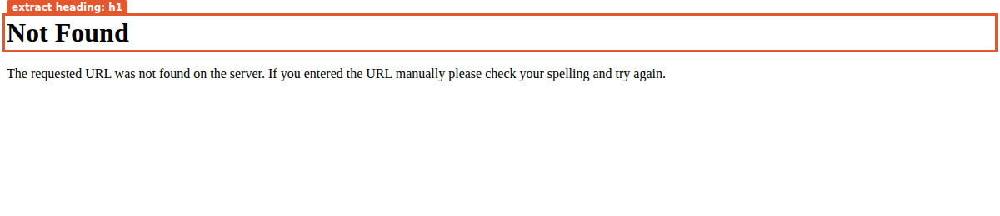
<!-- /capture -->

A `goto` fails on a response only when the recipe's block rule says it is a block (by default 403, 429 or an
AWS WAF challenge: [part 10](09-running.md#3-access-proxies-and-blocks)). A 408, 425, 429, 500, 502, 503 or
504, or a connection that fails in passing, is loaded again first, after a pause (the `↺` lines of a trace).
When the tries run out, the last answer is the page: a 503 error page loads like a 404 one, and a 429 counts
as a block. That is what a browser does, and a site's "not found" page is sometimes the data you want. When it
is not, check for an element the real page has.

A `request` is different: it is a data fetch, and a 4xx or 5xx fails it. The second recipe,
[`request-missing`](recipes/page-goto/request-missing.input.json), fetches the same missing page with a
`request` from the start page:

<!-- capture:page-goto summary -->
```text
goto-pages: 3 emitted, 0 rejected, 0 duplicates, 3 pages
request-missing: 0 emitted, 0 rejected, 0 duplicates, 2 pages, stopped: step steps.1 (request) failed: HTTP 404 for https://quotes.toscrape.com/does-not-exist
```
<!-- /capture -->

The run stopped at the `request`. The failed fetch still counts as a page (`2 pages`): the engine reports the
visit, with its status, before it fails the step.

Two more options change when `goto` returns. `waitUntil` picks the load event it waits for: `load` (the
default: the page and its images, scripts and stylesheets), `domcontentloaded` (the HTML parsed), `networkidle`
(no requests for 500 ms) or `commit` (the response started). `ready: { selector }` is for a site that sometimes
serves its shell without the content: the page is loaded again, up to `reloads` times (default 2), until the
element shows.

## `fill`, `press`, `click` and `wait`: a login

quotes.toscrape.com has a login form that accepts any name and password, and shows each author's Goodreads link
only to a logged-in visitor. The recipe [`login`](recipes/page-login/login.input.json) logs in, moves to page
2, and reads those links:

```json
{ "type": "goto", "url": "{{start.url}}" },
{ "type": "fill", "selector": "#username", "value": "{{vars.user}}" },
{ "type": "fill", "selector": "#password", "value": "{{vars.password}}" },
{ "type": "press", "selector": "#password", "key": "Enter" },
{ "type": "wait", "selector": "a[href='/logout']" },
{ "type": "click", "selector": "li.next a" },
{ "type": "wait", "selector": ".quote" },
{ "type": "screenshot", "path": "docs/assets/how-it-works/page-login-step.png" },
{ "type": "extract", "id": "quotes", "selector": ".quote", "kind": "css", "take": "html", "many": true },
{ "type": "forEach", "over": "quotes", "as": "quote", "emit": true, "steps": ["…text, author, goodreads…"] }
```

<!-- capture:page-login screenshot n=1 alt=The_login_form:_the_two_fields_filled,_and_the_button_Enter_submits -->
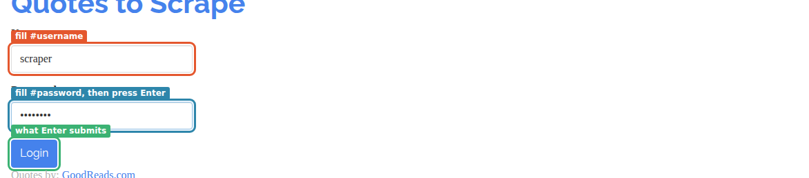
<!-- /capture -->

- **`fill`** finds the first element matching `selector`, waits until it can be typed into, clears it and sets
  the value (a template: `{{vars.user}}` becomes `scraper`). It fires the `input` event, as typing does, but it
  types nothing key by key; a widget that listens for key presses needs `press`.
- **`press`** sends one key (`Enter`, `Tab`, `ArrowDown`, `Control+a`) to the element, or to the page when the
  step has no `selector`. Enter in a form field submits the form, as it does for a person.
- **`wait`** here is what makes the next step safe. A `press` or a `click` returns once the navigation it
  started is under way (Playwright waits for the new page to commit), not once that page has loaded. Waiting for an element only the logged-in page has
  (the Logout link) proves the login worked, and fails the run with a clear timeout if it didn't.
- **`click`** clicks the first match, after Playwright checks it is visible, stable and not covered. The "Next"
  link navigates, so a `wait` follows it too.

<!-- capture:page-login screenshot n=2 alt=After_the_login:_the_Logout_link_the_wait_looks_for,_and_the_Goodreads_links -->
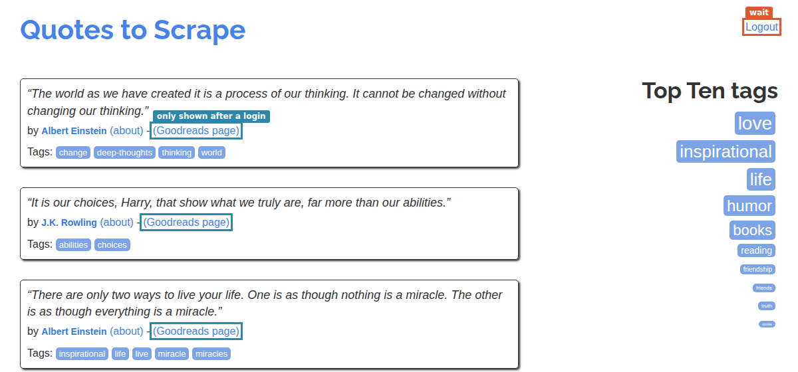
<!-- /capture -->

<!-- capture:page-login screenshot n=3 alt=The_link_the_click_follows -->
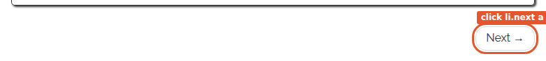
<!-- /capture -->

None of these steps binds a value, so the trace shows them without an id. There are three `⇢` lines: the
`goto`'s, then one for the navigation the key press caused (the form posts, and the site redirects to `/`) and one
for the click's (page 2). A navigation a `click`, `press` or `select` causes is followed like a `goto`: the engine
waits for its response and `load`, retries a failure in passing, applies the block rule, emits `page:visit` and
counts the page, so the run reports `3 pages`. Its `⇢` line comes before the step's own `·` line, which is written
when the step ends. `page.number` stays 1 throughout: only `paginate` moves it.

<!-- capture:page-login trace lines=12 grep=^(?!.*↺) -->
```text
▶ login (web)
  ⇄ access direct (direct)
  ⇢ page 1  https://quotes.toscrape.com/login
  · steps.0  goto  … ms
  · steps.1  fill  … ms
  · steps.2  fill  … ms
  ⇢ page 1  https://quotes.toscrape.com/
  · steps.3  press  … ms
  · steps.4  wait  … ms
  ⇢ page 1  https://quotes.toscrape.com/page/2/
  · steps.5  click  … ms
  · steps.6  wait  … ms
  …
```
<!-- /capture -->

The records carry the Goodreads links, and `page.url` followed the click to page 2 while `page.number` stayed 1:

<!-- capture:page-login records n=3 -->
```json
{"text":"“This life is what you make it. No matter what, you're going to mess up sometimes, it's a universal truth. But the good part is you get to decide how you're …","author":"Marilyn Monroe","goodreads":"http://goodreads.com/author/show/82952.Marilyn_Monroe","pageUrl":"https://quotes.toscrape.com/page/2/","page":1}
{"text":"“It takes a great deal of bravery to stand up to our enemies, but just as much to stand up to our friends.”","author":"J.K. Rowling","goodreads":"http://goodreads.com/author/show/1077326.J_K_Rowling","pageUrl":"https://quotes.toscrape.com/page/2/","page":1}
{"text":"“If you can't explain it to a six year old, you don't understand it yourself.”","author":"Albert Einstein","goodreads":"http://goodreads.com/author/show/9810.Albert_Einstein","pageUrl":"https://quotes.toscrape.com/page/2/","page":1}
```
<!-- /capture -->

`selector` in these steps is a CSS selector (Playwright also takes `text=…` and `xpath=…`). It is never a
template: a selector that depends on a value goes in `target` instead (`"target": "#row-{{item.id}}"`), which
also takes a live element from a `forEach` over `selector` ([authoring.md §3.7](../recipes/authoring.md#37-live-elements-driving-a-configurator)).
`click` with `optional: true` waits 2 s for the element and does nothing if it never shows: a cookie banner
that appears on some visits only.

A login usually belongs in `session.bootstrap` rather than in the steps: it runs once before the crawl, and an
`api` recipe can use the cookies it leaves ([part 10](09-running.md#2-sessions)). In the steps, as here, it runs
again for every start point.

## `click` with `download`: a file the page hands over

Some pages give their data as a file behind a button: "Export to Excel", "Download CSV". `click` with
`download` clicks, catches the file the browser receives, and reads it like a fetched document: CSV,
spreadsheet, PDF, Word, JSON and the rest, by `as` or by the file's name. The step's `id` binds the result,
and it becomes the current document.

None of the practice sites has an export button, so [`export`](recipes/page-download/export.input.json) makes
one: an `evaluate` puts a link on the page to a CSV of the ten quotes it shows (the script builds the file in
the page, and the link carries `download="quotes.csv"`). From there on, the recipe is what it would be on a site
with a real button:

```json
{ "type": "goto", "url": "{{start.url}}" },
{ "type": "evaluate", "id": "rowsWritten", "script": "(() => { …adds a#export, returns the row count… })()" },
{ "type": "click", "id": "export", "selector": "#export", "download": {} },
{ "type": "extract", "id": "table", "from": "export", "kind": "table", "selector": "^text author$",
  "columns": { "text": "^text$", "author": "^author$" } },
{ "type": "set", "id": "rows", "value": "{{table.rows}}" },
{ "type": "forEach", "over": "rows", "as": "row", "emit": true, "steps": [] }
```

<!-- capture:page-download screenshot alt=The_page_the_script_turns_into_a_CSV,_and_where_it_puts_the_link -->
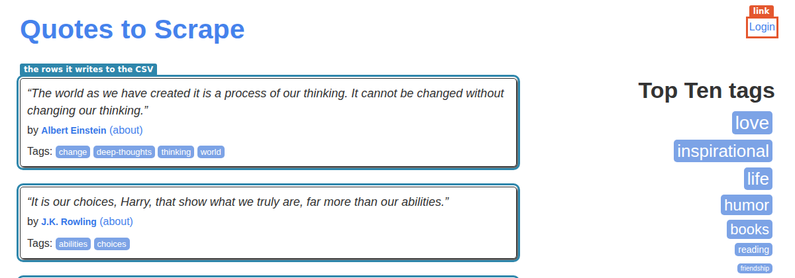
<!-- /capture -->

What the click bound: the CSV, read into a workbook with one sheet named after the file.

<!-- capture:page-download scope ids=rowsWritten,export -->
```json
{
  "rowsWritten": 10,
  "export": {
    "kind": "workbook",
    "sheets": [
      {
        "name": "quotes",
        "rows": [
          [
            "text",
            "author"
          ],
          [
            "“The world as we have created it is a process of our thinking. It cannot be changed without changing our thinking.”",
            "Albert Einstein"
          ],
          [
            "“It is our choices, Harry, that show what we truly are, far more than our abilities.”",
            "J.K. Rowling"
          ],
          "… 8 more"
        ]
      }
    ],
    "csv": {
      "encoding": "utf-8",
      "delimiter": ","
    }
  }
}
```
<!-- /capture -->

<!-- capture:page-download trace lines=9 -->
```text
▶ export (web)
  ⇄ access direct (direct)
  ⇢ page 1  https://quotes.toscrape.com/
  · steps.0  goto  … ms
  · steps.1  evaluate rowsWritten  … ms
  · steps.2  click export  … ms
  · steps.3  extract table  … ms
  · steps.4  set rows  … ms
  ✚ record ["“The world as we have created it is a process of our thinking. It cannot be changed without changing our thinking.”"]
  …
```
<!-- /capture -->

The `extract` has `from: "export"`, and it must. In web mode an `extract` without `from` reads the live page,
even right after a download, so a `table` extract would look for an HTML table on the quotes page. The
download is only read when named. `download.saveTo` (a template) keeps a copy of the file; `download.timeoutMs`
bounds the wait for it to start.

## `select`: a form that posts itself back

[quotes.toscrape.com/search.aspx](https://quotes.toscrape.com/search.aspx) works like an old ASP.NET form. The
author list has `onchange="__doPostBack()"`: picking an author submits the whole form, with a hidden
`__VIEWSTATE` field that carries the page's state, and the server answers with a new page whose tag list holds
that author's tags. Only then can a tag be picked and the search run.

<!-- capture:page-select screenshot n=1 alt=The_search_form:_an_author_list,_and_a_tag_list_with_no_tags_yet -->
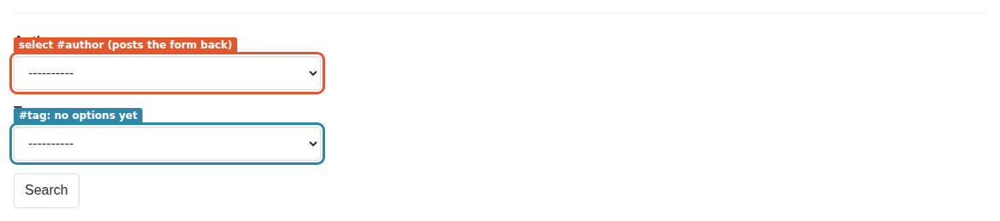
<!-- /capture -->

The recipe, [`search`](recipes/page-select/search.input.json):

```json
{ "type": "goto", "url": "{{start.url}}" },
{ "type": "select", "selector": "#author", "value": "{{vars.author}}" },
{ "type": "select", "selector": "#tag", "values": ["{{vars.tag}}"] },
{ "type": "click", "selector": "input[name=submit_button]" },
{ "type": "wait", "selector": ".results .quote" },
{ "type": "extract", "id": "quotes", "selector": ".results .quote", "kind": "css", "take": "html", "many": true },
{ "type": "forEach", "over": "quotes", "as": "quote", "emit": true, "steps": ["…text, author, tag…"] }
```

The two `select` steps take the two paths the step has:

- **One `value`, `label` or `index`** goes straight to Playwright's `selectOption`, which picks the option as
  a person does and fires `input` and `change`. The page's `change` handler posts the form back. The step does
  not wait for the new page.
- **`values`** (or `multiple`, `force`, `search`) resolves each wanted entry to an option first, by value, then
  by label, and **waits until every one exists**, checking every 250 ms, up to `timeoutMs`. That is what the
  tag list needs: its options arrive with the page the postback brings back. When the time is up, the step
  fails and names what matched nothing, with the first options it did find.

<!-- capture:page-select screenshot n=2 alt=After_the_postback:_the_author_kept,_and_the_author's_tags_in_the_tag_list -->
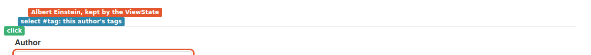
<!-- /capture -->

Each postback is a navigation to `/filter.aspx`, and after each step the engine re-reads the URL:

<!-- capture:page-select scope ids=page,text,author,tag -->
```json
{
  "page": {
    "url": "https://quotes.toscrape.com/filter.aspx",
    "number": 1
  },
  "text": "“There are only two ways to live your life. One is as though nothing is a miracle. The other is as though everything is a miracle.”",
  "author": "Albert Einstein",
  "tag": "life"
}
```
<!-- /capture -->

<!-- capture:page-select screenshot n=3 alt=The_results_the_search_returned,_which_the_wait_and_the_extract_read -->
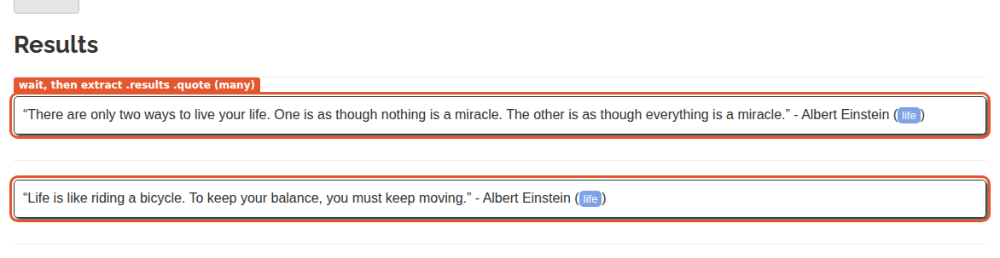
<!-- /capture -->

<!-- capture:page-select trace lines=9 -->
```text
▶ search (web)
  ⇄ access direct (direct)
  ⇢ page 1  https://quotes.toscrape.com/search.aspx
  · steps.0  goto  … ms
  ⇢ page 1  https://quotes.toscrape.com/filter.aspx
  · steps.1  select  … ms
  · steps.2  select  … ms
  ⇢ page 1  https://quotes.toscrape.com/filter.aspx
  · steps.3  click  … ms
  …
```
<!-- /capture -->

The browser carries the ViewState from page to page without the recipe seeing it, which is the reason to drive
this form in a browser at all. A `request` with `form` (web mode, [part 4](03-data-steps.md#a-form-post-from-a-web-page))
can post the same form from the page instead, ViewState included, when the result is easier to read as a
response than as the next page.

The other options, for pages that hide their `<select>`:

| Option | What it does |
|---|---|
| `values: ["a", "b"]`, `multiple: true` | Picks several; `multiple` adds to what is already chosen. An item that renders a list adds each element. |
| `force: true` | Sets the options on the element itself, visible or not, and fires `input` and `change`: a hidden `<select>` behind a widget built by a script. |
| `search: { input, open?, close? }` | Types each value missing from the options into the widget's search box, key by key, and picks it once the page lists it. |
| `clear: true` | `values` that render to nothing clear the control instead of leaving it alone. |
| `ignoreCase: true` | Matches values and labels without case. |

## `scroll`: infinite lists

[quotes.toscrape.com/scroll](https://quotes.toscrape.com/scroll) has no "next" link. It fetches ten quotes from
`/api/quotes?page=1` when it loads, and ten more each time the window reaches the bottom.

<!-- capture:page-scroll screenshot alt=The_infinite_scroll_page_with_its_first_ten_quotes -->
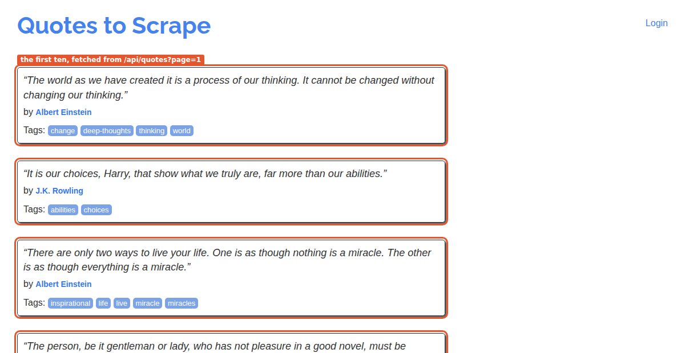
<!-- /capture -->

`scroll` moves the window to the bottom (`to: "bottom"`) or brings an element into view (`to: "<selector>"`),
`times` times (default 1). After each round it waits `settleMs` (default **300 ms**) and reads the page's
height. With `untilStable: true` it keeps going until the height stops changing: the page has nothing more to
add, or `maxScrolls` rounds (default 50) have run, which ends the step with a `warning` event rather than a
failure.

That wait is the whole of its patience. A page whose next batch takes longer to arrive looks finished, and
the step ends early. Two recipes on the same page:

- [`scroll-until-stable`](recipes/page-scroll/scroll-until-stable.input.json): `wait` for the first quote, then
  `scroll` with `untilStable`.
- [`scroll-and-wait`](recipes/page-scroll/scroll-and-wait.input.json): `scroll`, `wait` for the 11th quote,
  `scroll`, `wait` for the 21st. Each round waits for the batch it asked for, however long it takes.

<!-- capture:page-scroll summary -->
```text
scroll-and-wait: 30 emitted, 0 rejected, 0 duplicates, 1 pages
scroll-until-stable: 10 emitted, 0 rejected, 0 duplicates, 1 pages
```
<!-- /capture -->

<!-- capture:page-scroll trace grep=▶|■|✖|·_steps\.[0-9]+__ -->
```text
▶ scroll-and-wait (web)
  · steps.0  goto  … ms
  · steps.1  wait  … ms
  · steps.2  scroll  … ms
  · steps.3  wait  … ms
  · steps.4  scroll  … ms
  · steps.5  wait  … ms
  · steps.6  extract quotes  … ms
  · steps.7  forEach  … ms
■ scroll-and-wait: 30 emitted, 0 rejected, 0 duplicates, 1 pages, … ms
▶ scroll-until-stable (web)
  · steps.0  goto  … ms
  · steps.1  wait  … ms
  · steps.2  scroll  … ms
  · steps.3  extract quotes  … ms
  · steps.4  forEach  … ms
■ scroll-until-stable: 10 emitted, 0 rejected, 0 duplicates, 1 pages, … ms
```
<!-- /capture -->

On the network this guide was captured on, the API took longer than 300 ms to answer, so `untilStable` saw
the same height twice and stopped before the second batch arrived. On a fast connection it may read further.
That is the point: `untilStable` measures the page, not the site's API, and the result depends on how fast the
site answers. When the count matters, pair each `scroll` with a `wait` for what it should bring, as the second
recipe does. Two more details:

- The first `wait` matters too. Right after `goto`, the first batch may still be on its way; a page shorter than
  the window cannot scroll, so the scroll fires no event and nothing more loads.
- On a slow site, raise `settleMs`. On a list that never ends, `maxScrolls` is what stops the step
  (`limits.timeoutMs` does not apply to `scroll`); set it to the number of batches you want.

A page like this one always has an API behind it. Reading `/api/quotes?page=N` with `request` and
`paginate` ([part 5](04-flow-steps.md)) is faster and gets every quote; scroll when the API is out of reach.

## `wait`

`wait` does one or more of three things, in this order, each only if given: `selector` waits for an element to
be **visible**, `ms` sleeps, `state: "networkidle"` waits until the page has made no request for 500 ms.
`timeoutMs` bounds the first and the last.

[quotes.toscrape.com/js](https://quotes.toscrape.com/js/) builds its quotes with a script that runs while the
page loads; [/js-delayed](https://quotes.toscrape.com/js-delayed/) runs the same script ten seconds later.
Three recipes read the first quote right after `goto`, two of them without a `wait`:

| Recipe | Page | Steps |
|---|---|---|
| [`js-no-wait`](recipes/page-wait/js-no-wait.input.json) | `/js/` | `goto`, `extract` |
| [`delayed-no-wait`](recipes/page-wait/delayed-no-wait.input.json) | `/js-delayed/` | `goto`, `extract` |
| [`delayed-wait`](recipes/page-wait/delayed-wait.input.json) | `/js-delayed/` | `goto`, `wait` for `.quote` (up to 15 s), `extract` |

<!-- capture:page-wait screenshot n=1 alt=js-delayed_when_goto_returns:_the_page_has_loaded,_the_quotes_have_not -->
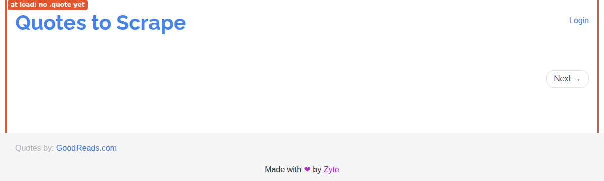
<!-- /capture -->

<!-- capture:page-wait screenshot n=2 alt=js-delayed_ten_seconds_later,_when_the_wait_returns -->
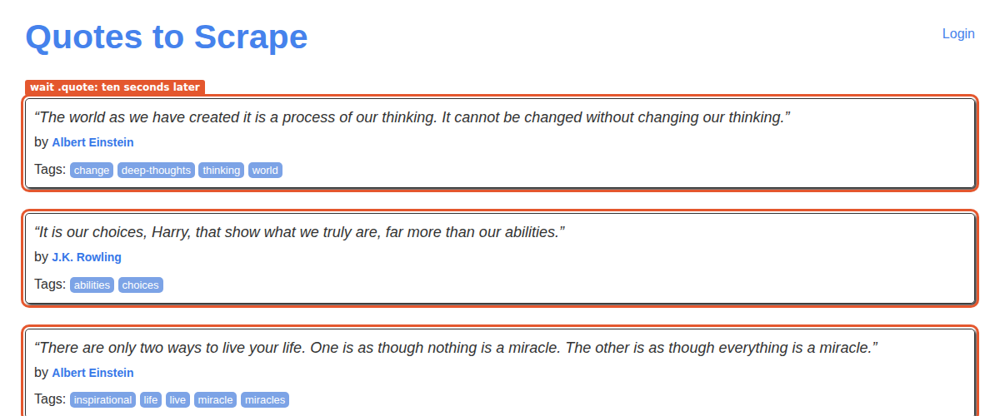
<!-- /capture -->

<!-- capture:page-wait summary -->
```text
delayed-no-wait: 0 emitted, 0 rejected, 0 duplicates, 1 pages, stopped: step steps.1 (extract) failed: no match for .quote .text
delayed-wait: 2 emitted, 0 rejected, 0 duplicates, 1 pages
js-no-wait: 2 emitted, 0 rejected, 0 duplicates, 1 pages
```
<!-- /capture -->

<!-- capture:page-wait trace grep=▶|■|✖|·_steps\.[0-9]+__ -->
```text
▶ delayed-no-wait (web)
  · steps.0  goto  … ms
  ✖ step steps.1 (extract) failed: no match for .quote .text
■ delayed-no-wait: 0 emitted, 0 rejected, 0 duplicates, 1 pages, … ms
  ✖ stopped: step steps.1 (extract) failed: no match for .quote .text
▶ delayed-wait (web)
  · steps.0  goto  … ms
  · steps.1  wait  … ms
  · steps.2  extract first  … ms
  · steps.3  extract quotes  … ms
  · steps.4  forEach  … ms
■ delayed-wait: 2 emitted, 0 rejected, 0 duplicates, 1 pages, … ms
▶ js-no-wait (web)
  · steps.0  goto  … ms
  · steps.1  extract first  … ms
  · steps.2  extract quotes  … ms
  · steps.3  forEach  … ms
■ js-no-wait: 2 emitted, 0 rejected, 0 duplicates, 1 pages, … ms
```
<!-- /capture -->

`goto` waits for the `load` event: the HTML, scripts and stylesheets. On `/js/` the quotes are written while
the page is parsed, so they are there when `goto` returns. On `/js-delayed/` the load event comes ten seconds
before the quotes, so the `extract` right after `goto` found nothing and failed. With the `wait`, the same
`extract` ran once the first quote showed.

Waiting for the element you are about to read is the reliable form. `ms` is a guess that is either too long or
too short; `networkidle` fails on pages that poll or stream forever. `goto` with `ready` covers the other
case: a page that sometimes never shows the element, and needs loading again.

## `screenshot`

`screenshot` saves the whole page (`fullPage`, not just the window) as a PNG at `path`, a template, relative to
the directory the crawler runs in. It binds nothing and changes nothing: it is for seeing what the browser saw
when a recipe misbehaves. The `login` recipe takes one after its `wait` for `.quote`:

<p align="center">
  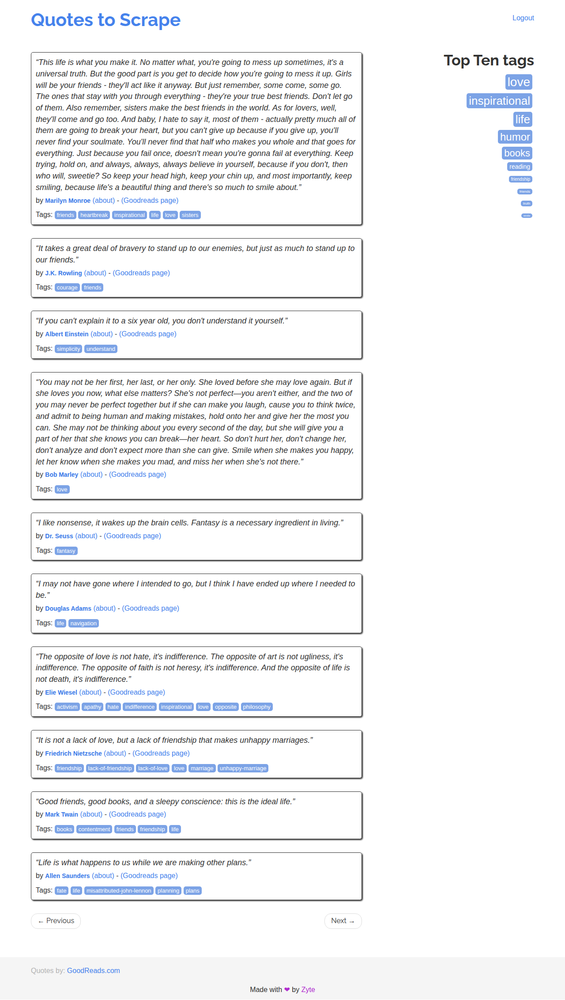
</p>

## `evaluate`

`evaluate` runs JavaScript in the page and binds what it returns under its `id`. The result must be
JSON-serialisable: numbers, strings, lists and plain objects, not DOM elements or functions. A promise is
awaited.

[quotes.toscrape.com/js](https://quotes.toscrape.com/js/) writes its quotes from a variable in one of its
scripts, `var data = [ … ]`. `data` holds the same quotes as objects, with what the markup leaves out: each
author's slug and Goodreads path. The recipe [`js-data`](recipes/page-evaluate/js-data.input.json) reads the
variable instead of the markup:

```json
{ "type": "goto", "url": "{{start.url}}" },
{ "type": "evaluate", "id": "total", "script": "data.length" },
{ "type": "evaluate", "id": "quotes", "script": "(options) => data.slice(0, options.count)",
  "args": { "count": "{{vars.count}}" } },
{ "type": "forEach", "over": "quotes", "as": "quote", "emit": true, "steps": [] }
```

<!-- capture:page-evaluate screenshot alt=The_quotes_the_page_wrote_from_its_data_variable -->
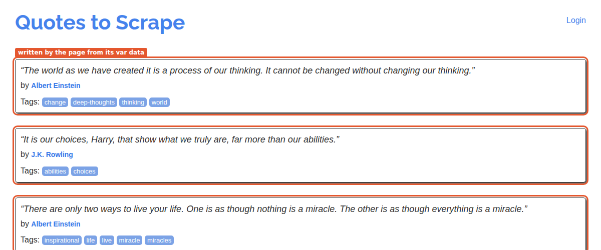
<!-- /capture -->

<!-- capture:page-evaluate scope ids=total,quote -->
```json
{
  "total": 10,
  "quote": {
    "tags": [
      "change",
      "deep-thoughts",
      "thinking",
      "world"
    ],
    "author": {
      "name": "Albert Einstein",
      "goodreads_link": "/author/show/9810.Albert_Einstein",
      "slug": "Albert-Einstein"
    },
    "text": "“The world as we have created it is a process of our thinking. It cannot be changed without changing our thinking.”"
  }
}
```
<!-- /capture -->

<!-- capture:page-evaluate trace lines=6 -->
```text
▶ js-data (web)
  ⇄ access direct (direct)
  ⇢ page 1  https://quotes.toscrape.com/js/
  · steps.0  goto  … ms
  · steps.1  evaluate total  … ms
  · steps.2  evaluate quotes  … ms
  …
```
<!-- /capture -->

The two forms:

- **Without `args`**, `script` is an expression, evaluated as it is: `data.length` gives `10`.
- **With `args`**, `script` is a function, called with `args` after its templates are rendered. A string that is
  one placeholder keeps its type: `"{{vars.count}}"` passes the number `3`, not `"3"`.

The mapping then reads the objects directly: `quote.author.name`, `quote.tags`. No selector touched the markup.

`script` is rendered as a template **before** it runs, so a literal `{{` in the JavaScript is read as a
placeholder. Put such values in `args`. And `evaluate` runs whatever the recipe says in the page, with the
page's cookies: run it only from recipes you trust.

## `captcha`

A captcha is a challenge a site puts between a visitor and the page. OpenCraw does not solve captchas itself:
it finds them, hands them to a **solver** you register with the crawler (`captchaSolvers`), checks the page
afterwards, retries, and caps what a run spends. Solving one can break a site's terms; read
[captcha.md](../recipes/captcha.md) first.

Three places start a solve, all in web mode:

- **`session.captcha`**: after every `goto`, every page `paginate` opens, every `click` and every `press`, the
  engine looks for a visible challenge (reCAPTCHA, hCaptcha, Cloudflare Turnstile) and solves it before the next
  step. Not after `fill`, `select` or `evaluate`, which rarely bring one up.
- **`onBlock.solve`**: a page the block rule calls a block, which shows a challenge, is solved on the spot.
- **The `captcha` step**: at one known point, such as a login form. It also detects reCAPTCHA v3, which has no
  widget, and a page with no challenge is fine: the step does nothing. With `image`, `field` and `submit`, it
  handles a picture captcha checked when its form is posted.

Each challenge gets 3 attempts by default, 120 s each, and a run gets 10 solves in all. The loop and its events
(`⚿`, `✓`, `✗` in a trace) are in [part 10](09-running.md#5-captchas).

This guide solves no real captcha. [`examples/captcha-solver`](../../examples/captcha-solver) is a working
solver for a paid service, with a demo that runs the whole loop on your machine: a local page with a
reCAPTCHA-shaped challenge and a fake solving API, so nothing leaves the machine.

## Summary: what each step leaves behind

| Step | Binds under `id` | Changes |
|---|---|---|
| `goto` | nothing | `page.url` (the final URL); emits `page:visit` (`⇢`) |
| `click` | nothing; with `download`, the file | `page.url` if it navigated, and then a `page:visit` (`⇢`), checked like a `goto`'s; with `download`, the current document |
| `press`, `select` | nothing | as `click`, without the download |
| `fill`, `scroll`, `wait` | nothing | `page.url` if the page navigated |
| `screenshot` | nothing | a file at `path` |
| `evaluate` | the script's result | whatever the script does to the page |
| `captcha` | nothing | the page, once solved |

Every one of them runs on the recipe's single tab, and after every one of them `page.url` is the tab's URL.
`page.number` belongs to `paginate`.

Next: [4. Data steps](03-data-steps.md), where the values come from.
