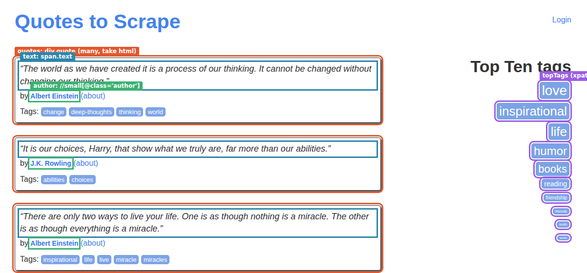
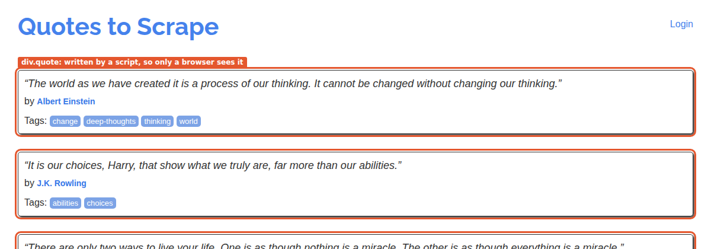
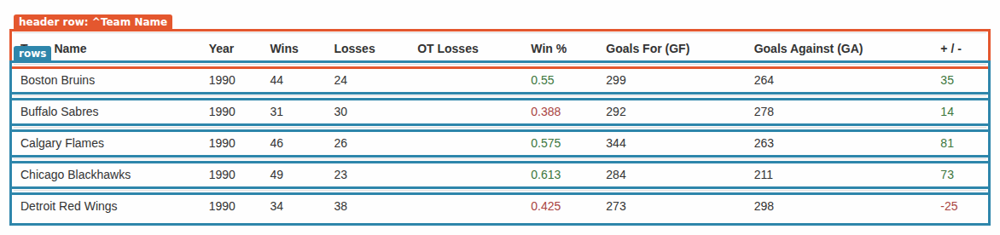
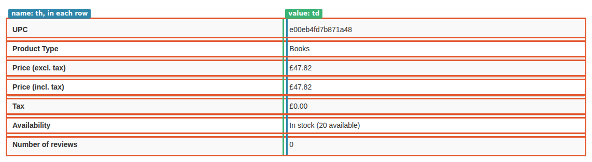
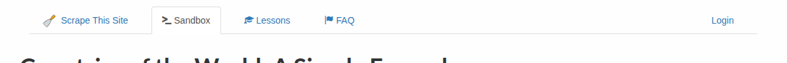
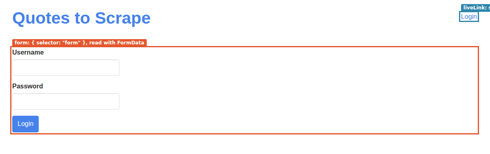

<p align="center">
  
</p>

# Data steps

[← How OpenCraw works](README.md) · Next: [5. Flow steps](04-flow-steps.md)

Four steps produce values: `extract` reads one out of a page or a document, `request` fetches a document,
`set` computes one from what is already in scope, and `hook` asks your own code for one. Each binds its result
under its `id` in the scope it runs in (inside a `forEach`, that is the iteration's scope). This page follows
each of them on a real page or a real API: what the selector matches, what the step binds, and the edge cases
that make a value come out different from what you expected.

[authoring.md §3.2–3.3](../recipes/authoring.md#32-requests-http) and
[§4](../recipes/authoring.md#4-extract-in-depth) are the reference for every key named here.

## Which engine reads: the live page or a document

`extract` has two engines behind it, and which one runs depends on the mode, on `from`, and on the `kind`:

| Mode | `from` | `kind` | What is read, and by what |
|---|---|---|---|
| web | none | `css`, `xpath` | The live page, through Playwright locators: one `evaluateAll` round trip for every match. |
| web | none | `regex` | The live page's serialised DOM (`page.content()`): the HTML after scripts ran, not what the server sent. |
| web | none | `table` | The same serialised DOM, through the HTML table reader. |
| web | none | `jsonpath` | Never the page: the JSON the last `request` fetched (see [request](#request-fetching-a-document)). |
| web | an id | any | The value bound to that id, read statically, as in api mode. |
| api | none | any | The current document: the body of the nearest `request`. |
| api | an id | any | The value bound to that id. |

"Statically" means [cheerio](https://cheerio.js.org) for `css`, `xpath` over an XML DOM for `xpath`, and
jsonpath-plus for `jsonpath`. The two engines agree on plain CSS, but not on everything:

| | Playwright (live page) | cheerio (fetched HTML, fragments) |
|---|---|---|
| What it sees | The DOM after scripts ran | The HTML as the server sent it |
| `:has-text("…")`, `:visible`, `>>` chaining | Work | Fail: `Unknown pseudo-class :has-text` |
| `:contains("…")` | Fails: `is not a valid selector` | Works |
| `:has()`, attribute selectors, combinators | Work | Work |
| `take: "html"` | `element.getHTML()` | cheerio's `.html()` |
| `take: "value"` | The live `.value` property (what was typed) | `val()`, else the `value` attribute |
| Waiting for elements | None: `evaluateAll` reads what is there now | Not applicable |

Neither engine waits. A web `extract` that runs before a script has drawn its elements gets nothing: a single
extract fails, a `many` extract binds `[]`. Put a `wait` (or `goto` with `ready`) before it
([part 3](02-page-steps.md)).

## `extract` on a web page: CSS and XPath

The recipe [`quotes-web`](recipes/data-quotes-web/quotes-web.input.json) opens
[quotes.toscrape.com](https://quotes.toscrape.com), then reads the page in three ways:

```json
{ "type": "extract", "id": "topTags", "selector": "//div[contains(@class, 'tags-box')]//a[@class='tag']", "kind": "xpath", "many": true },
{ "type": "extract", "id": "einstein", "selector": "div.quote:has-text(\"Albert Einstein\") span.text", "kind": "css", "many": true },
{ "type": "extract", "id": "quotes", "selector": "div.quote", "kind": "css", "take": "html", "many": true },
{ "type": "forEach", "over": "quotes", "as": "quote", "emit": true, "steps": [
  { "type": "extract", "id": "text", "from": "quote", "selector": "span.text", "kind": "css" },
  { "type": "extract", "id": "author", "from": "quote", "selector": "//small[@class='author']", "kind": "xpath" },
  { "type": "extract", "id": "tags", "from": "quote", "selector": "a.tag", "kind": "css", "many": true },
  …
]}
```

<!-- capture:data-quotes-web screenshot alt=quotes.toscrape.com,_with_what_each_extract_selects -->

<!-- /capture -->

The first three extracts have no `from`, so they run on the live page. `topTags` is XPath through Playwright's
`xpath=` engine. `einstein` uses `:has-text()`, a Playwright extension to CSS: it keeps the quotes whose box
contains the text, and it would fail in cheerio. `quotes` takes each `div.quote` as its inner HTML, one string
per quote. Inside the loop every extract has `from: "quote"`, so it reads that string with cheerio, and the XPath
`//small[@class='author']` runs over the fragment alone: `//` means "anywhere in this quote", not "anywhere in
the page". For the first quote:

<!-- capture:data-quotes-web scope ids=topTags,einstein,text,author,about,tags -->
```json
{
  "topTags": [
    "love",
    "inspirational",
    "life",
    "… 7 more"
  ],
  "einstein": [
    "“The world as we have created it is a process of our thinking. It cannot be changed without changing our thinking.”",
    "“There are only two ways to live your life. One is as though nothing is a miracle. The other is as though everything is a miracle.”",
    "“Try not to become a man of success. Rather become a man of value.”"
  ],
  "text": "“The world as we have created it is a process of our thinking. It cannot be changed without changing our thinking.”",
  "author": "Albert Einstein",
  "about": "/author/Albert-Einstein",
  "tags": [
    "change",
    "deep-thoughts",
    "thinking",
    "world"
  ]
}
```
<!-- /capture -->

### What `take` returns

The same element, `a.tag` in the first quote (`<a class="tag" href="/tag/change/page/1/">change</a>`), taken
five ways:

<!-- capture:data-quotes-web scope ids=tagText,tagHtml,tagOuter,tagHref,tagTitle -->
```json
{
  "tagText": "change",
  "tagHtml": "change",
  "tagOuter": "<a class=\"tag\" href=\"/tag/change/page/1/\">change</a>",
  "tagHref": "/tag/change/page/1/"
}
```
<!-- /capture -->

| `take` | Gives | Use it for |
|---|---|---|
| `text` (default) | The text content, whitespace collapsed: `change` | Almost everything. |
| `html` | The inner HTML: here also `change`, since the link has no markup inside | A block you will `extract` from again with `from`. |
| `json` | The outer HTML, the element itself | An element whose information sits on its own attributes (`<li title="…">`), read again later. |
| `attr:href` | The attribute as written: a relative `/tag/change/page/1/` | Links (make them absolute with the `absoluteUrl` transform, [part 8](07-mapping-and-transforms.md)). |
| `attr:title` | Nothing: the link has no `title` | |

`tagTitle` isn't in the scope at all. A missing attribute is not a failed match: the element matched, its value
is `undefined`, and the mapping treats it as missing, under its missing-value policy ([part 9](08-policies.md)).
Only an element that isn't there fails the step (see [no match](#one-or-many-and-no-match)).

## JSONPath: reading JSON

The recipe [`quotes-api`](recipes/data-api-quotes/quotes-api.input.json) runs in api mode against
`https://quotes.toscrape.com/api/quotes?page=1`. The `request` binds the parsed response under `list`, and it
becomes the current document. The response, as the scope holds it (lists cut to three items):

<!-- capture:data-api-quotes scope ids=list -->
```json
{
  "list": {
    "has_next": true,
    "page": 1,
    "quotes": [
      {
        "author": {
          "goodreads_link": "/author/show/9810.Albert_Einstein",
          "name": "Albert Einstein",
          "slug": "Albert-Einstein"
        },
        "tags": [
          "change",
          "deep-thoughts",
          "thinking",
          "world"
        ],
        "text": "“The world as we have created it is a process of our thinking. It cannot be changed without changing our thinking.”"
      },
      {
        "author": {
          "goodreads_link": "/author/show/1077326.J_K_Rowling",
          "name": "J.K. Rowling",
          "slug": "J-K-Rowling"
        },
        "tags": [
          "abilities",
          "choices"
        ],
        "text": "“It is our choices, Harry, that show what we truly are, far more than our abilities.”"
      },
      {
        "author": {
          "goodreads_link": "/author/show/9810.Albert_Einstein",
          "name": "Albert Einstein",
          "slug": "Albert-Einstein"
        },
        "tags": [
          "inspirational",
          "life",
          "live",
          "… 2 more"
        ],
        "text": "“There are only two ways to live your life. One is as though nothing is a miracle. The other is as though everything is a miracle.”"
      },
      "… 7 more"
    ],
    "tag": null,
    "top_ten_tags": [
      [
        "love",
        14
      ],
      [
        "inspirational",
        13
      ],
      [
        "life",
        13
      ],
      "… 7 more"
    ]
  }
}
```
<!-- /capture -->

JSONPath (the [jsonpath-plus](https://github.com/JSONPath-Plus/JSONPath) dialect) always yields a list of nodes.
What `take` does with each node is the part that surprises people:

```json
{ "type": "extract", "id": "hasNext", "selector": "$.has_next", "kind": "jsonpath" },
{ "type": "extract", "id": "hasNextData", "selector": "$.has_next", "kind": "jsonpath", "take": "json" },
{ "type": "extract", "id": "authorTexts", "selector": "$.quotes[*].author", "kind": "jsonpath", "many": true },
{ "type": "extract", "id": "authorNames", "from": "authorTexts", "selector": "$[*].name", "kind": "jsonpath", "take": "json", "many": true }
```

<!-- capture:data-api-quotes scope ids=hasNext,hasNextData,authorTexts,authorNames -->
```json
{
  "hasNext": "true",
  "hasNextData": true,
  "authorTexts": [
    "{\"goodreads_link\":\"/author/show/9810.Albert_Einstein\",\"name\":\"Albert Einstein\",\"slug\":\"Albert-Einstein\"}",
    "{\"goodreads_link\":\"/author/show/1077326.J_K_Rowling\",\"name\":\"J.K. Rowling\",\"slug\":\"J-K-Rowling\"}",
    "{\"goodreads_link\":\"/author/show/9810.Albert_Einstein\",\"name\":\"Albert Einstein\",\"slug\":\"Albert-Einstein\"}",
    "… 7 more"
  ],
  "authorNames": [
    "Albert Einstein",
    "J.K. Rowling",
    "Albert Einstein",
    "… 7 more"
  ]
}
```
<!-- /capture -->

- **The default `take: "text"` turns every node into text.** `$.has_next` is the boolean `true` in the response,
  but `hasNext` holds the string `"true"`. An object becomes its JSON text: each item of `authorTexts` is a
  string, not an object. A `null` node becomes `undefined`.
- **`take: "json"` keeps the node as it is**: `hasNextData` is a real boolean, and a `$.quotes[*]` extract with
  `take: "json"` gives objects you can loop over and read paths from (`{{quote.author.name}}`).
- **A list of texts is read as JSON.** `authorNames` reads `from: "authorTexts"`, a list of strings. For
  `jsonpath`, the engine parses every string that is JSON, drops the ones that aren't, and runs the path over
  the array of results, so `$[*].name` finds every name. A single string is parsed the same way.

That last rule exists for JSON-LD. A page usually has several `<script type="application/ld+json">` blocks,
and the one you want is not always the first. Take them all as text, then query across them:

```json
{ "type": "extract", "id": "ld", "selector": "script[type=\"application/ld+json\"]", "kind": "css", "many": true },
{ "type": "extract", "id": "name", "from": "ld", "selector": "$[?(@['@type']=='Product')].name", "kind": "jsonpath" }
```

The parser also unwraps what sites wrap their JSON in: CDATA and comment guards, `)]}'` prefixes, JSONP
callbacks, `window.__STATE__ = {…};` assignments. Nothing is evaluated: what is left must be strict JSON
([authoring §4.1](../recipes/authoring.md#41-which-document)).

Inside the loop, `from: "quote"` reads a bound object directly, with no parsing:

<!-- capture:data-api-quotes scope ids=text,author,authorData,tags -->
```json
{
  "text": "“The world as we have created it is a process of our thinking. It cannot be changed without changing our thinking.”",
  "author": "{\"goodreads_link\":\"/author/show/9810.Albert_Einstein\",\"name\":\"Albert Einstein\",\"slug\":\"Albert-Einstein\"}",
  "authorData": {
    "goodreads_link": "/author/show/9810.Albert_Einstein",
    "name": "Albert Einstein",
    "slug": "Albert-Einstein"
  },
  "tags": [
    "change",
    "deep-thoughts",
    "thinking",
    "world"
  ]
}
```
<!-- /capture -->

`author` and `authorData` use the same path, `$.author`. Only the `take` differs. The mapping reads
`authorData.name`; `author.name` would find nothing, because `author` is a string.

JSONPath reads JSON, and a PDF, a workbook or a deck as data ([part 7](06-documents.md)). On an HTML, text or
XML document it fails at once with `jsonpath needs a JSON document; the current document is html`.

## Regex: values that live in scripts

[quotes.toscrape.com/js](https://quotes.toscrape.com/js/) looks like the home page in a browser, but the quotes
are drawn by a script from a `var data = [...]` literal in the page.

<!-- capture:data-regex-js screenshot alt=The_/js/_page_in_a_browser:_every_quote_is_drawn_by_a_script -->

<!-- /capture -->

The recipe [`quotes-js`](recipes/data-regex-js/quotes-js.input.json) fetches it in api mode, with no browser:

```json
{ "type": "request", "id": "html", "url": "{{start.url}}" },
{ "type": "extract", "id": "rendered", "selector": "div.quote", "kind": "css", "take": "html", "many": true },
{ "type": "extract", "id": "names", "selector": "\"name\": \"([^\"]+)\"", "kind": "regex", "many": true },
{ "type": "extract", "id": "firstName", "selector": "\"name\": \"[^\"]+\"", "kind": "regex" },
{ "type": "extract", "id": "data", "selector": "var data = (\\[.*?\\]);\\s*for", "kind": "regex" },
{ "type": "extract", "id": "quotes", "from": "data", "selector": "$[*]", "kind": "jsonpath", "take": "json", "many": true }
```

<!-- capture:data-regex-js scope ids=rendered,names,firstName -->
```json
{
  "rendered": [],
  "names": [
    "Albert Einstein",
    "J.K. Rowling",
    "Albert Einstein",
    "… 7 more"
  ],
  "firstName": "\"name\": \"Albert Einstein\""
}
```
<!-- /capture -->

- `rendered` is empty. The server sends no `div.quote`: only a browser running the script makes them. The same
  CSS extract in web mode would find ten.
- A regex extract returns **capture group 1** when the pattern has one, and the whole match otherwise.
  `names` has a group, so it holds the names. `firstName` has none, so it holds the whole `"name": "…"` text.
  Only group 1 is ever returned: to pick another part, make it the first group.
- `names` is raw text from the script. Its seventh name (cut from the scope above) is `Andr\u00e9 Gide`,
  the JSON escape as written in the page: a regex never decodes anything.
- The flags are fixed at `g` and `s`: every match is found, and `.` matches line breaks. There is no option for
  other flags, so to ignore case write both cases, as in `[Pp]rice`. `take` is ignored.

The `data` extract uses the `s` flag: `\[.*?\]` spans the sixty lines of the literal. What it binds is text, and
a `jsonpath` extract with `from: "data"` parses it. The two records, with `André` decoded this time:

<!-- capture:data-regex-js records n=2 -->
```json
{"text":"“The world as we have created it is a process of our thinking. It cannot be changed without changing our thinking.”","author":"Albert Einstein","tags":["change","deep-thoughts","thinking","world"]}
{"text":"“It is our choices, Harry, that show what we truly are, far more than our abilities.”","author":"J.K. Rowling","tags":["abilities","choices"]}
```
<!-- /capture -->

A regex reads any document as text: HTML and XML as markup, JSON re-serialised, a PDF's or a workbook's text, a
list of strings joined by line breaks. In web mode without `from`, it reads `page.content()`, which includes the
elements the script drew.

## Tables, in outline

`kind: "table"` reads tables rather than elements: the `selector` is a case-insensitive regular expression for
the header row, and the result is one object per table found, with its rows keyed by column. On an HTML page it
reads every `<table>`; [part 7](06-documents.md) covers how, and how PDFs, spreadsheets and decks are read into
the same shape. The recipe [`hockey-table`](recipes/data-table/hockey-table.input.json) reads
[scrapethissite.com's hockey table](https://www.scrapethissite.com/pages/forms/?per_page=5):

```json
{ "type": "extract", "id": "table", "selector": "^Team Name", "kind": "table", "columns": { "team": "^Team Name$", "year": "^Year$", "wins": "^Wins$", "losses": "^Losses$", "otLosses": "^OT Losses$" } },
{ "type": "set", "id": "rows", "value": "{{table.rows}}" },
{ "type": "forEach", "over": "rows", "as": "row", "emit": true, "steps": [] }
```

<!-- capture:data-table screenshot alt=The_hockey_table:_the_header_row_the_selector_matches,_and_the_rows -->

<!-- /capture -->

<!-- capture:data-table scope ids=table,row -->
```json
{
  "table": {
    "sheet": "table 1",
    "title": "Team Name",
    "header": [
      "Team Name",
      "Year",
      "Wins",
      "… 6 more"
    ],
    "rows": [
      {
        "team": "Boston Bruins",
        "year": "1990",
        "wins": "44",
        "losses": "24",
        "otLosses": ""
      },
      {
        "team": "Buffalo Sabres",
        "year": "1990",
        "wins": "31",
        "losses": "30",
        "otLosses": ""
      },
      {
        "team": "Calgary Flames",
        "year": "1990",
        "wins": "46",
        "losses": "26",
        "otLosses": ""
      },
      "… 2 more"
    ]
  },
  "row": {
    "team": "Boston Bruins",
    "year": "1990",
    "wins": "44",
    "losses": "24",
    "otLosses": ""
  }
}
```
<!-- /capture -->

`columns` renames the columns it names and drops the rest (`Win %`, `Goals For (GF)`…). Cells are text:
`"1990"` becomes the integer `1990` only when the mapping coerces it into an `integer` field. The `set` is
there because `forEach` loops over one id, not a path ([part 5](04-flow-steps.md#foreach)).

## One or many, and no match

| | `many: true` | Without `many` |
|---|---|---|
| Matches | The list of every value, in document order | The first value |
| No match | `[]`, and the step succeeds | The step fails: `no match for <selector>` |
| A match whose value is missing (an absent attribute, a JSON `null` with `take: "text"`) | `undefined` in the list | The id holds `undefined`, which the mapping treats as missing; the step succeeds |

A failing extract goes through its error policy: the step's `onError`, else the recipe's, else `fail`. Page 3
of [quotes.toscrape.com's API](https://quotes.toscrape.com/api/quotes?page=3) has a quote with no tags, and a
recipe reading `$.tags[0]` with `onError: { "policy": "skip" }` goes past it:

<!-- capture:flow-onerror-skip trace grep=↷|✚_record_\["“It_is_impossible lines=2 -->
```text
    ↷ steps.2.steps.1  extract firstTag  skipped: no match for $.tags[0]
  ✚ record ["“It is impossible to live without failing at something, unless you live so cautiously that you might as well not have lived at all - in which case, you fail by default.”"]
```
<!-- /capture -->

The skipped extract leaves `firstTag` unbound for that quote alone, and the mapping's missing-value policy
decides what the record gets (`null` here). Without the `skip`, the same miss stops the whole recipe, and a
`skip` on the enclosing `forEach` does not help: [part 5](04-flow-steps.md#error-policies) shows both.

Two idioms follow from the table. To test whether something is there, use `many: true` and test the list
(`{{ len(wall) > 0 }}`): it never fails. To say a value is optional, use `onError: skip` on a single extract:
the step's miss is then visible in the trace as `↷`, which a `many` extract never shows.

## `from` and fragments

`from` names an id to read instead of the page or the current document. The usual pattern: take each repeating
block as HTML with `many: true`, loop over the blocks, and read each one with `from`. What the id holds decides
how it's read:

| The id holds | `css` | `xpath` | `jsonpath` | `regex` |
|---|---|---|---|---|
| Text starting with `<!doctype` or `<html` | A full document | XML if well-formed, else HTML parsed as a browser would | The text parsed as JSON | The text |
| Other text (a fragment) | A fragment | XML if well-formed, else HTML wrapped in one root | The text parsed as JSON | The text |
| A list of texts | Fails | Fails | Every text that parses as JSON, as one array | The texts joined by line breaks |
| Data (an object, a list of objects) | Fails: `is not HTML text; use kind "jsonpath" for data` | Fails: `is not markup` | The data | The data as JSON text |

A read PDF, workbook, deck or XML document bound to an id is read as [part 7](06-documents.md) describes, and
`table` reads those, and HTML text too: with `from` bound to a page a `request` fetched, a Word or Markdown
document, or a list of fragments taken with `take: "html"`, it reads their `<table>`s.

The fragment row matters for table rows and list items. The recipe
[`book-specs`](recipes/data-fragments/book-specs.input.json) reads the product table of a
[books.toscrape.com book](https://books.toscrape.com/catalogue/sharp-objects_997/index.html), one `tr` at a time:

```json
{ "type": "extract", "id": "rows", "selector": "table.table-striped tr", "kind": "css", "take": "html", "many": true },
{ "type": "forEach", "over": "rows", "as": "row", "emit": true, "steps": [
  { "type": "extract", "id": "name", "from": "row", "selector": "th", "kind": "css" },
  { "type": "extract", "id": "value", "from": "row", "selector": "td", "kind": "css" },
  { "type": "extract", "id": "valueByXpath", "from": "row", "selector": "//td", "kind": "xpath" }
]}
```

<!-- capture:data-fragments screenshot alt=The_product_table:_each_row_is_one_fragment -->

<!-- /capture -->

<!-- capture:data-fragments scope ids=row,name,value,valueByXpath -->
```json
{
  "row": "\n            <th>UPC</th><td>e00eb4fd7b871a48</td>\n        ",
  "name": "UPC",
  "value": "e00eb4fd7b871a48",
  "valueByXpath": "e00eb4fd7b871a48"
}
```
<!-- /capture -->

`row` is `<th>UPC</th><td>…</td>` with no `<table>` or `<tr>` around it. An HTML5 parser given that as a
document drops the cells, because a `<td>` outside a table is invalid: `td` would match nothing. The engine
parses any text that doesn't start with `<!doctype` or `<html` as a fragment, which keeps the cells as they are.
XPath does the equivalent: markup that isn't well-formed XML is parsed as HTML and wrapped in a single
`<fragment>` root, so `//td` finds the cell. The same holds for `<li>`, `<option>` and `<dt>`/`<dd>` blocks.

<!-- capture:data-fragments records n=4 -->
```json
{"book":"Sharp Objects","name":"UPC","value":"e00eb4fd7b871a48"}
{"book":"Sharp Objects","name":"Product Type","value":"Books"}
{"book":"Sharp Objects","name":"Price (excl. tax)","value":"£47.82"}
{"book":"Sharp Objects","name":"Price (incl. tax)","value":"£47.82"}
```
<!-- /capture -->

### The wrapper trap, and shifted fields

A selector that matches a wrapper instead of the item gives one block per wrapper, and "the first X" in that
block is the first item's X. [scrapethissite.com's country list](https://www.scrapethissite.com/pages/simple/)
lays out its 250 countries in rows of three. The recipe
[`countries-by-row`](recipes/data-wrapper-trap/countries-by-row.input.json) takes the grid rows as its items:

```json
{ "type": "extract", "id": "countries", "selector": "div.country", "kind": "css", "take": "html", "many": true },
{ "type": "extract", "id": "rows", "selector": "div.row:has(div.country)", "kind": "css", "take": "html", "many": true },
{ "type": "forEach", "over": "rows", "as": "row", "emit": true, "steps": [
  { "type": "extract", "id": "name", "from": "row", "selector": "h3.country-name", "kind": "css" },
  { "type": "extract", "id": "capital", "from": "row", "selector": ".country-capital", "kind": "css" },
  { "type": "extract", "id": "population", "from": "row", "selector": ".country-population", "kind": "css", "many": true }
]}
```

<!-- capture:data-wrapper-trap screenshot alt=Each_grid_row_is_one_match:_a_wrapper_of_three_countries -->

<!-- /capture -->

<!-- capture:data-wrapper-trap scope ids=counts,name,capital,population -->
```json
{
  "counts": {
    "rows": 84,
    "countries": 250
  },
  "name": "Andorra",
  "capital": "Andorra la Vella",
  "population": [
    "84000",
    "4975593",
    "29121286"
  ]
}
```
<!-- /capture -->

84 records instead of 250, and nothing failed. Each record is right about its first country (Andorra, Andorra
la Vella) and silently drops the other two, and the `many` extract collects all three populations. Now suppose
the first country of a row had no capital. A single `.country-capital` extract would still match, the second
country's capital, and the record would pair Andorra with the wrong city: a **shifted field**, with no error
anywhere. That is what nested markup (a table inside a table, a list inside a list) does when the outer element
is selected: its inner HTML holds every inner item.

The fix is to select the innermost repeating element (`div.country` here, `table.inner tr` rather than `tr`) and
to compare the number of items with what the page shows. `counts` in the scope above is that check.

## `request`: fetching a document

`request` sends an HTTP request and makes the response **the current document** of the scope it runs in. In api
mode it's how every document arrives. In web mode it goes through the page's own session (see
[the form section](#a-form-post-from-a-web-page)).

The recipe [`pokeapi-species`](recipes/data-request/pokeapi-species.input.json) lists three Pokémon from
[PokeAPI](https://pokeapi.co), then fetches each one's species:

```json
{ "type": "request", "id": "list", "url": "{{start.url}}", "query": { "limit": "{{vars.limit}}", "offset": "0" } },
{ "type": "extract", "id": "results", "selector": "$.results[*]", "kind": "jsonpath", "take": "json", "many": true },
{ "type": "forEach", "over": "results", "as": "mon", "emit": true, "steps": [
  { "type": "request", "id": "species", "url": "/api/v2/pokemon-species/{{mon.name}}/", "as": "json" },
  { "type": "extract", "id": "genus", "selector": "$.genera[?(@.language.name=='en')].genus", "kind": "jsonpath" },
  { "type": "extract", "id": "color", "selector": "$.color.name", "kind": "jsonpath" },
  { "type": "extract", "id": "captureRate", "selector": "$.capture_rate", "kind": "jsonpath", "take": "json" }
]}
```

<!-- capture:data-request trace lines=11 -->
```text
▶ pokeapi-species (api)
  ⇄ access direct (direct)
  ⇢ page 1  https://pokeapi.co/api/v2/pokemon?limit=3&offset=0
  · steps.0  request list  … ms
  · steps.1  extract results  … ms
  ⇢ page 1  https://pokeapi.co/api/v2/pokemon-species/bulbasaur/
    · steps.2.steps.0  request species  … ms
    · steps.2.steps.1  extract genus  … ms
    · steps.2.steps.2  extract color  … ms
    · steps.2.steps.3  extract captureRate  … ms
  ✚ record ["bulbasaur"]
  …
```
<!-- /capture -->

Step by step, for the first `request` and then inside the loop:

1. **Templates.** `url`, every `query` value and every header are rendered as text: `{{vars.limit}}` (the number
   `3`) becomes `limit=3`, added to the URL. A `body` is rendered all the way down instead: every string in an
   object or a list is a template, and a string that is exactly one placeholder keeps its type, so
   `"limit": "{{vars.limit}}"` sends the number `3`. An object or list body is sent as JSON, and a request with
   a body defaults to `POST` (without one, `GET`).
2. **The URL is resolved against the current page.** `/api/v2/pokemon-species/bulbasaur/` has no host: it is
   resolved against `page.url`, which the first request set to
   `https://pokeapi.co/api/v2/pokemon?limit=3&offset=0`. A relative URL with no page to resolve against fails
   with `is not a URL and no page is known to resolve it against`.
3. **The response is read** by `as` when given (`json`, `html`, `text`, `xml`, `csv`, `pdf`…), else by its
   content type. [Part 7](06-documents.md) covers the document formats.
4. **The status is checked.** A 4xx or 5xx fails the step with `HTTP 404 for <url>`. Before that, statuses
   408, 425, 429, 500, 502, 503 and 504, and dropped connections, are retried with backoff (`limits.retry`,
   [part 10](09-running.md)). A `goto` is different: a 404 page loads like any other.
5. **The scope's page changes**: `page.url` becomes the final URL (after redirects) and the parsed body becomes
   the current document, in the scope the step ran in. Here that's each iteration's scope, so `genus`, `color`
   and `captureRate` read the species with no `from`, and the list is untouched for the next iteration.
6. **The id holds the body**: parsed JSON as data, HTML and text as strings, a PDF, workbook, deck or XML
   document as the read object.

<!-- capture:data-request scope ids=list,page,mon,genus,color,captureRate -->
```json
{
  "list": {
    "count": 1351,
    "next": "https://pokeapi.co/api/v2/pokemon?offset=3&limit=3",
    "previous": null,
    "results": [
      {
        "name": "bulbasaur",
        "url": "https://pokeapi.co/api/v2/pokemon/1/"
      },
      {
        "name": "ivysaur",
        "url": "https://pokeapi.co/api/v2/pokemon/2/"
      },
      {
        "name": "venusaur",
        "url": "https://pokeapi.co/api/v2/pokemon/3/"
      }
    ]
  },
  "page": {
    "url": "https://pokeapi.co/api/v2/pokemon-species/bulbasaur/",
    "number": 1
  },
  "mon": {
    "name": "bulbasaur",
    "url": "https://pokeapi.co/api/v2/pokemon/1/"
  },
  "genus": "Seed Pokémon",
  "color": "green",
  "captureRate": 45
}
```
<!-- /capture -->

`list` is the whole first response; `page.url` is the species URL of this iteration. The trace shows every
`request` as a `⇢ page 1` line: `request` reports a visit, but only `paginate` advances `page.number`.

A failing status, from a recipe that asks PokeAPI for a Pokémon that doesn't exist (the retries are its
`onError`, [part 5](04-flow-steps.md#error-policies)):

<!-- capture:flow-onerror-retry trace grep=⇢|✖_step lines=4 -->
```text
  ⇢ page 1  https://pokeapi.co/api/v2/pokemon/missingno  [404]
  ⇢ page 1  https://pokeapi.co/api/v2/pokemon/missingno  [404]
  ⇢ page 1  https://pokeapi.co/api/v2/pokemon/missingno  [404]
  ✖ step steps.0 (request) failed: HTTP 404 for https://pokeapi.co/api/v2/pokemon/missingno
```
<!-- /capture -->

### A form post from a web page

In web mode, `request` is sent through the page's browser context: it carries the page's cookies (a login, a
consent, a solved captcha), the way the page's own scripts call its endpoints. `form` reads a form on the page
and posts it as the browser would. The recipe [`quotes-login`](recipes/data-form/quotes-login.input.json) logs
in to [quotes.toscrape.com/login](https://quotes.toscrape.com/login), which accepts any name and password:

```json
{ "type": "goto", "url": "{{start.url}}" },
{ "type": "request", "id": "home", "url": "/login", "method": "POST", "as": "html",
  "form": { "selector": "form", "set": { "username": "{{vars.user}}", "password": "{{vars.password}}" } } },
{ "type": "extract", "id": "liveLink", "selector": "div.header-box p a", "kind": "css" },
{ "type": "extract", "id": "fetchedLink", "from": "home", "selector": "div.header-box p a", "kind": "css" }
```

<!-- capture:data-form screenshot alt=The_login_form_the_request_reads,_and_the_header_link -->

<!-- /capture -->

<!-- capture:data-form scope ids=liveLink,fetchedLink,page -->
```json
{
  "liveLink": "Login",
  "fetchedLink": "Logout",
  "page": {
    "url": "https://quotes.toscrape.com/login",
    "number": 1
  }
}
```
<!-- /capture -->

- The form is read with the browser's `FormData`, so the hidden `csrf_token` goes along with it, and the session
  cookie the `goto` got makes the token valid. `set` adds or replaces fields (as templates); the form's own
  values are sent as read, never rendered.
- The server answers with a redirect to `/`, followed, and the logged-in home page is the response: `home`
  holds it, and its header says **Logout**.
- The browser tab never moved. `page.url` is still `/login`, and an extract without `from` reads the live page,
  whose header still says **Login**. In web mode, `css`, `xpath`, `regex` and `table` without `from` always read
  the live page: read a fetched document with `from: <request id>`, `table` included. Only `jsonpath` reads the
  fetched JSON directly.

`form` is refused in api mode, since there is no page to read it from: send the fields as a `body` there.

## `set`: computing a value

`set` binds `value` under its `id`, rendered all the way down like a request body. From the
[`quotes-api`](recipes/data-api-quotes/quotes-api.input.json) recipe:

```json
{ "type": "set", "id": "summary", "value": {
  "page": "{{list.page}}", "quotes": "{{ len(list.quotes) }}", "label": "page {{list.page}}, {{ len(list.quotes) }} quotes",
  "more": "{{list.has_next}}", "firstTwo": ["{{authorNames[0]}}", "{{authorNames[1]}}"] } }
```

<!-- capture:data-api-quotes scope ids=summary -->
```json
{
  "summary": {
    "page": 1,
    "quotes": 10,
    "label": "page 1, 10 quotes",
    "more": true,
    "firstTwo": [
      "Albert Einstein",
      "J.K. Rowling"
    ]
  }
}
```
<!-- /capture -->

A string that is exactly one placeholder keeps the value's type: `page` and `quotes` are numbers, `more` is the
boolean. A placeholder inside longer text is stringified: `label` is text. Numbers, booleans and `null` in the
`value` stay as they are. A `set` without an `id` does nothing.

`set` is also how a path becomes an id (`forEach` loops over one id), how an empty list is prepared for
`collect` ([part 5](04-flow-steps.md#cross-page-accumulation)), and how a lookup table is written into the
recipe (`starWords` in [the overview](README.md#a-run-end-to-end)). [Part 6](05-templates-and-scope.md) covers
the expression language.

## `hook`: asking your code

A `hook` step calls a function registered with the crawler and binds what it returns. This page's scenes
([`03-data-and-flow.mjs`](capture/scenes/03-data-and-flow.mjs)) register one for
[`quotes-api`](recipes/data-api-quotes/quotes-api.input.json):

```js
createCrawler({ hooks: { wordCount: (_input, args) => String(args.text ?? '').split(/\s+/).filter(Boolean).length } })
```

```json
{ "type": "hook", "id": "words", "name": "wordCount", "args": { "text": "{{text}}" } }
```

<!-- capture:data-api-quotes scope ids=text,words -->
```json
{
  "text": "“The world as we have created it is a process of our thinking. It cannot be changed without changing our thinking.”",
  "words": 21
}
```
<!-- /capture -->

- From a step, the hook's first argument (`input`) is `undefined`; from a `hook` transform in the mapping, it is
  the value being transformed.
- `args` is rendered like `set`'s value before the call.
- The third argument carries `recipeId`, a snapshot of the scope, and `log(level, message)`: an `error` log
  becomes an `error` event, anything else a `warning`, both in the trace.
- The result, awaited if it's a promise, is bound as it is: a number stays a number.
- A name nobody registered fails at the call, not at load time, with the list of registered hooks.

[authoring §6](../recipes/authoring.md#6-hooks) shows how the CLI and the MCP server load hooks from a module.

## The route through the steps

The trace of `quotes-api`, the recipe of the `set`, `hook` and JSONPath examples above: the `request`, the
five top-level extracts and the `set` run once, then the loop body runs once per quote until
`limits.maxRecords` (2) stops it.

<!-- capture:data-api-quotes trace lines=24 -->
```text
▶ quotes-api (api)
  ⇄ access direct (direct)
  ⇢ page 1  https://quotes.toscrape.com/api/quotes?page=1
  · steps.0  request list  … ms
  · steps.1  extract hasNext  … ms
  · steps.2  extract hasNextData  … ms
  · steps.3  extract authorTexts  … ms
  · steps.4  extract authorNames  … ms
  · steps.5  set summary  … ms
  · steps.6  extract quotes  … ms
    · steps.7.steps.0  extract text  … ms
    · steps.7.steps.1  extract author  … ms
    · steps.7.steps.2  extract authorData  … ms
    · steps.7.steps.3  extract tags  … ms
    · steps.7.steps.4  hook words  … ms
  ✚ record ["“The world as we have created it is a process of our thinking. It cannot be changed without changing our thinking.”"]
    · steps.7.steps.0  extract text  … ms
    · steps.7.steps.1  extract author  … ms
    · steps.7.steps.2  extract authorData  … ms
    · steps.7.steps.3  extract tags  … ms
    · steps.7.steps.4  hook words  … ms
  ✚ record ["“It is our choices, Harry, that show what we truly are, far more than our abilities.”"]
  · steps.7  forEach  … ms
■ quotes-api: 2 emitted, 0 rejected, 0 duplicates, 1 pages, … ms
```
<!-- /capture -->

Next: [5. Flow steps](04-flow-steps.md).
