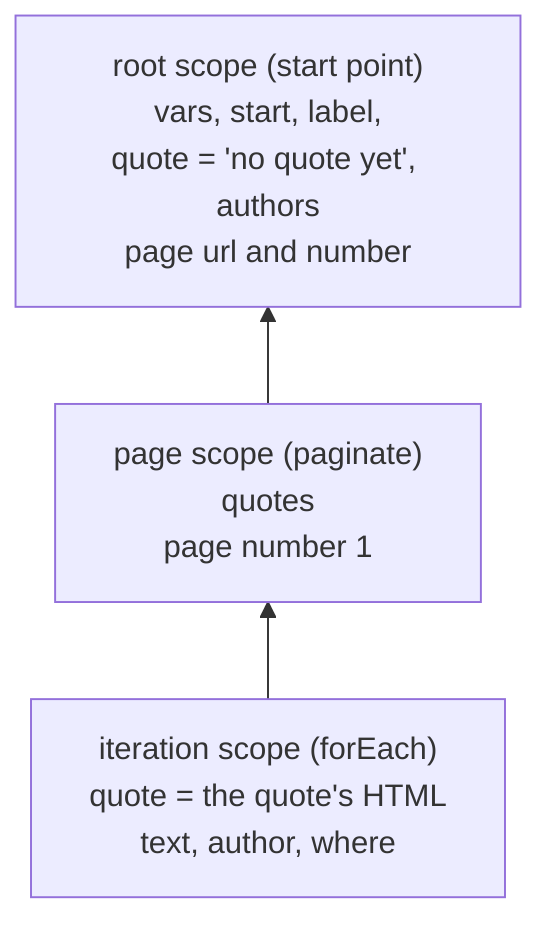

<p align="center">
  
</p>

# Templates and scope

[← How OpenCraw works](README.md) · Previous: [5. Flow steps](04-flow-steps.md) · Next: [7. Documents, under the hood](06-documents.md)

Every step that has an `id` stores its result under that name, and every later step reads it by name: in a
`{{ }}` template, in `from`, in `over`. Where those names live is the **scope**, and which names a step can see
depends on where the step sits in the recipe. This page follows the scope through a real run (loops, pages,
shadowing, what an emit takes with it), then the `{{ }}` language that reads it, with the values it produced,
and the three traps that catch most people.

[authoring.md §3.4–3.5](../recipes/authoring.md#34-templates) is the reference.

## What a step can see: the scope chain

A scope is a set of names with values, plus a link to its parent. Reading a name looks in the scope, then its
parent, then its parent's parent, up to the root. Writing a name (a step's `id`) always writes in the scope the
step runs in. A scope can also hold **page state**: the current URL, the page number, and the document an
`extract` reads when it has no `from`.

Each start point gets a fresh **root scope** holding `vars`, `start` (`{ url }`) and the page state
`{ url: start.url, number: 1 }`. Two steps open child scopes:

- `forEach` opens a new child scope for **each iteration**, and binds the item under its `as` name there;
- `paginate` opens a new child scope for **each page**, with the page number set there.

When the iteration or the page ends, its scope is dropped, with everything bound in it. `if` doesn't open a
scope: both branches run in the scope the `if` is in, so an id bound in a branch is still there after it.

### A real chain

The scene [`scope-chain`](recipes/scope-chain/books-tag.input.json) reads the quotes tagged "books" on
[quotes.toscrape.com](https://quotes.toscrape.com) (two pages) in a browser, and emits one record per quote,
then one more at the very end, outside every loop:

```json
"vars": { "tag": "books" },
"start": [{ "url": "https://quotes.toscrape.com/" }],
"steps": [
  { "type": "goto", "url": "{{start.url}}tag/{{vars.tag}}/" },
  { "type": "set", "id": "label", "value": "outside the loop" },
  { "type": "set", "id": "quote", "value": "no quote yet" },
  { "type": "set", "id": "authors", "value": [] },
  { "type": "paginate", "next": { "selector": "li.next a" }, "maxPages": 3, "steps": [
    { "type": "extract", "id": "quotes", "selector": "div.quote", "kind": "css", "take": "html", "many": true },
    { "type": "forEach", "over": "quotes", "as": "quote", "emit": true, "steps": [
      { "type": "extract", "id": "text", "from": "quote", "selector": ".text", "kind": "css" },
      { "type": "extract", "id": "author", "from": "quote", "selector": ".author", "kind": "css" },
      { "type": "set", "id": "where", "value": "{{author}}, page {{page.number}}" },
      { "type": "collect", "into": "authors", "value": "{{author}}" }
    ]}
  ]},
  { "type": "emit" }
]
```

While the first quote's iteration runs, the chain has three scopes:



The emit hands the mapping a **snapshot** of the chain: every name visible from the iteration, the nearest
binding of each, plus `page` as `{ url, number }`. For the first quote:

<!-- capture:scope-chain scope ids=text,author,where,quote,label,authors,page,start,vars record=0 -->
```json
{
  "text": "“The person, be it gentleman or lady, who has not pleasure in a good novel, must be intolerably stupid.”",
  "author": "Jane Austen",
  "where": "Jane Austen, page 1",
  "quote": "\n        <span class=\"text\" itemprop=\"text\">“The person, be it gentleman or lady, who has not pleasure in a good novel, must be intolerably stupid.”</span>\n …",
  "label": "outside the loop",
  "authors": [
    "Jane Austen"
  ],
  "page": {
    "url": "https://quotes.toscrape.com/tag/books/",
    "number": 1
  },
  "start": {
    "url": "https://quotes.toscrape.com/"
  },
  "vars": {
    "tag": "books"
  }
}
```
<!-- /capture -->

`text`, `author` and `where` come from the iteration scope, `label` and `authors` from the root, two levels up.
`quote` is the loop's item, the HTML fragment, not the root's `"no quote yet"` (more on that
[below](#shadowing)). `page.url` is the tag page the `goto` opened: `start.url` stays the URL the start point
gave.

The first quote on page 2, the run's 11th record:

<!-- capture:scope-chain scope ids=where,authors,page record=10 -->
```json
{
  "where": "George R.R. Martin, page 2",
  "authors": [
    "Jane Austen",
    "Mark Twain",
    "Jorge Luis Borges",
    "… 8 more"
  ],
  "page": {
    "url": "https://quotes.toscrape.com/tag/books/page/2/",
    "number": 2
  }
}
```
<!-- /capture -->

Page 1's iterations and page 1's scope are gone by now: nothing extracted there is visible on page 2. The
exception is `authors`. `collect` doesn't write in the scope it runs in: it appends to the list wherever that list
is bound, here in the root, which lives as long as the start point. That's how a value survives its loop: `set`
an empty list before the loop, `collect` into it inside.

And the last record, emitted by the top-level `emit` after `paginate` finished:

<!-- capture:scope-chain scope ids=text,author,where,quote,label,authors,page record=11 -->
```json
{
  "quote": "no quote yet",
  "label": "outside the loop",
  "authors": [
    "Jane Austen",
    "Mark Twain",
    "Jorge Luis Borges",
    "… 8 more"
  ],
  "page": {
    "url": "https://quotes.toscrape.com/tag/books/page/2/",
    "number": 2
  }
}
```
<!-- /capture -->

`text`, `author` and `where` aren't in it at all: they died with their iterations. The mapping reads them as
missing, so the record has `null` for them. `quote` is the root's value again. And `page` is page 2: when
`paginate` moves to the next page it records the new URL and number on the scope it runs in (here the root), so
after the loop the root's page state is the last page, and steps after a `paginate` run against it.

### Shadowing

A child binding with the same name as a parent's hides the parent's value, for the child's lifetime only. You
can't do it with a step `id`: binding checks refuse a second step that binds a name already bound on the same
path. Renaming the loop's `where` to `label` in the recipe above gives, from `loadRecipeSet` in a small Node
script:

```text
RecipeBindingError: recipes do not bind
  books-tag steps.4.steps.1.steps.2: id "label" is already bound on this path
```

So in a valid recipe, shadowing comes from three places:

- a `forEach`'s `as`, which binding doesn't check against outer names: here `as: "quote"` hides the root's
  `quote` in every iteration, and the root's value is back after the loop (the two snapshots above);
- a pagination cursor (`next: { jsonpath, as }`), bound in each next page's scope;
- page state: a `goto` or a `request` inside a loop records its URL (and document) in the iteration's scope, so
  the iteration sees the new page while the listing's page state, one level up, stays as it was for the next
  page's click.

Loop names deserve care for the same reason: a `forEach` over tags with `as: "item"` inside a `forEach` over
products with `as: "item"` hides the product. The record sees only the tag.

### What `emit` takes

- The snapshot is taken **at the emit**, synchronously. What the steps do afterwards doesn't change it.
- `collect` doesn't change a list in place: it binds a new, longer list. So each record keeps the list as it was
  at its own emit. The `seen` field counts `authors` in each record:

<!-- capture:scope-chain records n=3 -->
```json
{"text":"“The person, be it gentleman or lady, who has not pleasure in a good novel, must be intolerably stupid.”","author":"Jane Austen","where":"Jane Austen, page 1","label":"outside the loop","page":1,"seen":1}
{"text":"“Good friends, good books, and a sleepy conscience: this is the ideal life.”","author":"Mark Twain","where":"Mark Twain, page 1","label":"outside the loop","page":1,"seen":2}
{"text":"“I have always imagined that Paradise will be a kind of library.”","author":"Jorge Luis Borges","where":"Jorge Luis Borges, page 1","label":"outside the loop","page":1,"seen":3}
```
<!-- /capture -->

- `page` in the snapshot is `{ url, number }` only. The current document isn't in it; bind what you need with an
  `extract` first.
- `forEach` with `emit: true` snapshots each iteration's scope after its body ran. An `emit` step snapshots the
  scope it's in.

### `page`, `start`, `vars`, `item`

| Name | What it holds | Where it comes from |
|---|---|---|
| `page` | `{ url, number }` of the nearest page state up the chain | the start point, then every navigation. In web mode, `page.url` is the browser's real URL after every step (after redirects and clicks too). In api mode, the final URL of the nearest `request`. `number` starts at 1 and only `paginate` moves it. |
| `start` | `{ url }` of the start point | fixed for the start point's whole run |
| `vars` | the recipe's `vars`, overridden by the matrix or worker item's, overridden by the start point's own | fixed for the start point's whole run |
| `item` | nothing special | the usual `as` name of a `forEach`. In a mapping `each` rule, `from` paths are read inside each list item instead. |

`page`, `start` and `vars` can't be used as step ids. They're the names every recipe can read without binding
them.

## The `{{ }}` language

A template is a string with `{{ }}` placeholders. What's between the braces is either a **path** (`item.author.name`)
or an **expression** (`len(item.tags) > 3`). Nothing in it runs code: there's no method call, no assignment, and a
path only reads a value's own data.

The scene [`scope-templates`](recipes/scope-templates/template-probe.input.json) reads page 1 of the quotes JSON
API and, for the first quote, `set`s one id per template. Each `set` renders its value in the scope, so each
result below is a real rendered value from that snapshot. The inputs, for reference: `vars` is
`{ "offset": "1", "tag": "thinking" }`, and the first quote is

```json
{ "author": { "goodreads_link": "/author/show/9810.Albert_Einstein", "name": "Albert Einstein", "slug": "Albert-Einstein" },
  "tags": ["change", "deep-thoughts", "thinking", "world"],
  "text": "“The world as we have created it is a process of our thinking. It cannot be changed without changing our thinking.”" }
```

### Where templates are read

Not every string in a recipe is a template, and not every template gives the same kind of value:

| Kind | Where | Result |
|---|---|---|
| Typed | `set` and `collect` values, a `request` `body`, `hook` and `evaluate` `args` (every string inside, however nested); `when`, `if.test`, `paginate.until`; a `target` | a lone placeholder gives its value with its type; anything else gives text |
| Text | URLs (`goto`, `request`, `next.url`), `fill` values, headers, query values, `extract.selector`, `forEach.selector`, `screenshot.path`, `evaluate.script`, `saveTo` | always text |
| Not a template | `from`, `over`, `each`, `into` (they're paths or ids); the `selector` of `click`, `fill`, `press`, `select`, `wait` and `goto.ready` | the loader refuses a `{{` in those selectors: use `target` |

In a mapping, the `template` transform renders against the record's snapshot ([part 8](07-mapping-and-transforms.md)).

### Paths

A path is dot-separated names, with `[n]` for list positions: `item.author.name`, `item.tags[0]`. Its first name
is looked up up the scope chain; the rest walks into the value. A segment that isn't there gives *missing*, never
an error. Only a value's own data is read: `constructor`, `__proto__` and `toString` are missing, and so is
`.length` of a text (a list's `length` works; for text use `len()`).

### A lone placeholder keeps its type

When the whole string is one placeholder, the result is the value itself: a list stays a list, a number a number.
As soon as there's any other text around it, every placeholder is turned into text: missing as `""`, lists and
objects as JSON.

```json
{ "type": "set", "id": "quotes",     "value": "{{response.quotes}}" },
{ "type": "set", "id": "count",      "value": "{{ len(quotes) }}" },
{ "type": "set", "id": "countText",  "value": "{{ len(quotes) }} quotes on page {{page.number}}" },
{ "type": "set", "id": "tags",       "value": "{{item.tags}}" },
{ "type": "set", "id": "tagsInText", "value": "tags: {{item.tags}}" },
{ "type": "set", "id": "card",       "value": { "who": "{{item.author.name}}", "tagCount": "{{ len(item.tags) }}", "first": "{{ item.tags[0] }}" } }
```

<!-- capture:scope-templates scope ids=count,countText,tags,tagsInText,card -->
```json
{
  "count": 10,
  "countText": "10 quotes on page 1",
  "tags": [
    "change",
    "deep-thoughts",
    "thinking",
    "world"
  ],
  "tagsInText": "tags: [\"change\",\"deep-thoughts\",\"thinking\",\"world\"]",
  "card": {
    "who": "Albert Einstein",
    "tagCount": 4,
    "first": "change"
  }
}
```
<!-- /capture -->

`quotes` (left out above for length) holds the API's list of ten quotes as data, which is why the next step can
loop over it: `over` takes an id, not a path, so `{{response.quotes}}` is bound to an id first. `count` is the number `10`; `countText` is text.
Inside `card`, every string was rendered on its own, so `tagCount` is the number `4`, not `"4"`.

### Expressions and functions

A placeholder that isn't a plain path is parsed as an expression: literals (`12`, `'text'`, `true`, `null`),
`+ - * / %`, comparisons, `&& || !`, `??`, `test ? a : b`, and a closed set of functions (`upper`, `lower`, `trim`,
`len`, `default`, `round`, `number`, `join`, `first`, `last`, `replace`, `contains`, `split`, `urlEncode`, `entries`,
`keys`, `values`). An unknown function is an error when the step runs, listing the known ones.

```json
{ "type": "set", "id": "tagLine",  "value": "{{ join(item.tags, ', ') }}" },
{ "type": "set", "id": "firstTag", "value": "{{ first(item.tags) }}" },
{ "type": "set", "id": "hasTag",   "value": "{{ contains(item.tags, vars.tag) }}" },
{ "type": "set", "id": "words",    "value": "{{ len(split(item.text, ' ')) }}" },
{ "type": "set", "id": "size",     "value": "{{ len(item.text) > 100 ? 'long' : 'short' }}" },
{ "type": "set", "id": "shout",    "value": "{{ upper(item.author.name) }}" },
{ "type": "set", "id": "search",   "value": "https://quotes.toscrape.com/search.aspx?author={{ urlEncode(item.author.name) }}" }
```

<!-- capture:scope-templates scope ids=tagLine,firstTag,hasTag,words,size,shout,search -->
```json
{
  "tagLine": "change, deep-thoughts, thinking, world",
  "firstTag": "change",
  "hasTag": true,
  "words": 21,
  "size": "long",
  "shout": "ALBERT EINSTEIN",
  "search": "https://quotes.toscrape.com/search.aspx?author=Albert%20Einstein"
}
```
<!-- /capture -->

How the operators treat values:

- `&&` and `||` return one of their operands, not a boolean, and test it with recipe truthiness (below).
  `a ?? b` gives `b` only when `a` is missing or `null`.
- `==` and `!=` are loose: `3 == '3'` is true, and so is `null == ` a missing value. Objects compare by content.
- `- * / %` read numeric text as numbers. A value that isn't a number gives *missing*, and so does dividing by 0.
- `<` and friends compare as numbers when both sides are numbers, else as text.
- `split` trims every piece and drops blank ones, so `split('', ',')` is `[]`.
- Strings have no escapes: a string ends at the next quote of the same kind.
- Placeholders can't contain `{` or `}`. Expressions are capped at 512 tokens and 64 levels of nesting.

**Truthiness**, for `when`, `if.test`, `paginate.until`, `!`, `&&`, `||` and `? :`: `false`, `0`, `null`, missing,
an empty list, and the texts `""`, `"false"`, `"0"`, `"null"` and `"undefined"` (trimmed, any case) are false.
Everything else is true, including `{}` and `" no "`.

### Missing values

A path that isn't there is *missing*, and a missing value is never an error. Alone, it's `undefined`; in text,
it's `""`:

```json
{ "type": "set", "id": "bornText",    "value": "born: {{item.author.born}}" },
{ "type": "set", "id": "bornOr",      "value": "{{ item.author.born ?? 'unknown' }}" },
{ "type": "set", "id": "bornDefault", "value": "{{ default(item.author.born, 'unknown') }}" }
```

<!-- capture:scope-templates scope ids=bornText,bornOr,bornDefault -->
```json
{
  "bornText": "born: ",
  "bornOr": "unknown",
  "bornDefault": "unknown"
}
```
<!-- /capture -->

The API has no `born` field, so `bornText` ends in nothing. `??` falls back on missing or `null`; `default()` also
falls back on `""`. Choose `default()` for text a page might leave empty.

That silence has consequences outside `set`:

- a URL template that renders to `""` resolves to the current page: `goto "{{link}}"` with no `link` loads the
  current page again instead of failing. In `paginate`, a `next.url` that renders to `""` ends the pagination, which is
  deliberate;
- `if` and `when` treat missing as false;
- a mapping reads a missing value as missing, and the field's missing-value policy decides
  ([part 9](08-policies.md)).

The one exception is the access config ([part 10](09-running.md)): a proxy setting that reads an `env.NAME`
that isn't set fails with an `AccessConfigError` naming the variable.

## The traps

Three results in the snapshot were written to go wrong. The steps:

```json
{ "type": "set", "id": "pathTrap", "value": "[{{page.number-1}}]" },
{ "type": "set", "id": "minus",    "value": "{{ page.number - 1 }}" },
{ "type": "set", "id": "plusTrap", "value": "{{ vars.offset + 2 }}" },
{ "type": "set", "id": "plus",     "value": "{{ number(vars.offset) + 2 }}" },
{ "type": "set", "id": "times",    "value": "{{ vars.offset * 2 }}" },
{ "type": "set", "id": "trueTrap", "value": "[{{true}}]" },
{ "type": "set", "id": "trueExpr", "value": "[{{ true ? 'yes' : 'no' }}]" },
{ "type": "if", "test": "{{true}}",
  "steps": [{ "type": "set", "id": "branch", "value": "then" }],
  "else":  [{ "type": "set", "id": "branch", "value": "else" }] }
```

<!-- capture:scope-templates scope ids=pathTrap,minus,plusTrap,plus,times,trueTrap,trueExpr,branch -->
```json
{
  "pathTrap": "[]",
  "minus": 0,
  "plusTrap": "12",
  "plus": 3,
  "times": 2,
  "trueTrap": "[]",
  "trueExpr": "[yes]",
  "branch": "else"
}
```
<!-- /capture -->

**`{{a-b}}` is a path.** Before parsing, the engine checks whether the placeholder is made only of path
characters: letters, digits, `_`, `$`, `@`, `.`, `[`, `]` and `-`. If it is, it's looked up as a path, never
evaluated. That's what lets `item.display-name` and `ld.@type` work, but it makes `page.number-1` a lookup of a
name `number-1` inside `page`, which is missing. With spaces, `page.number - 1` has characters a path can't have,
so it's an expression, and gives `0`.

**`"1" + 2` is `"12"`.** `+` adds only when both sides are numbers. Otherwise it joins them as text. `vars.offset`
is the text `"1"`, so `vars.offset + 2` is `"12"`. Any value read from a page is text too, until a transform or a
field type converts it. `number()`
converts first. The other operators convert numeric text themselves, so `vars.offset * 2` is `2`.

**`{{true}}` alone is a lookup.** `true` is made of path characters too, so `{{true}}` (and `{{null}}`, `{{42}}`)
looks up an id named `true`, which doesn't exist. In text it renders as `""`; as an `if` test it's missing, so
false, and the `else` branch runs:

<!-- capture:scope-templates trace grep=⑂ -->
```text
    ⑂ steps.4.steps.21  else
```
<!-- /capture -->

Inside a larger expression, `true` is the literal: `{{ true ? 'yes' : 'no' }}` gives `yes`. A `when` or a `test`
with no placeholder at all is constant text, read by truthiness: `"when": "false"` is false and `"when": "true"`
is true.

Two more that follow from the rules above:

- `evaluate.script` is a text template, so a `{{` inside the JavaScript is read as a placeholder. Pass values
  through `args` instead.
- A lone placeholder can give a list where text was expected. `"value": "{{tags}}"` in a `fill` is fine (text
  templates stringify it to JSON), but a `set` of it keeps the list, and a `string` field then refuses it at
  coercion ([part 2](01-recipes.md#what-coercion-refuses)).

Next: [7. Documents, under the hood](06-documents.md).
