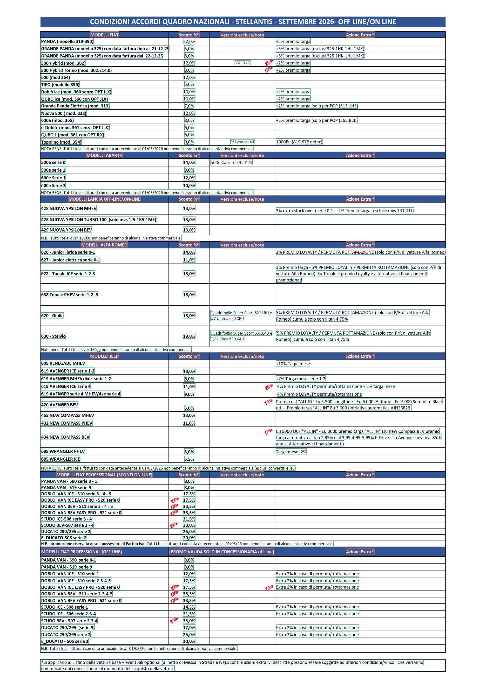
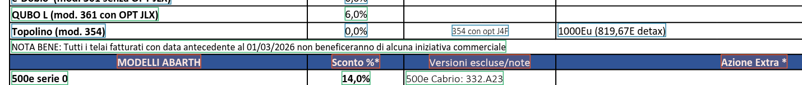
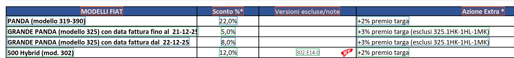
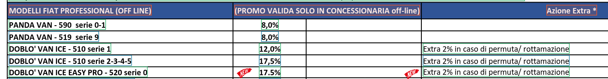
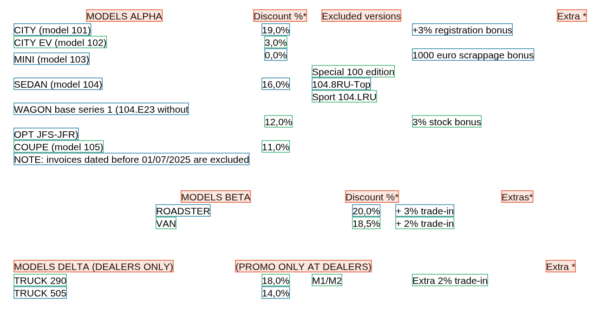
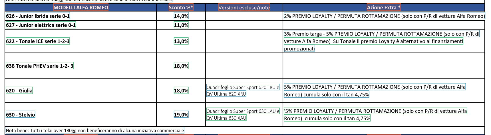
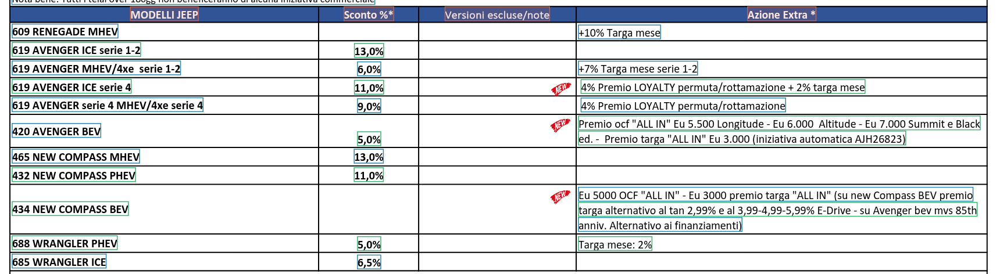
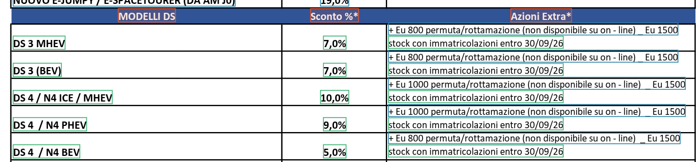
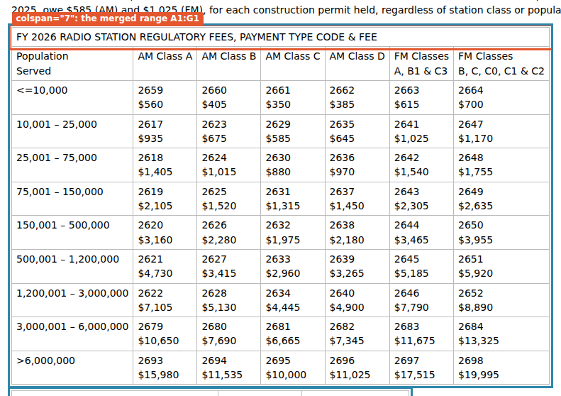

<p align="center">
  
</p>

# Documents, under the hood

Part 7 of [How OpenCraw works](README.md). Next: [8. Mapping and transforms](07-mapping-and-transforms.md).

A recipe that fetches a PDF, a spreadsheet or a Word file uses the same `extract` step as one that reads a
web page. This page explains what happens between the bytes and the step: how the format is chosen, what each
reader builds, and the algorithms that turn a page of positioned text or a grid of cells into rows. PDF gets
the most space, because a PDF has no rows or columns: the reader has to infer them from where the text is.

[authoring.md §4.6–4.13](../recipes/authoring.md#46-pdfs) is the reference for every option named here. Code is
cited as `file:line` under [`packages/core/src`](../../packages/core/src) or
[`packages/office-reader/src`](../../packages/office-reader/src).

## Contents

1. [From bytes to a document](#1-from-bytes-to-a-document)
2. [PDF](#2-pdf)
   1. [What pdf.js gives, and what is kept](#21-what-pdfjs-gives-and-what-is-kept)
   2. [Runs to cells](#22-runs-to-cells)
   3. [Cells to rows: overlap, not baselines](#23-cells-to-rows-overlap-not-baselines)
   4. [The constants, in points](#24-the-constants-in-points)
   5. [Finding a table](#25-finding-a-table)
   6. [Columns: bands from the body's left edges](#26-columns-bands-from-the-bodys-left-edges)
   7. [Mapping bands to headers](#27-mapping-bands-to-headers)
   8. [Placing values](#28-placing-values)
   9. [Regrouping wrapped cells](#29-regrouping-wrapped-cells)
   10. [Naming the columns, and `fillDown`](#210-naming-the-columns-and-filldown)
   11. [What fails, and why](#211-what-fails-and-why)
3. [Spreadsheets and CSV](#3-spreadsheets-and-csv)
4. [PowerPoint](#4-powerpoint)
5. [Word](#5-word)
6. [HTML tables](#6-html-tables)
7. [Markdown](#7-markdown)
8. [YAML](#8-yaml)
9. [XML](#9-xml)
10. [JSON and JSON Lines](#10-json-and-json-lines)
11. [Constants at a glance](#11-constants-at-a-glance)

The examples run against the real documents: the Stellantis discount sheet ENPAM publishes each month (a live
PDF), and the copies of a GSA workbook, a DfE deck and an FCC Word document shipped in [`examples/`](../../examples).
The repository's test fixtures fill the gaps, because each one was built to hold the quirks its reader handles.
The `doc-` recipes name a repository file by its GitHub URL, and a small hook, `repoFile`, turns that URL into
a `file:` URL into the local checkout ([`capture/scenes/06-documents.mjs`](capture/scenes/06-documents.mjs)).

## 1. From bytes to a document

### 1.1 Choosing the reader

Documents reach a recipe three ways: a `request` over HTTP, a `request` to a `file:` URL, and a web-mode
`click` with `download`. The format is chosen in this order
([`http-session/http.client.ts`](../../packages/core/src/http-session/http.client.ts)):

1. **`as` wins.** `httpRequest.as ?? formatFromContentType(…)` for a response (`:159`), `as ?? formatFromExtension(…)`
   for a file or a download (`:147`, `:172`).
2. **An HTTP response is typed by its `Content-Type`**, lower-cased, parameters dropped (`:232-250`). The rules
   run in order, first match wins:

   | Content type | Format |
   |---|---|
   | `application/gzip`, `application/x-gzip` or `application/octet-stream`, **and** a URL path ending `.xml.gz` | `xml` |
   | `text/csv`, `application/csv`, `text/x-csv`, `application/x-csv`, `text/comma-separated-values`, `text/tab-separated-values` | `csv` |
   | `application/x-ndjson`, `application/ndjson`, `application/jsonl`, `application/x-jsonlines`, `application/jsonlines` | `jsonl` |
   | contains `spreadsheetml`, or starts `application/vnd.ms-excel` | `xlsx` |
   | contains `presentationml`, or starts `application/vnd.ms-powerpoint` | `pptx` |
   | `application/msword`, contains `wordprocessingml`, or starts `application/vnd.ms-word` | `docx` |
   | `application/yaml`, `application/x-yaml`, `text/yaml`, `text/x-yaml` | `yaml` |
   | `text/markdown`, `text/x-markdown` | `markdown` |
   | contains `json` (so `application/ld+json`) | `json` |
   | contains `pdf`, then `html`, then `xml` (so `application/xhtml+xml` is `html`) | `pdf`, `html`, `xml` |
   | anything else | `text` |

3. **A file or a download is typed by its extension** (`:257-263`), case-insensitively: `.json`; `.jsonl`
   `.ndjson`; `.pdf`; `.csv` `.tsv`; `.xlsx` `.xlsm` `.xls`; `.pptx` `.pptm` `.ppsx` `.ppt`; `.docx` `.docm`
   `.dotx` `.doc`; `.yaml` `.yml`; `.md` `.markdown`; `.html` `.htm`; `.xml` `.rss` `.atom` `.kml` `.gpx`
   and `.xml.gz`. Anything else is `text`.

There is **no byte sniffing**. A response's URL extension is not consulted (except for `.xml.gz`), and the
first bytes are not looked at to choose a reader, so a PDF served as `application/octet-stream` or
`text/plain` reads as text unless the recipe says `as: "pdf"`. That is why the Stellantis recipe sets `as`.
[Issue #76](https://github.com/russoedu/open.craw/issues/76) is open for it. Bytes are only inspected inside a
reader once it is chosen: text decoding looks for a byte-order mark (§3.1), the XML reader gunzips a body that
starts with `1F 8B` (§9), `office-reader` recognises a legacy or encrypted compound file by its
`D0 CF 11 E0 A1 B1 1A E1` signature (§3.3), and pdf.js refuses bytes that are not a PDF.

A 4xx or 5xx response is parsed by format too before `HttpError` is thrown (`:120-122`), so the block detector
can read its text.

**The readers load lazily.** Each is a dynamic `import()` on first use, so a recipe that never reads a format
never loads its library: pdf.js ([`read-pdf.client.ts:21`](../../packages/core/src/pdf-document/read-pdf.client.ts#L21)),
the three entry points of `@opencraw/office-reader`, `/xlsx`, `/pptx` and `/docx`
([`read-xlsx.client.ts:19`](../../packages/core/src/workbook-document/read-xlsx.client.ts#L19),
[`read-pptx.client.ts:17`](../../packages/core/src/deck-document/read-pptx.client.ts#L17),
[`read-docx-html.client.ts:27`](../../packages/core/src/docx-document/read-docx-html.client.ts#L27)), `marked`
([`read-markdown.client.ts:47`](../../packages/core/src/markdown-document/read-markdown.client.ts#L47)) and
`yaml` ([`read-yaml.client.ts:30`](../../packages/core/src/yaml-document/read-yaml.client.ts#L30)).

### 1.2 What the step gets

Every reader produces one of seven document kinds. The `request` binds it as the scope's current document, the
one an `extract` without `from` reads, and binds `documentValue(body)` under the step's `id`
([`send-request.use-case.ts:64-65`](../../packages/core/src/api-steps/send-request.use-case.ts#L64-L65),
`:109`):

| Format | Document kind | What the step's `id` holds |
|---|---|---|
| `json`, `jsonl`, `yaml` | `json` | the parsed data |
| `html`, `markdown`, `docx` | `html` | the HTML string |
| `text` | `text` | the string |
| `pdf` | `pdf` | the document object: `{ kind, pages }` |
| `csv`, `xlsx` | `workbook` | the document object: `{ kind, sheets, csv? }` |
| `pptx` | `deck` | the document object: `{ kind, width, height, slides }` |
| `xml` | `xml` | the document object: `{ kind, xml }` |

Markdown and Word become HTML, so their `id` holds a string. An `extract` with `from` on that id reads it as
HTML for `css`, as markup for `xpath`, as text for `regex`, but **not** as a table: `table` with `from` accepts
only a PDF, workbook or deck object
([`extract-from-document.use-case.ts:207`](../../packages/core/src/api-steps/extract-from-document.use-case.ts#L207)).
A table in a Word or Markdown document is read from the current document, without `from`.

### 1.3 Which `extract` kind reads which document

([`extract-from-document.use-case.ts:29-79`](../../packages/core/src/api-steps/extract-from-document.use-case.ts#L29-L79))

| Kind | pdf | workbook | deck | html | xml | json | text |
|---|---|---|---|---|---|---|---|
| `table` | ✓ positions (§2) | ✓ grid (§3.4) | ✓ grid or positions (§4) | ✓ grid (§6) | – | – | – |
| `jsonpath` | the object | the object | the object | – | – | the data | – |
| `css` | – | – | – | ✓ | ✓ (cheerio, XML mode) | – | – |
| `xpath` | – | – | – | ✓ (parsed as a browser does) | ✓ | – | ✓ (parsed as XML) |
| `regex` | `pdfText` | `workbookText` | `deckText` | the markup | the markup | re-serialised | the text |

`regex` reads a text rendering of each document: a PDF's rows, cells joined by a tab, pages separated by a
blank line; a workbook's visible sheets and rows the same way; a deck's visible slides, each its shape texts,
its table rows and `Notes: …`. All `table` patterns (`selector`, `until`, `columns`, `sheet`, `slide`) compile
as case-insensitive regular expressions (`:136-158`), and options that belong to another kind of document fail
the step: `sheet` on a PDF, `slide` on a workbook (`:142-146`). In web mode, `table` reads the live page's
`page.content()` through the HTML table reader
([`extract-from-page.use-case.ts:21`](../../packages/core/src/web-steps/extract-from-page.use-case.ts#L21)).

## 2. PDF

A PDF page is a list of drawing operations. The text layer says "draw these glyphs at this point, in this font,
at this size", and nothing more: there are no cells, no rows, no columns. Ruling lines, if any, are separate
drawings with no link to the text. The reader rebuilds a table in four stages:

1. **Runs.** pdf.js returns the page's text items: strings at positions.
2. **Cells.** Runs on one baseline that nearly touch join into one cell.
3. **Rows.** Cells whose vertical extents overlap form one row.
4. **Tables.** A `table` extract finds a header row, clusters the body's cells into columns by their left
   edges, maps the columns to the header cells, and regroups lines that belong to one row.

Stages 1 to 3 run once, when the PDF is read ([`read-pdf.client.ts`](../../packages/core/src/pdf-document/read-pdf.client.ts),
[`row-assembly.algorithm.ts`](../../packages/core/src/pdf-document/row-assembly.algorithm.ts)). Stage 4 runs per
`extract` ([`pdf-table.algorithm.ts`](../../packages/core/src/pdf-document/pdf-table.algorithm.ts)).

The figures below are drawn by the capture script: pdf.js renders the page, then every cell `readPdf` found is
outlined, each row in one colour (blue and green alternate), and the rows the table `selector` matches are filled
orange. Here is page 1 of the September 2026 sheet, 1008 × 1427 points, read by the recipe of
[`recipes/pdf-discounts/`](recipes/pdf-discounts), a copy of the Stellantis example:

<!-- capture:pdf-discounts screenshot alt=Page_1_of_the_ENPAM_sheet,_every_cell_readPdf_found_outlined,_header_rows_filled -->

<!-- /capture -->

<!-- capture:pdf-discounts summary -->
```text
stellantis-it: 147 emitted, 0 rejected, 0 duplicates, 1 pages
```
<!-- /capture -->

### 2.1 What pdf.js gives, and what is kept

`readPdf` ([`read-pdf.client.ts:20-52`](../../packages/core/src/pdf-document/read-pdf.client.ts#L20-L52)):

1. Imports `pdfjs-dist/legacy/build/pdf.mjs` (pdf.js 6.x) on first use.
2. Calls `getDocument` with a **copy** of the bytes (pdf.js takes ownership of the buffer it gets, and refuses a
   Node `Buffer`) and `verbosity: 0`, `disableFontFace: true`, `useSystemFonts: false`, `stopAtErrors: true`.
   Nothing is rendered, no font is loaded, no script runs. A load failure becomes
   `PdfReadError("<source>: not a readable PDF (<pdf.js message>)")`. No password is ever passed, so a PDF
   that needs one to open fails here (one encrypted with an owner password only opens).
3. For each page, `getViewport({ scale: 1 })` gives its width and height in points, and `getTextContent()` its
   text items. Items without a `str` (marked-content markers) are dropped.
4. Each item becomes a **run** (`runOf`, `:48-52`):

   ```ts
   const [a, b, c, d, x, y] = item.transform
   return { x, y, width: item.width, height: item.height > 0 ? item.height : Math.hypot(c, d) || Math.hypot(a, b), text: item.str }
   ```

   `x` and `y` are the text's origin on its **baseline**, in PDF user space: points from the bottom-left
   corner, `y` growing upwards. `height` is the font size (the matrix's vertical scale when pdf.js reports 0).
   The font name, the direction (`dir`), the rotation part of the matrix, colours and every drawing are
   **not** kept: the reader works from text positions alone, and never sees table ruling.
5. The page's runs go through `assembleRows`. If **every** page ends with no row, the read fails with
   `no page has a text layer (a scanned PDF? OCR is not supported)` (`:40`). A PDF where only some pages are
   scans reads, and those pages have no rows.

The result, `{ kind: 'pdf', pages: [{ number, width, height, rows: [{ top, bottom, cells, text }] }] }`, is
what `jsonpath` queries. A cell is `{ x, y, width, height, text }`; a row's `top` is its highest `y + height`,
its `bottom` its lowest baseline, and its `text` the cells joined by a tab.

### 2.2 Runs to cells

A run is whatever pdf.js emitted as one string: a word, part of a word, a whole line. A cell is text that
reads as one unit. `joinCells`
([`row-assembly.algorithm.ts:58-79`](../../packages/core/src/pdf-document/row-assembly.algorithm.ts#L58-L79)):

1. **Drop whitespace runs.** pdf.js emits the gap between two table columns as one wide `" "` run, which would
   bridge the columns.
2. **Sort** the runs: two runs whose baselines are within `SAME_BASELINE × max(heights, 1)` compare left to right;
   otherwise the higher one comes first. (This pairwise tolerance is not a strict total order; for the
   gently wandering baselines of real documents it gives lines top to bottom, each left to right.)
3. **Join or start.** For each run, find the most recent cell on the same baseline (`|Δy| ≤ 0.2 × size`). With
   `size = max(run height, cell height, 1)` and `gap = run.x − (cell.x + cell.width)`:
   - if `gap ≤ JOIN_GAP × size` and `gap > −size` (an overlap of less than one font size is tolerated), the run
     is appended to the cell. A space goes between them when `gap > SPACE_GAP × size` and neither side already
     has whitespace at the join. The cell keeps its first run's origin, its width grows to the run's right
     edge, its height becomes the larger of the two;
   - otherwise the run starts a new cell.
4. **Trim** every cell and drop the empty ones.

A unit test pins it: `PANDA` and `(model 319)` 2 pt apart at 7 pt become `PANDA (model 319)`, since
2 ≤ 0.35 × 7 = 2.45 joins them and 2 > 0.1 × 7 = 0.7 puts a space between
([`row-assembly.algorithm.test.ts:6`](../../packages/core/src/pdf-document/row-assembly.algorithm.test.ts#L6)).

### 2.3 Cells to rows: overlap, not baselines

`rowsOfCells` (`:36-56`) sorts the cells by their vertical middle (`y + height / 2`), top first, then by `x`,
and walks them keeping one current row. A cell joins the current row when

```text
overlap = min(cell.y + cell.height, row.top) − max(cell.y, row.bottom)   ≥   ROW_OVERLAP × cell.height
```

and the row's extent grows to cover it; otherwise the cell starts a new row. A cell is only compared with the
**current** row, never with an earlier one. Each row's cells are then sorted left to right (`rowOf`, `:81-90`).

Why overlap and not equal baselines (the doc comment, `:15-19`): *"a table that centres its cells vertically puts a
one-line value a few points above or below its two-line label, and a row built from equal baselines would pair
the value with the wrong label."* The fixture reproduces it: `MINI (model 103)` sits on baseline 759 and its
`0,0%` on 762, 3 pt higher. At 7 pt the same-baseline tolerance is 1.4 pt, so the two are on different lines;
but the label spans 759–766 and the value 762–769, an overlap of 4 pt against the 2.8 pt required, so they
share a row. In the figure below, `MINI` and `0,0%` are outlined in the same colour.

Overlap has a limit: a cell only 40% inside a row's band joins it. On the ENPAM sheet, the Alfa Romeo table
prints `620 - Giulia` at y 769.9, vertically centred between the two lines of its excluded versions and of its
extra incentive (y 776.3 and 763.4, see [§2.9](#29-regrouping-wrapped-cells)). The name overlaps the line above
by 3.7 pt, short of the 4.0 pt that 10 pt text needs, so the three lines stay three rows, and the table reader
regroups them.

### 2.4 The constants, in points

All are shares of the font size or cell height, except the last two, which are fixed. The fixture is 7 pt, ENPAM's
sheet about 10 pt (pdf.js reports 9.97).

| Constant | Where | Value | 7 pt | 9 pt | 10 pt | What it decides |
|---|---|---|---|---|---|---|
| `SAME_BASELINE` | `row-assembly.algorithm.ts:8` | 0.2 × size | 1.4 | 1.8 | 2.0 | Two runs are on one line. |
| `JOIN_GAP` | `:4` | 0.35 × size | 2.45 | 3.15 | 3.5 | Two runs on a line join into one cell. |
| `SPACE_GAP` | `:6` | 0.1 × size | 0.7 | 0.9 | 1.0 | A joined gap wider than this gets a space. |
| overlap allowed on join | `:68` | 1 × size | 7 | 9 | 10 | A run may start this far inside the previous one. |
| `ROW_OVERLAP` | `:10` | 0.4 × cell height | 2.8 | 3.6 | 4.0 | A cell joins the current row. |
| band tolerance | `pdf-table.algorithm.ts:179` | max(3, 0.6 × median cell height) | 4.2 | 5.4 | 6.0 | Left edges closer than this to a band's start are one column. |
| band slack | `:186`, `:243` | 0.5 pt | | | | A cell belongs to a band whose start is at most 0.5 pt right of it. |
| `TIE` | `:263` | 1 pt | | | | Two anchors this close to a line are equally near. |

### 2.5 Finding a table

A `table` extract becomes a query `{ header, until, columns, align }`
([`pdf-table.algorithm.ts:5-14`](../../packages/core/src/pdf-document/pdf-table.algorithm.ts#L5-L14)). `findTables`
(`:52-63`) works **one page at a time**:

1. Every row whose cells, **joined by single spaces**, match `header` (the step's `selector`) starts a table.
   (`regex` sees the same row with tabs between the cells: a `selector` copied from `regex` output needs spaces.)
2. The table's body is the rows after the header, up to the next row that matches `header` **on the same page**,
   or the page's end.
3. `until` cuts the body at the first row it matches; that row is left out (`bodyOf`, `:66-70`).
4. Header cells that overlap horizontally merge into one, their texts joined by a space (`headerCells`,
   `:161-174`): a header written on two lines that ended up in one row.

The result is one `{ page, title, header, rows }` per match. `title` is the first header cell's text
(`MODELLI FIAT`), which the Stellantis mapping reads the brand from.

Because the search is per page, **a table never continues across a page break**. A table repeated under its
header on every page gives one table per page, which `many: true` and a `forEach` concatenate; a continuation
page without the header is not part of any table.

`until` matters more than it looks. The sheet ends each brand's table with a note:

<!-- capture:doc-pdf-enpam screenshot n=2 alt=The_end_of_the_Fiat_table:_a_note_row,_then_the_Abarth_header -->

<!-- /capture -->

The note is one wide cell starting at x 85.2, inside the model column. Without `until`, it would be a line with
a name and no value, and [§2.9](#29-regrouping-wrapped-cells) would glue it to the nearest row: `Topolino`'s
model would end with *NOTA BENE: Tutti i telai…*. The fixture shows it. Its recipe reads the four tables twice,
with `until: "^(NOTE|\\*)"` and without. The second pass repeats ten rows (the key drops them as duplicates)
and adds two:

<!-- capture:doc-pdf-fixture record record=12 -->
```json
{
  "table": "MODELS ALPHA",
  "model": "COUPE (model 105) NOTE: invoices dated before 01/07/2025 are excluded",
  "discount": "11,0%",
  "excluded": null,
  "extra": null
}
```
<!-- /capture -->

<!-- capture:doc-pdf-fixture record record=13 -->
```json
{
  "table": "MODELS GAMMA",
  "model": "G3 BEV *Discounts apply to the base list price",
  "discount": "5,0%",
  "excluded": null,
  "extra": "+ Eu 1000 trade-in _ Eu 1500 stock until 30/09/26"
}
```
<!-- /capture -->

<!-- capture:doc-pdf-fixture summary -->
```text
fixture-tables: 14 emitted, 0 rejected, 10 duplicates, 1 pages
```
<!-- /capture -->

A **narrow selector** needs the same care. The [`doc-pdf-enpam`](recipes/doc-pdf-enpam) recipe reads four
tables only, `^MODELLI (ALFA ROMEO|JEEP|FIAT PROFESSIONAL \(OFF|DS)\b`. A body ends at the next row the
selector matches, so the DS table, whose next header is Opel's, would read on through the whole Opel table.
Its `until` therefore adds `MODELLI`: `^(NOTA BENE|N\.B\.|\*Si applicano|MODELLI)`.

### 2.6 Columns: bands from the body's left edges

A header is a poor guide to where its column is. On this sheet every header is centred over its column, and the
column's cells are left-aligned:

<!-- capture:doc-pdf-enpam screenshot n=1 alt=The_Fiat_table:_headers_centred,_cells_left-aligned -->

<!-- /capture -->

`MODELLI FIAT` spans x 187.6–245.8; the model names start at 85.4. `Azione Extra *` spans 717.9–776.8; the extras
start at 572.5, 145 points to its left, closer to the end of `Versioni escluse/note` (547.7) than to their own
header. The first four Fiat records, read by the full Stellantis recipe:

<!-- capture:pdf-discounts records n=4 -->
```json
{"month":"2026-09","brand":"FIAT","channel":null,"model":"PANDA (modello 319-390)","discountPercent":22,"excludedVersions":null,"extraIncentive":"+2% premio targa","sheet":"https://www.enpam.it/wp-content/uploads/STELLANTIS-SCONTI-e-cod-promo_mese-09-2026.pdf"}
{"month":"2026-09","brand":"FIAT","channel":null,"model":"GRANDE PANDA (modello 325) con data fattura fino al 21-12-25","discountPercent":5,"excludedVersions":null,"extraIncentive":"+3% premio targa (esclusi 325.1HK-1HL-1MK)","sheet":"https://www.enpam.it/wp-content/uploads/STELLANTIS-SCONTI-e-cod-promo_mese-09-2026.pdf"}
{"month":"2026-09","brand":"FIAT","channel":null,"model":"GRANDE PANDA (modello 325) con data fattura dal 22-12-25","discountPercent":8,"excludedVersions":null,"extraIncentive":"+3% premio targa (esclusi 325.1HK-1HL-1MK)","sheet":"https://www.enpam.it/wp-content/uploads/STELLANTIS-SCONTI-e-cod-promo_mese-09-2026.pdf"}
{"month":"2026-09","brand":"FIAT","channel":null,"model":"500 Hybrid (mod. 302)","discountPercent":12,"excludedVersions":"302.E14.0","extraIncentive":"+2% premio targa","sheet":"https://www.enpam.it/wp-content/uploads/STELLANTIS-SCONTI-e-cod-promo_mese-09-2026.pdf"}
```
<!-- /capture -->

Placed by distance from the header cells, the extras would land under `Versioni escluse/note`, the header
they are nearest. So columns come from the body (`bandsOf`, `:176-193`):

1. Take every cell of every body row.
2. `tolerance = max(3, median cell height × 0.6)`: 6.0 pt here.
3. Sort the cells' left edges. Walk them: an edge more than `tolerance` right of the **current band's start**
   opens a new band. (Measured from the start, not from the previous edge, so a slow drift of edges cannot chain
   into one wide band.)
4. A band spans from its start to the furthest right edge of its cells, capped at the next band's start: *"a band
   spans what its cells cover, not the gap up to the next band"*. A cell belongs to a band when
   `start − 0.5 ≤ x < next start − 0.5`.

For the Fiat table the left edges are 85.4, 380.0, 382.6, 478.1, 487.0 and 572.5:

| Band | Cells starting at | Span |
|---|---|---|
| 1 | 85.4 (model names) | 85.4–351.3 |
| 2 | 380.0 and 382.6 (`12,0%` and `5,0%`: centred, so the shorter starts 2.6 pt further right) | 380.0–404.8 |
| 3 | 478.1 (`354 con opt J4F`) | 478.1–487.0 |
| 4 | 487.0 (`302.E14.0`) | 487.0–519.2 |
| 5 | 572.5 (the extras) | 572.5–755.5 |

The two discounts fall in one band because 2.6 < 6.0. The two excluded-version notes do not: they are centred
too, and 8.9 pt apart. Five bands for four headers: the next step decides which bands share a header.

### 2.7 Mapping bands to headers

`assignColumns` (`:207-237`) maps the bands to header cells **monotonically**: left to right, a band never maps
to a header left of the previous band's. Columns do not cross, and this rules out the nonsense mappings a
per-band "nearest header" would allow. Among the monotone mappings it picks, in order of priority:

1. **the one using the most headers**, so a table with as many bands as headers maps one to one;
2. **the one with the highest summed affinity**, where a band's affinity for a header is their horizontal
   overlap in points when they overlap, and minus their distance when they do not (`:209-213`).

It is a dynamic programme over (band, header) pairs. `table[i][h]` holds the best score for bands `0…i` with
band `i` on header `h`, reached from any `table[i−1][h′]` with `h′ ≤ h`; moving to a new header adds one to
`used`. The last row's best cell is traced back through `previous` to give every band its header (`:228-236`).
For *b* bands and *n* headers the work is O(*b* · *n*²), a few hundred steps for a real table.

For the Fiat table, the programme gives bands 1 → `MODELLI FIAT` (overlap 58.2), 2 → `Sconto %*` (24.8), 3 and
4 → `Versioni escluse/note` (8.9 and 32.2), and 5 → `Azione Extra *` (37.6). Band 5 overlaps its header by only
the 37.6 pt between 717.9 and 755.5, but the first priority settles it: with band 5 anywhere else, a header
would go unused.
The freedom left after "use every header" is exactly which neighbours share one: two bands under one header (a
column whose cells start at two edges, as here), or one header over two columns.

The fixture's DELTA table has the second case, a header `(PROMO ONLY AT DEALERS)` over the discount column and
a column of `M1/M2` codes; the two bands share it and the first row reads `18,0% M1/M2`. ENPAM's off-line Fiat
Professional table has the variant the Stellantis recipe matches with `"discount": "^(Sconto|\\(PROMO)"`:

<!-- capture:doc-pdf-enpam screenshot n=5 alt=The_(PROMO_VALIDA…)_header,_over_the_discount_column_and_the_empty_notes_column -->

<!-- /capture -->

Three headers here, and three bands: 85.4–251.7, 379.8–404.9 and 572.5–744.5. `(PROMO VALIDA SOLO IN
CONCESSIONARIA off-line)` spans 350.9–568.7, over the discounts and the empty notes column. The third band is
3.8 pt right of that header's end and overlaps `Azione Extra *` by 26.6 pt, so it maps to the extras. The table
as the step binds it, rows cut short:

<!-- capture:doc-pdf-enpam scope ids=table record=17 -->
```json
{
  "table": {
    "page": 1,
    "title": "MODELLI FIAT PROFESSIONAL (OFF LINE)",
    "header": [
      "MODELLI FIAT PROFESSIONAL (OFF LINE)",
      "(PROMO VALIDA SOLO IN CONCESSIONARIA off-line)",
      "Azione Extra *"
    ],
    "rows": [
      {
        "model": "PANDA VAN - 590 serie 0-1",
        "discount": "8,0%",
        "extra": ""
      },
      {
        "model": "PANDA VAN - 519 serie 9",
        "discount": "8,0%",
        "extra": ""
      },
      {
        "model": "DOBLO' VAN ICE - 510 serie 1",
        "discount": "12,0%",
        "extra": "Extra 2% in caso di permuta/ rottamazione"
      },
      "… 10 more"
    ]
  }
}
```
<!-- /capture -->

The header has no `Versioni…` cell, so the `excluded` pattern of `columns` matches nothing and rows have no
`excluded` key; the mapping's `default` turns the missing value into `null`:

<!-- capture:doc-pdf-enpam record record=19 -->
```json
{
  "month": "2026-09",
  "brand": "FIAT PROFESSIONAL",
  "channel": "offline",
  "model": "DOBLO' VAN ICE - 510 serie 1",
  "discountPercent": 12,
  "excludedVersions": null,
  "extraIncentive": "Extra 2% in caso di permuta/ rottamazione",
  "sheet": "https://www.enpam.it/wp-content/uploads/STELLANTIS-SCONTI-e-cod-promo_mese-09-2026.pdf"
}
```
<!-- /capture -->

### 2.8 Placing values

With the bands mapped, every body line becomes one value per header (`valuesOf`, `:239-249`). Its cells, taken
top to bottom then left to right, go to the **last band whose start is ≤ cell.x + 0.5**, or to the first band
when none is; pieces landing in the same column on one line are joined by a space. A cell left of every band
(impossible for body cells, which made the bands) would land in the first column. A cell that spans two columns
in the PDF (one long string) lands wholly in the column its left edge is in.

### 2.9 Regrouping wrapped cells

A row of the table is often several lines of the page: a long name wraps, a note runs onto a second line, a list
of versions sits above and below its row. After §2.8 each body line is `{ row, values[] }`, and `groupLines`
(`:105-124`) rebuilds table rows from them. A line is **named** when it has a first-column value, and **valued**
when any other column has one.

**1. Anchors.** A line anchors a table row when it is named and valued, or when it is *not* named but has a
value in the first value column (`values[1]`): the middle line of a name wrapped around centred values. If no
line qualifies, every named line is an anchor; if none is named either, the table has no rows (`:108-110`).

**2. Alignment.** `align` says where a row's values sit against its wrapped cell: `top`, `center`, `bottom`,
or `auto` (the default). `auto` becomes `center` when some anchor has **no name**, since only a centred table
produces a value line without a name (`:112`); otherwise `auto` places each line by distance.

**3. Centred tables: sharing wrapped names evenly** (`splitNamesEvenly`, `:131-144`). The named lines that are
not anchors are dealt out in page order: those above the first anchor go to it; between two anchors, the upper
one takes as many lines below it as it took above it, and the lower one takes the rest; the last anchor takes
everything after it. A name wrapped over three lines around its values ends up whole.

**4. Every other line joins an anchor** (`ownerOf`, `:146-151`):

- `top`: the last anchor at or above it (by `bottom`), else the first anchor;
- `bottom`: the first anchor at or below it, else the last;
- `auto` and `center`: the **nearest** anchor by vertical gap, `max(0, anchor.bottom − line.top, line.bottom − anchor.top)`
  (`nearest`, `:270-282`). **A tie**, two gaps within `TIE` = 1 pt of each other, **goes to the anchor below**:
  *"text reads top down, so a wrapped cell's first line comes before the row it belongs to."*

**5. Nameless anchors.** An anchor whose group still has no named line is a value spilling out of the row next to
it; its lines merge into the nearest kept anchor (`:117-121`).

**6. Joining.** Each group's lines are sorted top to bottom, and each column's non-empty pieces joined by a
space (`joinLines`, `:154-158`).

The fixture has the textbook cases: `SEDAN`'s excluded versions on the line above and the line below
(`Special 100 edition` · `104.8RU-Top` · `Sport 104.LRU`), and `WAGON`'s name wrapped over three lines with its
values on the middle one, a nameless anchor that switches ALPHA to centred mode:

<!-- capture:doc-pdf-fixture screenshot alt=The_fixture's_ALPHA,_BETA_and_DELTA_tables,_each_row_in_one_colour -->

<!-- /capture -->

<!-- capture:doc-pdf-fixture records n=6 -->
```json
{"table":"MODELS ALPHA","model":"CITY (model 101)","discount":"19,0%","excluded":null,"extra":"+3% registration bonus"}
{"table":"MODELS ALPHA","model":"CITY EV (model 102)","discount":"3,0%","excluded":null,"extra":null}
{"table":"MODELS ALPHA","model":"MINI (model 103)","discount":"0,0%","excluded":null,"extra":"1000 euro scrappage bonus"}
{"table":"MODELS ALPHA","model":"SEDAN (model 104)","discount":"16,0%","excluded":"Special 100 edition 104.8RU-Top Sport 104.LRU","extra":null}
{"table":"MODELS ALPHA","model":"WAGON base series 1 (104.E23 without OPT JFS-JFR)","discount":"12,0%","excluded":null,"extra":"3% stock bonus"}
{"table":"MODELS ALPHA","model":"COUPE (model 105)","discount":"11,0%","excluded":null,"extra":null}
```
<!-- /capture -->

`WAGON`'s first line lies between `SEDAN` and the nameless anchor; `SEDAN` took no name line above it, so it takes
none below, and the anchor gets it. `OPT JFS-JFR)` follows the anchor, which took one line above, so it takes one
below. `Special 100 edition` is 2 pt from `MINI` and 2 pt from `SEDAN`, a tie, so it goes to `SEDAN`, below.
BETA's extras band (314.0–355.8) overlaps `Discount %*` (278.0–316.1) by 2.1 pt and is 34 pt short of its own
header `Extras*` (390): a per-band "most overlap" rule would put the extras under the discount. Three bands and
three headers map one to one, so they land under `Extras*`.

**The Alfa Romeo table**: notes wrapped over two and three lines, the name and the discount centred beside them.

<!-- capture:doc-pdf-enpam screenshot n=3 alt=The_Alfa_Romeo_table:_notes_wrapped_around_names_and_discounts_centred_beside_them -->

<!-- /capture -->

No line here is a nameless anchor, so `auto` places lines by distance. The numbers, from the rows `readPdf`
built:

| Line | Gap to the anchor above | Gap to the anchor below | Joins |
|---|---|---|---|
| `3% Premio targa - 5% PREMIO LOYALTY…` | 5.5 (`627 - Junior elettrica`) | 3.1 (`622 - Tonale ICE`) | Tonale ICE |
| `promozionati` | 3.0 (`622 - Tonale ICE`) | 20.3 (`638 Tonale PHEV`) | Tonale ICE |
| `Quadrifoglio Super Sport 620.LRU e` · `5% PREMIO LOYALTY…Alfa` | 27.3 (`638 Tonale PHEV`) | 0.0 (`620 - Giulia`) | Giulia |
| `QV Ultima 620.XRU` · `Romeo) cumula solo con il tan 4,75%` | 0.0 (`620 - Giulia`) | 25.6 (`630 - Stelvio`) | Giulia |

<!-- capture:doc-pdf-enpam records n=6 -->
```json
{"month":"2026-09","brand":"ALFA ROMEO","channel":null,"model":"626 - Junior Ibrida serie 0-1","discountPercent":14,"excludedVersions":null,"extraIncentive":"2% PREMIO LOYALTY / PERMUTA ROTTAMAZIONE (solo con P/R di vetture Alfa Romeo)","sheet":"https://www.enpam.it/wp-content/uploads/STELLANTIS-SCONTI-e-cod-promo_mese-09-2026.pdf"}
{"month":"2026-09","brand":"ALFA ROMEO","channel":null,"model":"627 - Junior elettrica serie 0-1","discountPercent":11,"excludedVersions":null,"extraIncentive":null,"sheet":"https://www.enpam.it/wp-content/uploads/STELLANTIS-SCONTI-e-cod-promo_mese-09-2026.pdf"}
{"month":"2026-09","brand":"ALFA ROMEO","channel":null,"model":"622 - Tonale ICE serie 1-2-3","discountPercent":13,"excludedVersions":null,"extraIncentive":"3% Premio targa - 5% PREMIO LOYALTY / PERMUTA ROTTAMAZIONE (solo con P/R di vetture Alfa Romeo) Su Tonale il premio Loyalty è alternativo ai finanziamenti pr…","sheet":"https://www.enpam.it/wp-content/uploads/STELLANTIS-SCONTI-e-cod-promo_mese-09-2026.pdf"}
{"month":"2026-09","brand":"ALFA ROMEO","channel":null,"model":"638 Tonale PHEV serie 1-2- 3","discountPercent":18,"excludedVersions":null,"extraIncentive":null,"sheet":"https://www.enpam.it/wp-content/uploads/STELLANTIS-SCONTI-e-cod-promo_mese-09-2026.pdf"}
{"month":"2026-09","brand":"ALFA ROMEO","channel":null,"model":"620 - Giulia","discountPercent":18,"excludedVersions":"Quadrifoglio Super Sport 620.LRU e QV Ultima 620.XRU","extraIncentive":"5% PREMIO LOYALTY / PERMUTA ROTTAMAZIONE (solo con P/R di vetture Alfa Romeo) cumula solo con il tan 4,75%","sheet":"https://www.enpam.it/wp-content/uploads/STELLANTIS-SCONTI-e-cod-promo_mese-09-2026.pdf"}
{"month":"2026-09","brand":"ALFA ROMEO","channel":null,"model":"630 - Stelvio","discountPercent":19,"excludedVersions":"Quadrifoglio Super Sport 630.LAU e QV Ultima 630.XAU","extraIncentive":"'5% PREMIO LOYALTY / PERMUTA ROTTAMAZIONE (solo con P/R di vetture Alfa Romeo) cumula solo con il tan 4,75%","sheet":"https://www.enpam.it/wp-content/uploads/STELLANTIS-SCONTI-e-cod-promo_mese-09-2026.pdf"}
```
<!-- /capture -->

**The Jeep table**: a nameless anchor, so the whole table is read in centred mode.

<!-- capture:doc-pdf-enpam screenshot n=4 alt=The_Jeep_table:_420_AVENGER_BEV's_discount_sits_on_the_line_below_its_name -->

<!-- /capture -->

`420 AVENGER BEV` (baseline 585.9) and its `5,0%` (578.7) are 7.2 pt apart, with the two lines of its extra at
592.4 and 579.3: three rows, since each pair overlaps by 3.4 or 3.5 pt, short of 4.0. The `5,0%` line has a
discount and no name, so it is an anchor, and `auto` becomes `center`. The name is a named line between the
anchors `619 AVENGER serie 4…` and `5,0%`; the upper one took no name line above it, so the name goes to the
lower one. The extra's first line is 4.9 pt from the anchor above and 3.1 pt from `5,0%`, so it joins too:

<!-- capture:doc-pdf-enpam record record=11 -->
```json
{
  "month": "2026-09",
  "brand": "JEEP",
  "channel": null,
  "model": "420 AVENGER BEV",
  "discountPercent": 5,
  "excludedVersions": null,
  "extraIncentive": "Premio ocf \"ALL IN\" Eu 5.500 Longitude - Eu 6.000 Altitude - Eu 7.000 Summit e Black ed. - Premio targa \"ALL IN\" Eu 3.000 (iniziativa automatica AJH26823)",
  "sheet": "https://www.enpam.it/wp-content/uploads/STELLANTIS-SCONTI-e-cod-promo_mese-09-2026.pdf"
}
```
<!-- /capture -->

`434 NEW COMPASS BEV` has a name and an extra on one line, so it is an ordinary anchor; the extra's lines above
(2.4 pt against 6.9) and below (3.1 against 5.7) join it. It has no discount, and the record says so:

<!-- capture:doc-pdf-enpam record record=14 -->
```json
{
  "month": "2026-09",
  "brand": "JEEP",
  "channel": null,
  "model": "434 NEW COMPASS BEV",
  "discountPercent": null,
  "excludedVersions": null,
  "extraIncentive": "Eu 5000 OCF \"ALL IN\" - Eu 3000 premio targa \"ALL IN\" (su new Compass BEV premio targa alternativo al tan 2,99% e al 3,99-4,99-5,99% E-Drive - su Avenger bev …",
  "sheet": "https://www.enpam.it/wp-content/uploads/STELLANTIS-SCONTI-e-cod-promo_mese-09-2026.pdf"
}
```
<!-- /capture -->

**The DS table** (page 2, 1214 × 1718 points): every extra is two lines, the first **between** two rows.

<!-- capture:doc-pdf-enpam screenshot n=6 alt=The_DS_table:_each_extra's_first_line_sits_halfway_between_two_rows -->

<!-- /capture -->

The first line of `DS 3 (BEV)`'s extra, `+ Eu 800 permuta/rottamazione…`, is 2.7 pt below `DS 3 MHEV` and 2.7 pt
above `DS 3 (BEV)`. The gaps tie, so the line goes to the anchor below. Without that rule, `DS 3 MHEV` would get
three lines and `DS 3 (BEV)` half an extra. The fixture's GAMMA table is built to the same pattern
([`pdf-table.algorithm.test.ts:52`](../../packages/core/src/pdf-document/pdf-table.algorithm.test.ts#L52)).

<!-- capture:doc-pdf-enpam record record=30 -->
```json
{
  "month": "2026-09",
  "brand": "DS",
  "channel": null,
  "model": "DS 3 MHEV",
  "discountPercent": 7,
  "excludedVersions": null,
  "extraIncentive": "+ Eu 800 permuta/rottamazione (non disponibile su on - line) _ Eu 1500 stock con immatricolazioni entro 30/09/26",
  "sheet": "https://www.enpam.it/wp-content/uploads/STELLANTIS-SCONTI-e-cod-promo_mese-09-2026.pdf"
}
```
<!-- /capture -->

<!-- capture:doc-pdf-enpam record record=31 -->
```json
{
  "month": "2026-09",
  "brand": "DS",
  "channel": null,
  "model": "DS 3 (BEV)",
  "discountPercent": 7,
  "excludedVersions": null,
  "extraIncentive": "+ Eu 800 permuta/rottamazione (non disponibile su on - line) _ Eu 1500 stock con immatricolazioni entro 30/09/26",
  "sheet": "https://www.enpam.it/wp-content/uploads/STELLANTIS-SCONTI-e-cod-promo_mese-09-2026.pdf"
}
```
<!-- /capture -->

### 2.10 Naming the columns, and `fillDown`

`named` (`:251-260`) keys each row:

- **without `columns`**, by the header texts, through `Object.fromEntries`: of two identical header texts, the
  last column wins;
- **with `columns`**, each output key takes the **first** header whose text matches its pattern. A key whose
  pattern matches no header is absent (the `excluded` above); a header no pattern names is dropped.

Every value is a string: a cell's lines joined by spaces, `''` when empty. `fillDown` runs after, on PDF tables
as on workbooks ([`extract-from-document.use-case.ts:128`](../../packages/core/src/api-steps/extract-from-document.use-case.ts#L128),
§3.4): a value printed once for a group of rows is copied down to the rows below it that have none.

### 2.11 What fails, and why

| Case | What happens | Why |
|---|---|---|
| A scanned page | No rows on it. If every page is a scan, the read fails. | pdf.js reads the text layer; there is no OCR. |
| Password-protected PDF | The read fails at load. | No password is passed to `getDocument`. |
| Rotated or vertical text | Rows and columns come out wrong. | Only the origin and `width`/`height` are kept; every stage assumes horizontal, left-to-right baselines. A page with `/Rotate` reports its rotated size, but the item coordinates are not transformed. |
| Two columns closer than `JOIN_GAP` | They merge into one cell (3.5 pt at 10 pt). | Nothing but the gap separates two runs on a line. |
| A column whose left edges spread over more than the tolerance | Several bands; usually harmless, as the monotone mapping gives them to one header (Fiat's excluded versions). A right-aligned number column with widths differing by more than 6 pt splits the same way. | Bands cluster left edges. |
| Ruled vs unruled tables | No difference. | Drawings are never read. |
| A cell merged across columns | One cell, landing in the column of its left edge; its header gets the pieces of every band under it (DELTA). | A PDF carries no merge information. |
| A value merged down several rows | Printed once: one row gets it, or it anchors the rows in centred mode. `fillDown` copies it down. | As above. |
| A header on two lines that do not overlap | The second line is a body line, and can become a nameless anchor. | Header cells only merge within one row (§2.5). |
| Two tables side by side | One set of rows across both; a header pattern sees the whole line. | Rows are whole visual lines of the page. |
| A table continued on the next page | Not joined; a page without the header is not read. | `findTables` works per page. |
| A note row under the table, no `until` | Glued to the nearest row (§2.5). | A named line without values joins an anchor. |

## 3. Spreadsheets and CSV

A spreadsheet and a CSV both become a **workbook**: `{ kind: 'workbook', sheets: [{ name, rows, hidden?,
hiddenRows?, merges? }], csv? }`, cells `string | number | boolean`
([`workbook-document.model.ts`](../../packages/core/src/workbook-document/workbook-document.model.ts)). A grid
needs no geometry, so its table reader is much simpler than the PDF one.

### 3.1 Text decoding

Every text format (CSV, JSON, JSON Lines, HTML, text, YAML, Markdown, XML) goes through `decodeText`
([`text-decoding.algorithm.ts:25-43`](../../packages/core/src/http-session/text-decoding.algorithm.ts#L25-L43)),
which tries in order:

1. **A byte-order mark**: `EF BB BF` UTF-8, `FF FE` UTF-16LE, `FE FF` UTF-16BE. It wins even over the recipe's
   `encoding`, and is dropped from the text.
2. **The recipe's `encoding`**, any WHATWG label; an unknown one fails the step.
3. **The `charset`** of the `Content-Type`; an unknown one is ignored.
4. **Strict UTF-8**.
5. When strict UTF-8 fails: if the lenient UTF-8 decoding holds any character above U+007F other than
   U+FFFD, the text *is* UTF-8 with a stray byte, and stays UTF-8 ("a UTF-8 page with one stray byte keeps its
   accents"). Otherwise it is **Windows-1252**, the superset of Latin-1 that Excel's "CSV" export writes on
   Western Windows.

There is no UTF-32 and no BOM-less UTF-16 detection.

### 3.2 CSV: parsing and the delimiter

`parseCsv` ([`csv-parser.algorithm.ts:19-52`](../../packages/core/src/workbook-document/csv-parser.algorithm.ts#L19-L52))
is RFC 4180, tolerant: a double quote **at the start of a field** opens a quoted field, in which the delimiter and
line breaks are literal and `""` is a quote; an unterminated quote runs to the end; a quote elsewhere is a
literal character (`1.0 Hybrid "Cross"`). CRLF, LF and a lone CR end a record. Nothing is trimmed, ragged rows
stay ragged, a blank line is the row `['']`, and a trailing line break adds no row.

`detectDelimiter` (`:65-78`) parses the first 64 KiB with each of `,` `;` tab `|` and scores the non-blank rows
among the first 100 (the last one dropped when the sample cuts the file): the most common width above 1 (the larger on a tie), and
`agreeing rows / rows × 1000 + width`. The highest score wins; on equal scores the earlier candidate; with none
above 0, `,`. The repository's [`listino.csv`](../../packages/core/src/workbook-document/fixtures/listino.csv)
fixture is Windows-1252 with CRLF, a title line and a blank line above the header, `;` with decimal commas, and a
quoted field holding `;` and a line break:

| Delimiter | Rows | Widths (width: rows) | Score |
|---|---|---|---|
| `,` | 8 | 1: 3, 3: 2, 2: 3 | 3/8 × 1000 + 2 = 377.0 |
| `;` | 7 | 1: 1, 5: 6 | 6/7 × 1000 + 5 = 862.1 |
| tab, `\|` | 8 | 1: 8 | 0 |

With `,`, the quote before `Plus; automatica` is not at the start of a field, so it is literal and the line
break ends the record: eight rows instead of seven. The title line is outvoted either way. The file has no BOM
and fails strict UTF-8 (`ë`, `€` and `–` are single bytes), so it decodes as Windows-1252. The step's `id` holds
the workbook, with what was detected:

<!-- capture:doc-csv-listino scope ids=listino -->
```json
{
  "listino": {
    "kind": "workbook",
    "sheets": [
      {
        "name": "listino",
        "rows": [
          [
            "Listino prezzi autoveicoli – settembre 2026"
          ],
          [
            ""
          ],
          [
            "Marca",
            "Modello",
            "Versione",
            "… 2 more"
          ],
          "… 6 more"
        ]
      }
    ],
    "csv": {
      "encoding": "windows-1252",
      "delimiter": ";"
    }
  }
}
```
<!-- /capture -->

A CSV is a one-sheet workbook named after the file (`sheetNameOf`, the last path segment without its extension),
and every cell is a string: numbers are converted in the mapping, with a `locale`.

### 3.3 The XLSX reader

`@opencraw/office-reader` reads Office Open XML with two dependencies, `fflate` (zip) and `htmlparser2`
(streaming XML).

**The package** ([`ooxml-package.client.ts`](../../packages/office-reader/src/ooxml-package/ooxml-package.client.ts)):

- **Refusals first**, each an `OfficeReadError` with a code: an OLE compound file holding an `EncryptionInfo`
  stream is `encrypted`, any other compound file `legacy-format` (`.xls`, `.ppt`, `.doc`); a zip whose `mimetype`
  starts `application/vnd.oasis.opendocument` is `unsupported-format`; bytes that are not a zip are `not-zip`.
- **Listing without inflating.** The zip's directory is read first; each part is inflated only when asked for.
  Part names are case-folded and backslashes turned to slashes, since OPC names are case-insensitive and some
  writers produce `xl\sharedStrings.xml`.
- **Limits.** A part may declare at most 256 MiB, all parts read together 512 MiB (`:18-19`); fflate never
  inflates past a declared size, so a header that lies about a zip bomb gets a truncated part.
- **Streaming XML** (`walkXml`): SAX events, no DOM, no DTD processing, so declared entities are never expanded
  and nothing external is fetched. Relationships are typed by the last segment of their type URI, which is
  what the transitional and strict namespaces share.

**The workbook** ([`read-xlsx.use-case.ts`](../../packages/office-reader/src/spreadsheet/read-xlsx.use-case.ts)):
the main part comes from the root relationship (else `xl/workbook.xml`); `workbook.xml` gives the sheets in
order, their `hidden` state (`hidden` or `veryHidden`) and `date1904`; shared strings and styles come through
its relationships; chart, dialog and macro sheets are skipped.

**A worksheet** is streamed ([`worksheet.mapper.ts`](../../packages/office-reader/src/spreadsheet/worksheet.mapper.ts)):
`<row r hidden>` records hidden rows, `<c r t s>` places a cell (the previous position + 1 when `r` is missing),
`<mergeCell ref>` records a merged range. **Formulas are not evaluated**: `<f>` is ignored and `<v>`, the
cached result the writing application stored, is read. A formula without a cached value is empty. Hidden
columns are not recorded, so their cells read like any others.

**Values** ([`cell-value.algorithm.ts`](../../packages/office-reader/src/spreadsheet/cell-value.algorithm.ts)):
`t="s"` is a shared string (rich-text runs concatenated, phonetic guides dropped), `str` and `inlineStr` text,
`b` a boolean, `e` an error (`#DIV/0!`), `d` an ISO date. A number cell is a date or time when its **number
format** says so, else a number. The format only decides that: built-in ids 14–17, 22, 27–31, 34–36, 50–54, 57
and 58 are dates, 18–21, 32, 33, 45–47, 55 and 56 times; a custom code is read from its first section, with
quoted text, escapes and `[…]` brackets (`[Red]`, `[$-410]`) removed, as a date when `d`, `y` or a month `m`
remain (an `m` after `h` or `:`, or before `:` or `s`, is minutes), a time for `h` or `s`, and `[h]` elapsed
time as a number. **Display formats are never applied**: a percentage is `0.125`, a currency cell `15950`.
A serial becomes a date by `(serial − 25 569) × 86 400 s` from 1970, `+ 1462` days in the 1904 system, and one
day added to serials 1–59 to undo Lotus 1-2-3's phantom 29 February 1900.

The core adapter ([`read-xlsx.client.ts`](../../packages/core/src/workbook-document/read-xlsx.client.ts)) keeps
numbers and booleans typed ("`13955.625` is unambiguous; as text, a locale guess could read it as thirteen
million"), writes dates as ISO text (`2026-06-01` at midnight, `2026-06-01T09:30:00` otherwise, `12:00:00` for a
time on day zero), errors as their text, and empty cells as `''`.

### 3.4 The grid table algorithm

`findGridTables` ([`grid-table.algorithm.ts:51-118`](../../packages/core/src/workbook-document/grid-table.algorithm.ts#L51-L118))
has no geometry: column *i* of a row belongs to header *i*. Per sheet (hidden sheets skipped unless
`includeHidden`, sheets filtered by `sheet`):

1. **Visible rows**: hidden rows are removed, unless `includeHidden`.
2. **The filled grid**: every merged range's top-left value is copied into each cell it covers (`filledGrid`,
   `:164-178`): a brand merged down its models reads on every row, a group header merged across its sub-columns
   names each of them.
3. **Header matching reads the raw rows, not the filled grid.** A row's text is its non-empty cells,
   whitespace collapsed, joined by single spaces (`plain`, `:209-211`). A row starts a table when that text is
   non-empty and matches the `selector`. A header merged across columns is therefore matched by its text once,
   not once per covered cell. `until` tests the raw text too.
4. **The header** is the start row plus the next `headerRows − 1` visible rows.
5. **The body** is the visible rows after the header, up to the next header start, the first row `until`
   matches, or the sheet's end. Empty rows are skipped, but `until` is tested first, so `"until": "^$"` ends a
   table at the first empty row.
6. **Column keys** (`columnsOf`, `:126-145`): for each column up to the widest header or body row of the filled
   grid, the distinct cleaned texts of its header rows, joined (`Prezzo` over `Listino` → `Prezzo Listino`). A
   column with no header text but data is keyed by its **letter** (`E`); one with neither is **dropped**; a key
   seen before gets a counter (`Price 2`).
7. **Values** come from the filled grid; strings are trimmed but keep their inner line breaks, numbers and
   booleans stay typed. `columns` picks, per output key, the first column whose key matches.
8. **`title`** is the first non-empty cell of the raw header row, and **`fillDown`** (`:70-87`) fills an empty
   value with the last non-empty one above it in the same table.

The CSV fixture writes `Fiat` and `Pandina` once over two versions, and ends with a `Totale` line;
`"fillDown": ["brand", "model"]` and `"until": "^Totale"`:

<!-- capture:doc-csv-listino records n=4 -->
```json
{"brand":"Fiat","model":"Pandina","version":"1.0 Hybrid \"Cross\"","price":"15.950,00","discount":"12,5"}
{"brand":"Fiat","model":"Pandina","version":"1.0 Hybrid Icon","price":"16.450,00","discount":"12,5"}
{"brand":"Citroën","model":"C3","version":"Plus; automatica\nnuova","price":"19.300,00","discount":"8"}
{"brand":"Peugeot","model":"208","version":"Allure","price":"21.450,00","discount":null}
```
<!-- /capture -->

The office-reader fixture [`incentivi.xlsx`](../../packages/office-reader/src/spreadsheet/fixtures/incentivi.xlsx)
has what a spreadsheet adds: a title merged across the sheet (`A1:H1`), a header over two rows with `Prezzo`
merged over `Listino` and `Netto` (`C3:D3`) and the other headers merged down (`A3:A4`…), a brand merged down
two models (`A5:A6`), a formula (`C5*(1-E5)`, cached `13955.625`), a percentage, a date and a date-time, booleans,
`#DIV/0!`, a hidden row holding `secret`, a hidden sheet and a chart sheet. With `"headerRows": 2` and
`"until": "^Consegna"`, the table the step binds (keys from `columns`):

<!-- capture:doc-xlsx-incentivi scope ids=table -->
```json
{
  "table": {
    "sheet": "Incentivi giugno",
    "title": "Marca",
    "header": [
      "Marca",
      "Modello",
      "Prezzo Listino",
      "… 5 more"
    ],
    "rows": [
      {
        "brand": "Fiat",
        "model": "Pandina",
        "list": 15950,
        "net": 13955.625,
        "discount": 0.125,
        "from": "2026-06-01",
        "active": true,
        "note": "Solo rottamazione"
      },
      {
        "brand": "Fiat",
        "model": "Pandina Cross",
        "list": 17950,
        "net": 15706.25,
        "discount": 0.125,
        "from": "2026-06-01T09:30:00",
        "active": false,
        "note": "#DIV/0!"
      },
      {
        "brand": "Jeep",
        "model": "Avenger",
        "list": 24950.5,
        "net": "",
        "discount": "",
        "from": "",
        "active": "",
        "note": ""
      }
    ]
  }
}
```
<!-- /capture -->

`Fiat` fills `Pandina Cross` from the merge, the hidden row is gone, and the types survive into the records:

<!-- capture:doc-xlsx-incentivi records n=3 -->
```json
{"brand":"Fiat","model":"Pandina","listPrice":15950,"netPrice":13955.625,"discount":0.125,"validFrom":"2026-06-01","active":true,"note":"Solo rottamazione"}
{"brand":"Fiat","model":"Pandina Cross","listPrice":17950,"netPrice":15706.25,"discount":0.125,"validFrom":"2026-06-01T09:30:00","active":false,"note":"#DIV/0!"}
{"brand":"Jeep","model":"Avenger","listPrice":24950.5,"netPrice":null,"discount":null,"validFrom":null,"active":null,"note":null}
```
<!-- /capture -->

**A real workbook.** The GSA's FY2026 per diem rates
([`examples/gsa-per-diem/`](../../examples/gsa-per-diem)) is one sheet of 652 rows: a title in `B1`, the header
`ID STATE DESTINATION …` in row 2, then a row with no state for the standard rate, which the mapping skips
(`onMissing: "skip-record"`, reported as rejected). Row 4 carries three cells past the header, the last a
single space; `clean` makes it `''`, so columns I to K have neither header nor data and are dropped.
Lodging and meal rates arrive as numbers.

<!-- capture:doc-xlsx-gsa records n=3 -->
```json
{"rejected":{"field":"state","reason":"missing"}}
{"state":"AL","destination":"Birmingham","counties":"Jefferson","seasonBegin":"all year","seasonEnd":null,"lodgingUsd":126,"mealsUsd":80}
{"state":"AL","destination":"Gulf Shores","counties":"Baldwin","seasonBegin":"October 1","seasonEnd":"February 28","lodgingUsd":134,"mealsUsd":74}
```
<!-- /capture -->

<!-- capture:doc-xlsx-gsa summary -->
```text
gsa-per-diem-local: 649 emitted, 1 rejected, 0 duplicates, 1 pages
```
<!-- /capture -->

What the grid reader does not do: two tables side by side on one sheet read as one wide table (no column range
can be given); hidden columns are included; values are never formatted.

## 4. PowerPoint

`readPptx` ([`read-pptx.use-case.ts`](../../packages/office-reader/src/presentation/read-pptx.use-case.ts)) opens
the package as in §3.3 and reads `presentation.xml`: the slides in **presentation order**, and the slide size
in EMU, 12 700 per point (default 9 144 000 × 6 858 000, 720 × 540 pt). Each slide
([`slide.mapper.ts`](../../packages/office-reader/src/presentation/slide.mapper.ts)) is streamed into:

- **shapes**, `{ x, y, width, height, text, placeholder? }` in points from the **top-left** corner. A shape's box
  is its own `xfrm`, mapped through every enclosing group (`x′ = off.x + (x − chOff.x) × ext / chExt`, innermost
  group first); failing that, a placeholder inherits its box from the layout (same `idx`, then same type), then
  the master. Paragraphs are joined by `\n`, `<a:br>` is `\n`. Empty shapes and the slide-number, date and
  footer placeholders are dropped. The first `title` or `ctrTitle` placeholder is the slide's `title`. Shapes are
  sorted by `round(y)`, then `x`: reading order.
- **tables**, each a grid with its merges: `gridSpan` and `rowSpan` record a range from the cell that starts it,
  and the cells an `hMerge` or `vMerge` covers hold `''`.
- **charts**, read from the values the chart part caches (`c:strCache`, `c:numCache`), so the embedded workbook
  is never opened: the type (the first `…Chart` element of the plot area), the title (not an axis title), and
  each series' name, categories and values, `null` for a point left out of the cache.
- **notes**, the notes slide's body placeholder.

SmartArt, text in images and animations are not read. The core adapter keeps typed values, notes and charts
([`read-pptx.client.ts`](../../packages/core/src/deck-document/read-pptx.client.ts)).

**Native tables** go through the grid algorithm of §3.4, one workbook per slide, after the `slide` filter:
a slide is read when it is visible (or `includeHidden`) and its title matches `slide`
([`deck-table.algorithm.ts:39-50`](../../packages/core/src/deck-document/deck-table.algorithm.ts#L39-L50)). A
slide without a title placeholder has the title `''`. The DfE's model board pack
([`examples/dfe-college-accounts/`](../../examples/dfe-college-accounts)) is 13 slides of 960 × 540 pt;
`"slide": "^Student Numbers$"` picks slide 6 by its title, and `selector` its table by the header row:

<!-- capture:doc-pptx-dfe scope ids=table -->
```json
{
  "table": {
    "slide": 6,
    "slideTitle": "Student Numbers",
    "title": "Headcount",
    "header": [
      "Headcount",
      "Full year actuals (last year)",
      "Actuals (current year)",
      "… 4 more"
    ],
    "rows": [
      {
        "programme": "16-19 students",
        "last": "2,820",
        "current": "2,780",
        "budget": "2,710",
        "forecast": "2,790",
        "rag": "Green",
        "implications": "Increase in lagged funding in 202X/2Y of circa £350,000"
      },
      {
        "programme": "ASF (including devolved)",
        "last": "1,120",
        "current": "743",
        "budget": "1,230",
        "forecast": "1,150",
        "rag": "Red",
        "implications": "Forecast shortfall of £139,000 in 202W/2X which is outside tolerances"
      },
      {
        "programme": "16-18 Apprenticeships",
        "last": "210",
        "current": "115",
        "budget": "136",
        "forecast": "128",
        "rag": "Red",
        "implications": "Forecast shortfall in income of £36,000.  Substantial decline from previous year"
      },
      "… 4 more"
    ]
  }
}
```
<!-- /capture -->

The header cells hold line breaks (`Full year\nactuals\n(last year)`); keys are cleaned, so the key is
`Full year actuals (last year)`. Values keep theirs: `HE: full-time`'s implications read
`…£85,000\nSubstantial decline from previous year`. Numbers are text in a slide, converted in the mapping with
`"locale": "en-GB"`:

<!-- capture:doc-pptx-dfe record -->
```json
{
  "programme": "16-19 students",
  "lastYearActual": 2820,
  "currentActual": 2780,
  "budget": 2710,
  "forecast": 2790,
  "rag": "Green",
  "implications": "Increase in lagged funding in 202X/2Y of circa £350,000",
  "slide": 6
}
```
<!-- /capture -->

The deck's one chart, a waterfall on slide 9, is not read: it is a `chartEx` part (the chart types Office added
in 2016), which the reader finds but does not parse, so it reports `type: ""` and no series (and its title twice
over, run together).

**Text-box grids** read with `shapes: true` (`shapeTables`, `:53-72`). Each selected slide becomes a pseudo-PDF
page: each shape a cell, with `y` flipped to the PDF convention (`slide height − y − height`, the box's bottom
edge standing in for the baseline), the box's height for the font size, and its whitespace collapsed. Rows come
from `rowsOfCells`, the PDF's overlap rule (§2.3), without run joining; then `findTables` runs with `header`,
`until`, `columns` and `align`. Everything in §2.5–2.10 applies, with box heights in place of font sizes: 25 pt
boxes need 10 pt of overlap to share a row, and their band tolerance is 15 pt. Every shape takes part,
the title included, and a very tall box can pull two rows together.

The office-reader fixture [`incentivi.pptx`](../../packages/office-reader/src/presentation/fixtures/incentivi.pptx)
reads four ways in one recipe: a native table under a two-row merged header on slide 1, a chart on slide 3 by
`jsonpath`, the notes of slide 1 by `regex` (`Notes: [^\n]*\n(Validi[^\n]*)`), and on slide 2 a grid of text
boxes inside a group scaled by the group's transform:

<!-- capture:doc-pptx-incentivi scope ids=native,chart,validity -->
```json
{
  "native": {
    "slide": 1,
    "slideTitle": "Incentivi giugno",
    "title": "Modello",
    "header": [
      "Modello",
      "Prezzo Listino",
      "Prezzo Netto",
      "Sconto"
    ],
    "rows": [
      {
        "Modello": "Pandina",
        "Prezzo Listino": "15.950 €",
        "Prezzo Netto": "13.955 €",
        "Sconto": "12,5%"
      },
      {
        "Modello": "Pandina Cross",
        "Prezzo Listino": "17.950 €",
        "Prezzo Netto": "15.706 €",
        "Sconto": "12,5%"
      }
    ]
  },
  "chart": {
    "type": "bar",
    "title": "Immatricolazioni",
    "series": [
      {
        "name": "Pandina",
        "categories": [
          "Aprile",
          "Maggio",
          "Giugno"
        ],
        "values": [
          1200,
          1350.5,
          1410
        ]
      },
      {
        "name": "600e",
        "categories": [
          "Aprile",
          "Maggio",
          "Giugno"
        ],
        "values": [
          300,
          null,
          410
        ]
      }
    ]
  },
  "validity": "Validi fino al 30 giugno."
}
```
<!-- /capture -->

<!-- capture:doc-pptx-incentivi records n=2 -->
```json
{"model":"Avenger","price":"24.950 €","discount":"8%","slide":2}
{"model":"Compass","price":"39.900 €","discount":"10%","slide":2}
```
<!-- /capture -->

## 5. Word

A `.docx` is read by `readDocx`
([`read-docx.use-case.ts`](../../packages/office-reader/src/document/read-docx.use-case.ts)) into blocks, then
turned into **HTML** by the core
([`read-docx-html.client.ts`](../../packages/core/src/docx-document/read-docx-html.client.ts)), so `css`,
`xpath`, `regex` and `table` all work on it.

**What is read** ([`body.mapper.ts`](../../packages/office-reader/src/document/body.mapper.ts)):

- **Paragraphs**: `<w:t>` text, `<w:tab>` as `\t`, `<w:br>` and `<w:cr>` as `\n`, a non-breaking hyphen as `-`.
  Empty paragraphs are dropped.
- **Tracked changes read as accepted**: insertions and `moveTo` are text; deletions and `moveFrom` are skipped.
  Field codes (`instrText`) are skipped and their displayed result kept; `mc:Fallback` is skipped, so a text box
  is read once.
- **Headings** from the paragraph's outline level, else its style chain (`basedOn`, at most 20 steps): a style
  *named* `heading N` (the built-in names stay English in every language, so an Italian `Titolo2` is named
  `heading 2`), `title` as 1, or an outline level. **Lists** from the paragraph's numbering, else its style's;
  a level is ordered unless its format is `bullet` or `none`. A heading is never a list item.
- **Tables**: a cell's paragraphs joined by `\n`; `gridSpan` pads the row and records a range; `vMerge`
  `restart`…`continue` records a vertical range and leaves `''` in the covered cells; `gridBefore` pads the
  row's start. A nested table becomes its own block and also adds its text to the enclosing cell.
- **Page headers, footers, footnotes and endnotes**, one block list per part, unless `extras: false`.

**The HTML**, in this order:

```html
<!doctype html><html><head><title>…</title></head><body>
  <header data-part="header">…</header>        one per header part, BEFORE the body
  <section data-heading="…" data-level="1"><h1 id="…">…</h1>…</section>   the body, sectioned (§7)
  <footer data-part="footer">…</footer>        one per footer part
  <aside data-part="notes"><ol><li id="footnote-1" data-kind="footnote">…</li></ol></aside>
</body></html>
```

Headings become `<h1>`…`<h6>` (Word's levels 7–9 all become `<h6>`), paragraphs `<p data-style="…">`, list
runs nested `<ul>`/`<ol>`, links `<a href>`. Text is escaped, and each `\n` becomes `<br>`. A table becomes
`<table data-name="table N">`, all `<td>` (no `<th>`), the top-left cell of each merged range carrying
`rowspan`/`colspan` and the covered cells left out. The body goes through the same `sectioned` pass as
Markdown (§7), which re-serialises it through cheerio: that is why the body's tables have a `<tbody>` and the
headers' do not.

The FCC's regulatory fee fact sheet for the Media Bureau
([`examples/fcc-regulatory-fees/`](../../examples/fcc-regulatory-fees)) has four header parts, the second
holding an address table, before a body of paragraphs and tables. Its radio-station fee table, as the engine
builds it:

<!-- capture:doc-docx-fcc screenshot alt=The_FCC_fee_table_as_HTML:_a_title_merged_across_seven_columns,_two_paragraphs_in_each_header_and_value_cell -->

<!-- /capture -->

```html
<tr><td colspan="7">FY 2026 RADIO STATION REGULATORY FEES, PAYMENT TYPE CODE &amp; FEE</td></tr>
<tr><td>Population <br>Served</td><td>AM Class A</td>…<td>FM Classes<br>A, B1 &amp; C3</td>…</tr>
<tr><td>&lt;=10,000</td><td>2659<br>$560</td><td>2660<br>$405</td>…</tr>
```

Each header and value cell is two Word paragraphs. The HTML table reader (§6) reads `<br>` as a space, so
`FM Classes<br>A, B1 &amp; C3` is the key `FM Classes A, B1 & C3` and `2659<br>$560` the value `2659 $560`.
The HTML table reader numbers tables in document order and the page header holds one, so this is `table 2`
(its `data-name` is `table 1`: the Word reader numbers each part's tables on their own):

<!-- capture:doc-docx-fcc scope ids=table -->
```json
{
  "table": {
    "sheet": "table 2",
    "title": "Population Served",
    "header": [
      "Population Served",
      "AM Class A",
      "AM Class B",
      "… 4 more"
    ],
    "rows": [
      {
        "population": "<=10,000",
        "amClassA": "2659 $560",
        "amClassB": "2660 $405",
        "amClassC": "2661 $350",
        "amClassD": "2662 $385",
        "fmClassesA": "2663 $615",
        "fmClassesB": "2664 $700"
      },
      {
        "population": "10,001 – 25,000",
        "amClassA": "2617 $935",
        "amClassB": "2623 $675",
        "amClassC": "2629 $585",
        "amClassD": "2635 $645",
        "fmClassesA": "2641 $1,025",
        "fmClassesB": "2647 $1,170"
      },
      {
        "population": "25,001 – 75,000",
        "amClassA": "2618 $1,405",
        "amClassB": "2624 $1,015",
        "amClassC": "2630 $880",
        "amClassD": "2636 $970",
        "fmClassesA": "2642 $1,540",
        "fmClassesB": "2648 $1,755"
      },
      "… 6 more"
    ]
  }
}
```
<!-- /capture -->

The mapping splits each value into the payment type code and the fee with a `regex` transform each:

<!-- capture:doc-docx-fcc mapping fields=populationServed,fmClassesA.paymentTypeCode,fmClassesA.feeUsd -->
| Field | Step | Value |
|---|---|---|
| `populationServed` | read | `"<=10,000"` |
| | `trim` | `"<=10,000"` |
| | **field** | `"<=10,000"` |
| `fmClassesA.paymentTypeCode` | read | `"2663 $615"` |
| | `regex` | `"2663"` |
| | **field** | `"2663"` |
| `fmClassesA.feeUsd` | read | `"2663 $615"` |
| | `regex` | `"615"` |
| | `number` | `615` |
| | **field** | `615` |
<!-- /capture -->

## 6. HTML tables

`htmlTableSheets` ([`html-tables.mapper.ts:17-47`](../../packages/core/src/workbook-document/html-tables.mapper.ts#L17-L47))
turns every `<table>` of an HTML document into a sheet; it serves fetched HTML, rendered Markdown, Word
documents and, in web mode, the live page:

1. cheerio parses the document; **every** `<table>`, in document order, becomes `table 1`, `table 2`…
2. A table's rows are the `<tr>`s whose closest `<table>` is this one, so a nested table's rows belong to it,
   not to its parent. `<thead>`, `<tbody>` and `<tfoot>` rows are read in document order.
3. Its cells are the `<th>` and `<td>` children of each row, alike.
4. **Placement follows the HTML table model**: skip the columns an earlier `rowspan` occupies, mark the
   `rowspan × colspan` block, write the text into its top-left slot, and record a span over 1 as an A1 range in
   `merges`. A span is `trunc(Number(attr))` when finite and positive, capped at 1000, else 1: `colspan="0"`
   counts as 1. The grid is cut to the number of `<tr>`s, so a `rowspan` past the last row is dropped.
5. **Cell text** (`cellText`, `:59-66`): text nodes give their text, `<br>` gives a **space**, and a block
   element (`p`, `div`, `li`, `h1`–`h6`, `table`, `td`… 29 of them) is wrapped in spaces; inline elements
   (`b`, `span`, `a`) add nothing. Whitespace then collapses to one space and the text is trimmed. So
   `<p>FM Classes</p><p>A, B1 &amp; C3</p>` reads `FM Classes A, B1 & C3`, and `<b>Fee</b> <i>due</i>: $1,<span>200</span>`
   reads `Fee due: $1,200`. A nested table's text also counts in its parent's cell.
6. The sheets go through the grid algorithm of §3.4, merges filled, with `headerRows`, `columns`, `until` and
   `fillDown`.

This rule is the table reader's own. A `css` extract with `take: "text"` and `xpath` text on HTML read
`a<br>b` as `ab`.

## 7. Markdown

`readMarkdown` ([`read-markdown.client.ts:43-89`](../../packages/core/src/markdown-document/read-markdown.client.ts#L43-L89)):

1. **Front matter**: a `---` block at the very start (after the BOM is stripped) is parsed as YAML 1.2 (§8);
   YAML that does not parse fails the step.
2. **The body** is rendered by `marked` as GitHub-flavoured Markdown: tables, task lists, strikethrough,
   autolinks. Raw HTML is kept; it is data, parsed by cheerio and never run.
3. **Sections**: `sectioned` walks the top-level nodes; each `<h1>`–`<h6>` closes any open section of the same
   or a deeper level and opens `<section data-heading="<text>" data-level="<n>">`. The heading gets GitHub's
   slug `id` (lower case, punctuation dropped, spaces to hyphens, `-1`, `-2` for repeats). Headings nested
   inside other elements are not sectioned.
4. **Output**: `<!doctype html><html><head><script type="application/json" data-front-matter>…</script></head><body>…`,
   `<` in the JSON escaped as `\u003c` so a value holding `</script>` cannot close the element.

The document is `html`, so `css`, `table` (§6), `xpath` and `regex` read it. The repository's
[`listino.md`](../../packages/core/src/markdown-document/fixtures/listino.md) has front matter with
`market: NO`, a table with an escaped pipe and a short row, a task list, and raw HTML. The front matter is read
the way JSON-LD is, `css` then `jsonpath` with `from`; the task list through its section:

<!-- capture:doc-markdown-listino scope ids=front,updated,accessories -->
```json
{
  "front": "{\"title\":\"Listino giugno\",\"updated\":\"2026-06-01\",\"brand\":\"Fiat\",\"market\":\"NO\"}",
  "updated": "2026-06-01",
  "accessories": [
    "Ruotino",
    "Gancio traino"
  ]
}
```
<!-- /capture -->

`market: NO` stays the string `"NO"` (YAML 1.2). In the table, `con \| pipe` keeps its pipe and the row with two
cells is padded:

<!-- capture:doc-markdown-listino records n=3 -->
```json
{"model":"Pandina","version":"1.0 Hybrid","price":"15.950 €","note":"con | pipe","updated":"2026-06-01"}
{"model":"600e","version":"La Prima","price":"36.950 €","note":"bold link","updated":"2026-06-01"}
{"model":"Solo due celle","version":"x","price":null,"note":null,"updated":"2026-06-01"}
```
<!-- /capture -->

## 8. YAML

`readYaml` ([`read-yaml.client.ts:29-47`](../../packages/core/src/yaml-document/read-yaml.client.ts#L29-L47))
calls the `yaml` package's `parseAllDocuments` with `version: '1.2'`, whatever the file declares, so a
`%YAML 1.1` directive does not turn `NO` into `false` or `0123` into octal. The schema is `core` for
`scalars: "typed"` (the default) and `failsafe` for `"text"`, which keeps every scalar as written (`0123`,
`1.10`). Merge keys (`<<: *base`) are applied; duplicate keys are an error; an alias count above 100 fails,
which defeats a "billion laughs" file; a custom tag (`!!js/function`) is read as its plain value, with a
warning event. Several documents (`---`) give an array. The result is a `json` document: `jsonpath` reads YAML
as it reads JSON.

## 9. XML

Reading ([`http.client.ts:184-194`](../../packages/core/src/http-session/http.client.ts#L184-L194)): bytes that
start with `1F 8B` are gunzipped (a `sitemap.xml.gz` served as a file), the text is decoded (§3.1), parsed once
to validate it (a body that looks like HTML gets the hint `read it with "as": "html"`), and kept **as text**,
`{ kind: 'xml', xml }`. Parsing
([`xml-parser.client.ts`](../../packages/core/src/xml-document/xml-parser.client.ts)) uses `@xmldom/xmldom`,
failing on fatal errors only; entities a DOCTYPE declares are never expanded and external ones never fetched;
the last 16 parsed documents are cached by their text.

`xpath` ([`xpath.algorithm.ts:28-43`](../../packages/core/src/xml-document/xpath.algorithm.ts#L28-L43)) is XPath
1.0. Prefixes declared on the **root element** are known; the step's `namespaces` add to them. A **default**
namespace has no prefix, so an Atom feed's `<entry>` matches `//a:entry` with `"namespaces": { "a":
"http://www.w3.org/2005/Atom" }`, or `//entry` with `"ignoreNamespaces": true`, which queries a copy with local
names only (comments and processing instructions dropped). An unknown prefix fails with that hint. A function
(`count()`, `string()`) gives one value. `take` is `text` (collapsed), `value` (as is), `html` (inner markup),
`json` (outer markup, namespace declarations included, to query again with `from`) or `attr:<name>`. On HTML,
`xpath` parses the page as a browser would (`<tbody>` inserted) and queries it without namespaces. `css` on XML
uses cheerio's XML mode; `jsonpath` on XML is refused.

## 10. JSON and JSON Lines

`parseJsonLike` ([`json-text.algorithm.ts:29-42`](../../packages/core/src/selection/json-text.algorithm.ts#L29-L42))
tries `JSON.parse` first. Only when that fails does it strip one wrapper and parse strictly what is inside:
comment or CDATA guards around JSON-LD, an anti-hijacking prefix (`)]}'`, `while(1);`, `for(;;);`), a JSONP call
`cb({…});`, or an assignment `window.__STATE__ = {…};`. Nothing is evaluated. A JSON body that still fails names
the URL, and adds `it looks like JSON Lines: read it with "as": "jsonl"` when the text has two or more non-blank
lines and the first parses alone. JSON Lines (`parseJsonLines`, `:52-62`) read one value per non-blank line into
an array and name the line that fails. `jsonpath` is `jsonpath-plus` with `wrap: true`: a path always gives a
list.

## 11. Constants at a glance

| Where | Constant | Value |
|---|---|---|
| PDF cells | `JOIN_GAP` | 0.35 × font size |
| PDF cells | `SPACE_GAP` | 0.1 × font size |
| PDF lines | `SAME_BASELINE` | 0.2 × max(font sizes, 1) |
| PDF rows | `ROW_OVERLAP` | 0.4 × cell height |
| PDF columns | band tolerance | max(3 pt, 0.6 × median cell height) |
| PDF columns | band slack | 0.5 pt |
| PDF rows | `TIE` | 1 pt, a tie goes to the anchor below |
| CSV | delimiters | `,` `;` tab `\|`, in order of preference |
| CSV | sample | 64 KiB, 100 rows |
| HTML tables | span cap | 1000 |
| Office packages | per part / total | 256 MiB / 512 MiB declared |
| XLSX dates | Unix epoch serial, 1904 offset | 25 569, 1462 days |
| PPTX | EMU per point | 12 700 |
| Word styles | `basedOn` depth | 20 |
| YAML | aliases | 100 |
| XML | parse cache | 16 documents |

---

Next: [8. Mapping and transforms](07-mapping-and-transforms.md), from scope to record.
