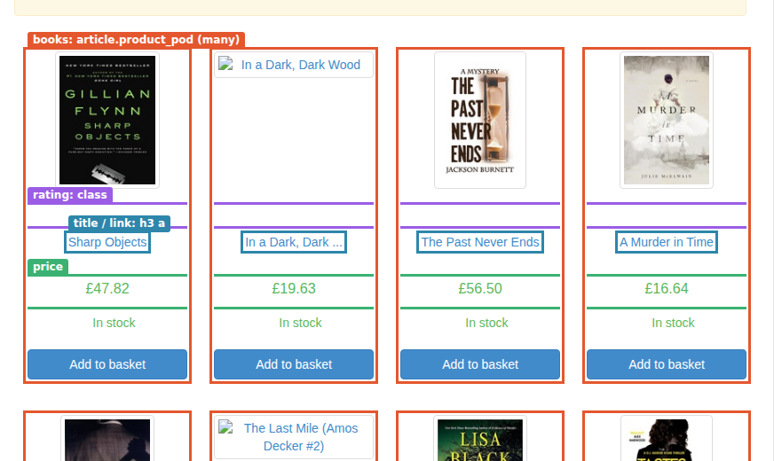
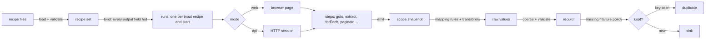

<p align="center">
  
</p>

# How OpenCraw works

This guide follows data through the engine: which page or document it sees, what each step keeps, how a
value changes transform by transform, and why the record ends up the way it does. Every example runs against a
real site, API or document, and every screenshot, scope, value table and trace here was produced by running it
([how](#how-this-guide-is-made)).

[authoring.md](../recipes/authoring.md) is the reference: every key, step and transform. This guide is the
explanation: read it to understand the engine, or when a recipe does something you didn't expect.

## The parts

| Part | What it explains |
|---|---|
| **[1. A run, end to end](#a-run-end-to-end)** (this page) | One recipe on a real site, from the page to the record. |
| [2. Recipes](01-recipes.md) | The output recipe (fields, types, coercion, keys) and the input recipe (web or api mode, sessions). |
| [3. Page steps](02-page-steps.md) | Driving a browser: `goto`, `click`, `fill`, `press`, `select`, `scroll`, `wait`, `screenshot`, `evaluate`, `captcha`. |
| [4. Data steps](03-data-steps.md) | Getting values: `extract` (CSS, XPath, JSONPath, regex, tables), `request`, `set`, `hook`. |
| [5. Flow steps](04-flow-steps.md) | Loops and decisions: `forEach`, `paginate`, `if`, `collect`, `emit`. |
| [6. Templates and scope](05-templates-and-scope.md) | What a step can see, and the `{{ }}` language. |
| [7. Documents, under the hood](06-documents.md) | How PDFs, spreadsheets, CSV, PowerPoint, Word, HTML tables, XML, YAML and Markdown are read, down to the algorithms. |
| [8. Mapping and transforms](07-mapping-and-transforms.md) | From scope to record: `from`, `each`, and every transform with real before and after values. |
| [9. Policies](08-policies.md) | Missing values, values that can't be converted, transforms that fail: what's dropped and what stops a run. |
| [10. Running](09-running.md) | Sessions, access and proxies, blocks, throttling, retries, captchas, concurrency, worker mode, change detection, events. |

## A run, end to end

The recipe: every book in the Mystery category of [books.toscrape.com](https://books.toscrape.com), a site
built for scraping practice, read in a browser. Two files:

- [`book.output.json`](recipes/books-list/book.output.json), the **output recipe**, says what a record is:
  `url` (the key), `title`, `price` (in GBP), `stars`, `inStock`, `category`, `page`.
- [`mystery-web.input.json`](recipes/books-list/mystery-web.input.json), the **input recipe**, says where the
  data is and how to turn it into records.

```json
"steps": [
  { "type": "goto", "url": "{{start.url}}" },
  { "type": "set", "id": "starWords", "value": [{ "word": "One", "n": 1 }, "…", { "word": "Five", "n": 5 }] },
  { "type": "paginate", "next": { "selector": "li.next a" }, "maxPages": 2, "steps": [
    { "type": "extract", "id": "books", "selector": "article.product_pod", "kind": "css", "take": "html", "many": true },
    { "type": "forEach", "over": "books", "as": "book", "emit": true, "steps": [
      { "type": "extract", "id": "title", "from": "book", "selector": "h3 a", "kind": "css", "take": "attr:title" },
      { "type": "extract", "id": "link", "from": "book", "selector": "h3 a", "kind": "css", "take": "attr:href" },
      { "type": "extract", "id": "price", "from": "book", "selector": ".price_color", "kind": "css", "take": "text" },
      { "type": "extract", "id": "rating", "from": "book", "selector": "p.star-rating", "kind": "css", "take": "attr:class" },
      { "type": "extract", "id": "stock", "from": "book", "selector": ".availability", "kind": "css", "take": "text" }
    ]}
  ]}
]
```

### 1. What the engine sees

`goto` opens the category page in Chromium. `extract` with `many: true` takes every element matching
`article.product_pod`, as HTML (`take: "html"`): one fragment per book. Inside `forEach`, each fragment is the
`book`, and the five `extract`s read from it (`from: "book"`), not from the page.

<!-- capture:books-list screenshot alt=The_Mystery_category,_with_what_each_extract_selects -->

<!-- /capture -->

### 2. What the steps keep: the scope

Every step with an `id` binds its value under that name. When `forEach` emits, the engine takes a snapshot of
everything in scope: the loop's own values, then its parents' (`page`, `starWords`, `vars`, `start`). That
snapshot is what the mapping reads. For the first book:

<!-- capture:books-list scope ids=title,link,price,rating,stock,page,vars -->
```json
{
  "title": "Sharp Objects",
  "link": "../../../sharp-objects_997/index.html",
  "price": "£47.82",
  "rating": "star-rating Four",
  "stock": "In stock",
  "page": {
    "url": "https://books.toscrape.com/catalogue/category/books/mystery_3/index.html",
    "number": 1
  },
  "vars": {
    "category": "Mystery"
  }
}
```
<!-- /capture -->

`book` (the fragment) and `books` (all of them) are in the snapshot too, left out here for length.

### 3. From scope to record: the mapping

Each output field has a rule: where to read (`from`) and what to do with it (`transform`). The table shows each
field's value as read, after each transform, and as it lands in the record, after coercion to the field's type:

<!-- capture:books-list mapping fields=url,price,stars,inStock,page -->
| Field | Step | Value |
|---|---|---|
| `url` | read | `"../../../sharp-objects_997/index.html"` |
| | `absoluteUrl` | `"https://books.toscrape.com/catalogue/sharp-objects_997/index.html"` |
| | **field** | `"https://books.toscrape.com/catalogue/sharp-objects_997/index.html"` |
| `price` | read | `"£47.82"` |
| | `currency` | `{"amount":47.82,"currency":"GBP"}` |
| | **field** | `{"amount":47.82,"currency":"GBP"}` |
| `stars` | read | `"star-rating Four"` |
| | `regex` | `"Four"` |
| | `lookup` | `4` |
| | **field** | `4` |
| `inStock` | read | `"In stock"` |
| | `trim` | `"In stock"` |
| | `boolean` | `true` |
| | **field** | `true` |
| `page` | read | `1` |
| | **field** | `1` |
<!-- /capture -->

Three things happen here that aren't obvious from the recipe:

- `absoluteUrl` resolves the link against the page it came from, so `../../../sharp-objects_997/index.html`
  becomes a full URL.
- `currency` reads the `£` sign and returns `GBP`. When a text has no sign, the field's `currency` fills it in
  at coercion.
- `stars` takes two steps: `regex` pulls the word out of the class (`Four`), then `lookup` finds it in the
  `starWords` table the recipe `set` at the start, and returns its `n`.

### 4. The record

<!-- capture:books-list record -->
```json
{
  "url": "https://books.toscrape.com/catalogue/sharp-objects_997/index.html",
  "title": "Sharp Objects",
  "price": {
    "amount": 47.82,
    "currency": "GBP"
  },
  "stars": 4,
  "inStock": true,
  "category": "Mystery",
  "page": 1
}
```
<!-- /capture -->

The output declares `url` as the key: a second record with the same URL would be dropped as a duplicate.

### 5. The route: the trace

`traceLine` turns the engine's events into this, one line per event, indented by step depth. `⇢` is a page,
`·` a finished step with its path in the recipe (`steps.2.steps.1.steps.0` is the first step inside the loop
inside `paginate`), `✚` a record with its key:

<!-- capture:books-list trace lines=16 -->
```text
▶ mystery-web (web)
  ⇄ access direct (direct)
  ⇢ page 1  https://books.toscrape.com/catalogue/category/books/mystery_3/index.html
  · steps.0  goto  … ms
  · steps.1  set starWords  … ms
    · steps.2.steps.0  extract books  … ms
      · steps.2.steps.1.steps.0  extract title  … ms
      · steps.2.steps.1.steps.1  extract link  … ms
      · steps.2.steps.1.steps.2  extract price  … ms
      · steps.2.steps.1.steps.3  extract rating  … ms
      · steps.2.steps.1.steps.4  extract stock  … ms
  ✚ record ["https://books.toscrape.com/catalogue/sharp-objects_997/index.html"]
      · steps.2.steps.1.steps.0  extract title  … ms
      · steps.2.steps.1.steps.1  extract link  … ms
      · steps.2.steps.1.steps.2  extract price  … ms
      · steps.2.steps.1.steps.3  extract rating  … ms
  …
```
<!-- /capture -->

<!-- capture:books-list summary -->
```text
mystery-web: 32 emitted, 0 rejected, 0 duplicates, 2 pages
```
<!-- /capture -->

32 books over two pages: `paginate` clicked "next" once, then found no "next" on page 2 and stopped.

## How the pipeline fits together



Each box is a part of this guide. The same pipeline runs whether the source is a web page, an API, or a PDF
fetched by URL: the document readers (part 7) turn every format into something `extract` can select from.

## How this guide is made

Each example's recipes live in [`recipes/`](recipes), one folder per scene. The capture script,
[`capture/capture.mjs`](capture/capture.mjs), does the following for each scene:

- runs its recipes with `CrawlOptions.debug`, so every `record:emit` event carries the scope snapshot and each
  field's mapping trace;
- saves the records, the trace and the summary to [`captures/`](captures);
- takes the screenshots, outlining what each selector matches;
- rewrites the regions of these pages marked `<!-- capture:… -->`.

```sh
npm run docs:capture                     # every scene, against the live sites (a few minutes)
npm run docs:capture -- --only books-list
npm run docs:capture -- --render         # rewrite the pages from the saved captures, offline
```

CI loads and binds every scene's recipes on each pull request, so a change to the engine that breaks one fails
there. The capture itself runs on demand, since the sites are live.
